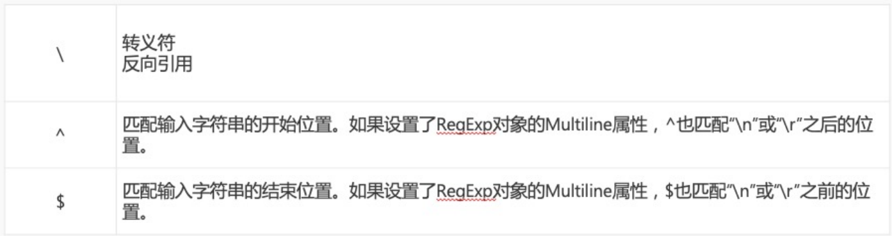
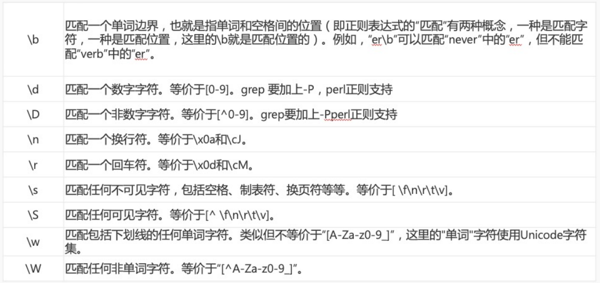
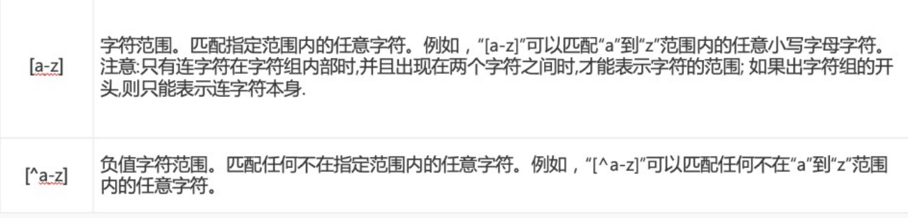
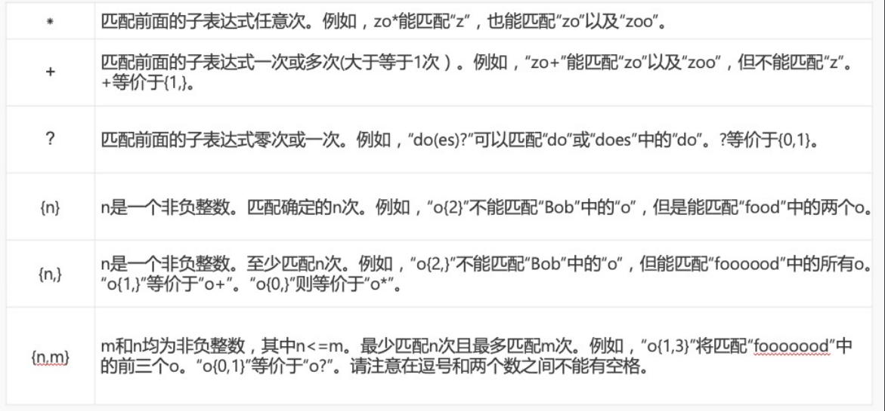
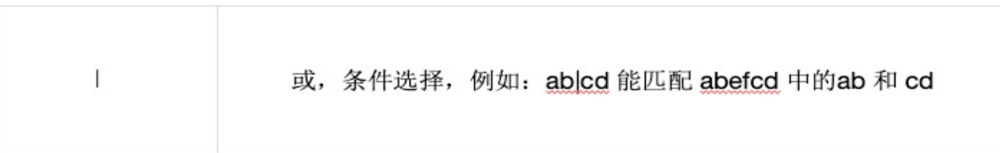

>[success] # js 正则
~~~
1.正则表达式，又称规则表达式。（英语：Regular Expression，在代码中常简写为regex、regexp或RE），
 正则表达式通常被用来检索、替换那些符合某个模式(规则)的文本。
2.用来匹配字符串
3.正则表达式的组成:是由元字符或者是限定符组成的一个式子
~~~
>[danger] ##### 元字符

>[danger] ##### 字符集合

>[danger] ##### 量词

>[danger] ##### 分支

>[danger] ##### 贪婪与懒惰
~~~
1.'贪婪模式'——在匹配成功的前提下，尽可能多的去匹配
2.'惰性模式'——在匹配成功的前提下，尽可能少的去匹配

说明:js 正则默认是贪婪模式,就是符合情况下尽可能多的去匹配
~~~
~~~
const str = 'I want you to (match the content) between the bracket)';

// 贪婪匹配只要满足我都要
console.log(/((.*))/.exec(str));
// 惰性遇到? 问号的意思是满足零次或者一次 也就是最少次数
// + 加号的意思是一次或者多次也就是 配合问号最少次数 则满足一次即可
console.log(/((.+?))/.exec(str));
// 找到满足非( 开始的字符以贪婪匹配则满足的都要
console.log(/(([^(]*))/.exec(str));

// 找到满足非( 开始的字符以惰性匹配则满足即第一个满足
console.log(/(([^(]+?))/.exec(str));

~~~
* 输出打印结果
~~~
[
  'I want you to (match the content) between the bracket)',
  'I want you to (match the content) between the bracket)',
  'I want you to (match the content) between the bracket)',
  index: 0,
  input: 'I want you to (match the content) between the bracket)',
  groups: undefined
]
[
  'I',
  'I',
  'I',
  index: 0,
  input: 'I want you to (match the content) between the bracket)',
  groups: undefined
]
[
  'I want you to ',
  'I want you to ',
  'I want you to ',
  index: 0,
  input: 'I want you to (match the content) between the bracket)',
  groups: undefined
]
[
  'I',
  'I',
  'I',
  index: 0,
  input: 'I want you to (match the content) between the bracket)',
  groups: undefined
]
~~~