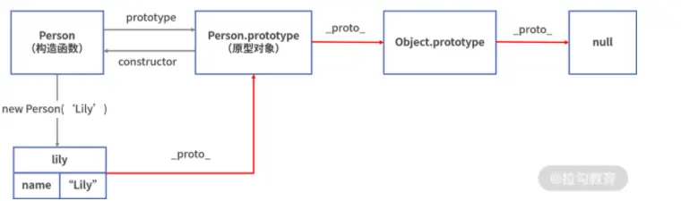
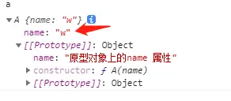
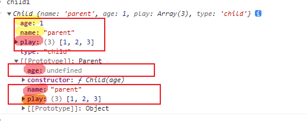
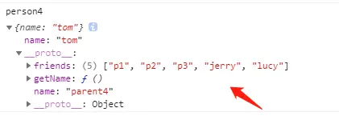

>[success] # 关于继承
1. 在 JavaScript 中，是通过**遍历原型链**的方式，**来访问对象的方法和属性**,简单的说就是**我自身没有我就通过'_\_proto__' 找到我的构造函数的'prototype'上**，构造函数原型对象没有他就去找**构造函数上'_\_proto__' 链接的原型对象**一直都没找到的情况下，最后找到**null 终止**
2. 在原型链上查找属性**比较耗时**，**对性能有副作用**，这在性能要求苛刻的情况下很重要。另外试图访问**不存在**的属性时**会遍历整个原型链**。
~~~
function Person (name) {
    this.name = name;
}
var lily = new Person("Lily");
~~~

3. **js属性遮蔽**可以理解成就近原则
~~~
function A (name) {
    this.name = name
}
A.prototype.name = "原型对象上的name 属性"

const a = new A('w')

console.log(a.name); // w
~~~
* 会找离自身最近属性对应值

>[danger] #####  hasOwnProperty -- 属性是否是原型对象上
1. 证明打印是自己的而不是原型对象**prototype**上的，使用**hasOwnProperty**返回的是**true** 则使用的是实例对象自己的，**false**怎相反
~~~
 function Person() {}
// 每一个函数都有一个原型属性prototype
// 他们都会指向实例对象因此在Person这个
// 构造函数的prototype加属性即可创建的对象共享
Person.prototype.name = 'wang'

const p1 = new Person()
// 当前的name 到底是p1的还是 Person的
console.log(p1.hasOwnProperty('name'))

const p2 = new Person()
p2.name = 'p2'
// 当前的name 到底是p1的还是 Person的
console.log(p2.hasOwnProperty('name'))

打印结果：
false
true
~~~
>[info] ## 继承几种方式

>[danger] #####  原型链继承

1. 这种继承新实例无法向**父类构造函数传参**
2. 所有新实例都会共享父类实例的属性，会产生的问题两个实例使用的是**同一个原型对象**。它们的内存空间是共享的，如果属性是**引用类型**当一个发生变化的时候，另外一个也随之进行了**变化**
3. 通过直接打印对象是看不到这个属性的，因为我们将父类直接new 生成对象挂在到原型链上，其实当调用时候自身没有的都会去挂在对象去找本事其真正本身属性都是共享属性

~~~
// 第一种 原型链继承
function Parent(){
    this.name="parent";
    this.play = [1,2,3]
}
function Child(){
    this.type="child";
}
Child.prototype = new Parent();
const child1 = new Child()
const child2 = new Child()

child1.play.push(12345)
console.log(child1.play,child2.play); // [ 1, 2, 3, 12345 ] [ 1, 2, 3, 12345 ]
~~~
>[danger] ##### 构造函数继承

1. 此通过 **apply()和call()** 方法 改变函数执行时this 指向,单独声明时候并不会执行只有当new Child 时候此时执行然后给当前this 调用了一个赋值属性的封装方法
~~~
function a(obj){
    obj.name = "w"
    obj.age = 12
}
const z = {}
a(z)
~~~
2. 这种问题弊端只继承了父类构造函数的属性，没有继承父类原型的属性，因此导致下面的'child.getName()'
调用会报错

~~~
function Parent(age){
    this.name="parent";
    this.age = age
    this.play = [1,2,3]
}
Parent.prototype.getName = function(){
    return this.name
}
function Child(age){
    // ;(function(){
    //     this.name = "zzz"
    //     this.play = [1,2,3]
    // }).call(this)
    // 上面注释方法和下面等同
    Parent.call(this,age)
    this.type="child";
}
const child1 = new Child(1)
const child2 = new Child(10)

child1.play.push(12345)
console.log(child1.play,child2.play); // [ 1, 2, 3, 12345 ] [ 1, 2, 3 ]
// 报错
// console.log(child.getName())
~~~
>[danger] ##### 组合继承

1. 上面两种各自有对方不能解决的问题，将这两种组合形成继承，弊端就是下面的'Parent' 会执行两次，分别在构造函数时候执行一次在原型链上执行一次浪费性能开销
1.1.  一次在创建子类原型的时候；
1.2. 一次在子类构造函数内部(也就是每次创建子类实例的时候)；
2. **所有的子类实例事实上会拥有两份父类的属性**
2.1. 一份在当前的实例自己里面(也就是person本身的)，另一份在子类对应的原型对象中(也就是person.\_\_proto\_\_里面)，这两份属性我们无需担心访问出现问题，因为默认一定是访问实例本身这一部分的(就近原则)

~~~
// 第一种 原型链继承
function Parent(age){
    this.name="parent";
    this.age = age
    this.play = [1,2,3]
}
Parent.prototype.getName = function(){
    return this.name
}
function Child(age){
    Parent.call(this,age)
    this.type="child";
}
// 执行一次
Child.prototype = new Parent()
// 手动挂上构造器，指向自己的构造函数
Child.prototype.constructor = Child;
const child1 = new Child(1) // 触发函数执行了第二次Parent = 》Parent.call(this,age)
const child2 = new Child(10)

child1.play.push(12345)
console.log(child1.play,child2.play); // [ 1, 2, 3, 12345 ] [ 1, 2, 3 ]
~~~
>[danger] ##### 原型继承

 **道格拉斯·克罗克福**德在一篇文章中介绍了一种实现继承的方法，**这种方法并没有使用严格意义上的构造函数**。它的想法**是借助原型可以基于已有的对象创建新对象，同时还不必因此创建自定义类型**。为了达到这个目的，他给出了如下函数。
~~~
function object(o){
    function F() {}
    F.prototype = o;
    return new F();
}
~~~
在object()函数内部，**先创建了一个临时性的构造函数，然后将传入的对象作为这个构造函数的原型，最后返回了这个临时类型的一个新实例**。**从本质上讲，object()对传入其中的对象执行了一次浅复制**。
克罗克福德主张的**这种原型式继承**，**要求你必须有一个对象可以作为另一个对象的基础**。

1. ECMAScript5通过新增 **Object.create()** 方法规范化了原形式继承这个方法接收两个参数：一是用作新对象原型的对象、二是为新对象定义额外属性的对象（可选参数），将这个方法拆解可以写作下面
~~~
Object.myCreate = function (obj, properties)  {
  var F = function ()  {}
  F.prototype = obj
  if (properties) {
     Object.defineProperties(F, properties)
  }
  return new F()
}
~~~
2. 如图相当于都挂载到原型了导致数据共享问题，无法实现复用，属于自己的属性需要给create 第二个方法传参

3. 这类思想就是脱离之前构造函数的想法，而是直接给对象做继承，虽然每次伪造了一个 构造函数但对其包装并未暴露
~~~
  let parent4 = {
    name: "parent4",
    friends: ["p1", "p2", "p3"],
    getName: function() {
      return this.name;
    }
  };

  let person4 = Object.create(parent4);
  person4.name = "tom";
  person4.friends.push("jerry");

  let person5 = Object.create(parent4);
  person5.friends.push("lucy");

  console.log(person4.name);
  console.log(person4.name === person4.getName());
  console.log(person5.name);
  console.log(person4.friends);
  console.log(person5.friends);
打印结果：
tom
true
parent4
[ 'p1', 'p2', 'p3', 'jerry', 'lucy' ]
[ 'p1', 'p2', 'p3', 'jerry', 'lucy' ]
~~~
>[danger] ##### 寄生式继承
1. **寄生式(Parasitic)继承是与原型式继承紧密相关的一种思想**, 并且同样由道格拉斯·克罗克福德(Douglas Crockford)提出和推广的,不同在于**手动去增加当前实例的属性和方法**，寄生式继承的思路是结合原型类继承和**工厂模式**的一种方式

~~~
 let parent5 = {
    name: "parent5",
    friends: ["p1", "p2", "p3"],
    getName: function() {
      return this.name;
    }
  };

  function clone(original) {
    let clone = Object.create(original);
    clone.getFriends = function() {
      return this.friends;
    };
    return clone;
  }

  let person5 = clone(parent5);

  console.log(person5.getName());
  console.log(person5.getFriends());
~~~
>[danger] ##### 寄生组合继承

1. 组合继承是比较理想的继承方式, 但是存在两个问题:
1.1. 构造函数会被调用两次: 一次在创建子类型原型对象的时候, 一次在创建子类型实例的时候.
1.2. 父类型中的属性会有两份: 一份在原型对象中, 一份在子类型实例中

2. **Object.create** 可以挂载原型，这样直接将父类的原型挂载给当前**Child.prototype= new Parent()** 相对于这种相当于少执行一次父类的实例，在利用call 将父类的属性在当前子类的构造函数挂载会来,在这个时候有个疑问为什么不**Child.prototype= Parent.property** 这样的话两者内存共享子类也可以修改父类**new Parent()** 本身就是为了创建一个新的不影响的**Object.create**本质也是创建的新对象
3. 是否可以直接对象的隐式原型去绑定，也就是 
~~~
const c = new Child()
c.__proto__ = Parent.property
~~~
这样问题就是`__proto__` 并不是js 提供只是浏览器提供所以这种用法未来会出现兼容性问题

~~~
 function clone (parent, child) {
    // 这里改用 Object.create 就可以减少组合继承中多进行一次构造的过程
    child.prototype = Object.create(parent.prototype);
    child.prototype.constructor = child;
  }

  function Parent6() {
    this.name = 'parent6';
    this.play = [1, 2, 3];
  }
   Parent6.prototype.getName = function () {
    return this.name;
  }
  function Child6() {
    Parent6.call(this);
    this.friends = 'child5';
  }

  clone(Parent6, Child6);

  Child6.prototype.getFriends = function () {
    return this.friends;
  }

  let person6 = new Child6();
  console.log(person6);
  console.log(person6.getName());
  console.log(person6.getFriends());
~~~

>[info] ## 参考
[参考文章](https://www.kancloud.cn/cyyspring/html_js_cs/725347)
[六种继承](https://www.cnblogs.com/Grace-zyy/p/8206002.html)
[参考拉勾教育文章链接](https://kaiwu.lagou.com/course/courseInfo.htm?courseId=601#/detail/pc?id=6176)