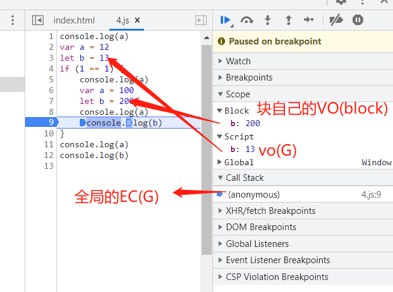

>[success] # 阅读跳转章节

[链接](https://www.kancloud.cn/cyyspring/more/1278974)
>[info] ## 补充说明 var 和function
~~~
1.浏览器首先会把所有带var/function关键字的进行提前声明或者定义
 1.1.带var的只是提前声明 
 1.2.带function的，此阶段声明+定义{赋值}都完成了
2.下面案例说明在代码运行之前，进行了了变量提升，即其实下面代码实际是
var fn // 声明未赋值但是 函数fn 此时不仅声明了还赋值了此时fn 是函数
function fn(){ console.log(1); }
function fn(){ console.log(2); } // 重新又给fn 声明又赋值了 变成了新的函数
console.log(fn);
console.log(fn);
 fn = 12; // 此时是变量的赋值， fn 此时已经从函数赋值为了 变量12
console.log(fn);
console.log(fn);
因此下面的执行结果
ƒ fn(){ console.log(2); }
ƒ fn(){ console.log(2); }
12
12
~~~
* 案例说明
~~~
console.log(fn);
function fn(){ console.log(1); }
console.log(fn);
var fn = 12;
console.log(fn);
function fn(){ console.log(2); }
console.log(fn);
~~~
>[info] ## 补充说明 块级作用域 var 和function
~~~
1.如果在大括号(判断体/循环体/代码块)即'块'，中出现了 let/const/function/class 等关键词声明变
量，则当前大括号会产生一个'块级私有上下文'；它的上级上下文是所处的环境；var不产生，
也不受块级上下文的影响,简单的说var 没有块级作用域
~~~
>[danger] ##### 变量声明 举个例子
~~~
console.log(a)
var a = 12
let b = 13
if (1 == 1) {
    console.log(a)
    var a = 100
    let b = 200
    console.log(a)
    console.log(b)
}
console.log(a)
console.log(b)
打印结果：
undefined
12
100
200
100
13
~~~

>[danger] ##### function 举个例子
~~~
1.之前解释过函数在变量提升阶段是声明加定义，在新版浏览器中，在块级作用域中let const 变量声明属于块的，
并不会属于全局，var 和 function 不受块作用域的影响，虽然function 不受块的影响，但在块中声明的function，
在块之前的全局位置调用，仅仅只会是具备声明而不会具备定义值，但在块里面的时候function 依旧会定义加
声明
2.在块级作用域声明的function 依旧会在全局创建一份，但注意其实是将块级function 复制了一份，此时全局和块
都会有function 定义但相互不会产生影响，当操作块级的并不会影响全局，以下面代码为例
~~~
~~~
console.log(foo)  // 因为块级声明的foo function 在块级之前全局里调用只是声明不在具有定义性质因此undefined
if (1 === 1) {
    console.log(foo) // 在块级时候是声明加定义
    function foo() {}
    foo = 1
    console.log(foo) // 重新给foo 赋值
}
console.log(foo) // 全局的foo function 会复制一份从块，此时二者没有关系，因此块级中function改变并不影响全局

// 打印结果
undefined
[Function: foo]
1
[Function: foo]
~~~
>[danger] ##### 总结
~~~
1.let 和const 声明之前的报错在词法解析阶段事情，也就是当对js 进行词法解析阶段发现该词法是let const 声明
但却在之前使用即会报错'Uncaught ReferenceError: Cannot access '参数' before initialization'
2.const 声明其实本质判断是内存是否改变，即使来说 const a = 3， a = 3 此时你觉前后都是a 指向都是3内存
没发生变化，实际在堆栈说过 这里基础类型创建在栈中，每次重新赋值都会创建新的变量空间 此时 a 和上一次a
只是看着一样但在栈中是两个空间 两个地址

3.console.log(typeof n); //Uncaught ReferenceError: Cannot access 'n' before initialization
  let n = 20; 
~~~
>[danger] ##### 关于var let const 从词法来解释
