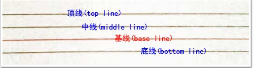
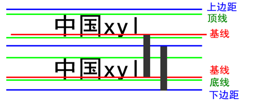
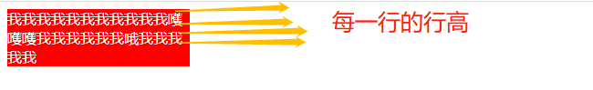

>[success] # line-height
* 是基线与基线之间的距离,什么是基线?这个定义来自于英文字母中用到的一个概念，是一个四线本子，四条线分别是顶线，顶线，基线，底线，在实际中文中没有基线这个概念，两行英文基线和基线的距离的行高等同于顶线到底线的距离

* 默认情况下文字大小小于行高
* 撑起**div块**的高度是**行高**，而**不是文字高度**
* 将行高和div高度一致，也就是说一行文字行高和父元素高度一致的时候，垂直居中显示。原因是文字是垂直居中行高，所以这样也就垂直居中了父级
* 行高设置的是文字垂直居中，是文字特有的。

* 多行撑起高度，折行了行高是单行的行高，而不是说总高度
