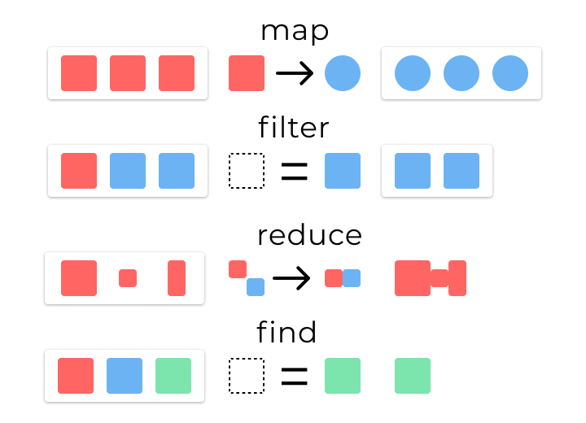

[TOC]

 
>[success] # map、filter、reduce、find 四种方法
~~~
1.工作中比较常用的四个数组api,' map、filter、reduce、find '
~~~
[原文内容4-javascript-array-methods](https://www.30secondsofcode.org/blog/s/4-javascript-array-methods)
>[info] ## 引用文章中的一个图概括全部
~~~
1.map：原来一组正方形通过map后变成一组圆形，形象说明map是用来转换原数组，切输出的结果和原结果
长度是一致的
2.filter：原来是一组不同颜色的正方形，根据条件生成一组只有蓝色的正方形。形象的说明filter 用来过滤的
他不会改变原来组内单独每一项的特性值。只是单纯过滤出符合项
3.reduce：原来是一组数据，经过reduce 后可以不再单单是一组数据，可以是别的内容的表现形式
4.find ：原来是一组数组通过find 找到符合的单独值，形象说明find 是用来找到符合元素项，是具体的一个值
~~~

>[danger] ##### map
~~~
1.转换应用于原始数组的每个元素，创建一个新数组
2.输出的'结果数组长度和原数组长度相同'
~~~
* 下面案例新数组的长度 和 原数组长度相同
~~~
const arr = [1, 2, 3];
const test = arr.map( x => x * 2); 
const test1 = arr.map( x => {
    if(x>1) return x
})

log(test) // [2, 4, 6]
 
log(test1) // [ undefined, 2, 3 ]
~~~
>[danger] ##### filter
~~~
1.过滤函数创建新数组，以仅保留true基于该函数返回的元素
2.新数组的长度等于或小于原始数组长度的数组
3.新数组含与原始数组相同元素的子集
~~~
~~~
const arr = [1, 2, 3];
const isOdd = x => x % 2 === 1;
arr.filter(isOdd); // [1, 3]
~~~
>[danger] ##### find
~~~
1.返回匹配器函数返回的第一个元素true
2.结果是原始数组中的单个元素
~~~
~~~
const arr = [1, 2, 3];
const isOdd = x => x % 2 === 1;
arr.find(isOdd); // 1
~~~
>[danger] ##### reduce
~~~
1.初始值创建任何类型的输出值
2.结果可以是任何类型，例如整数，对象或数组
~~~
~~~

const arr = [1, 2, 3];

const sum = (x, y) => x + y;
arr.reduce(sum, 0); // 6

const increment = (x, y) => [...x, x[x.length - 1] + y];
arr.reduce(increment, [0]); // [0, 1, 3, 6]
~~~