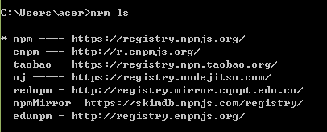

> [success] # nrm的安装使用
~~~
1.作用：提供了一些最常用的NPM包镜像地址，能够让我们快速的切换安装包
时候的服务器地址； 
2.什么是镜像：原来包刚一开始是只存在于国外的NPM服务器，但是由于网络原
因，经常访问不到，这时候，我们可以在国内，创建一个和官网完全一样的NPM服
务器，只不过，数据都是从人家那里拿过来的，除此之外，使用方式完全一样；
~~~
>[danger] ##### 使用
~~~
1.运行npm i nrm -g全局安装nrm包；

2.使用nrm ls查看当前所有可用的镜像源地址以及当前所使用的镜像源地址；

3.使用nrm use npm或nrm use taobao切换不同的镜像源地址；

4.注意： nrm 只是单纯的提供了几个常用的 下载包的 URL地址，并能够让我们在 这几个 地址之间，很方便的进行切换，但是，我们每次装包的时候，使用的 
~~~

