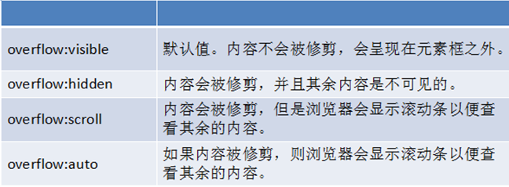
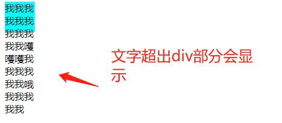
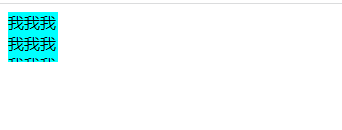
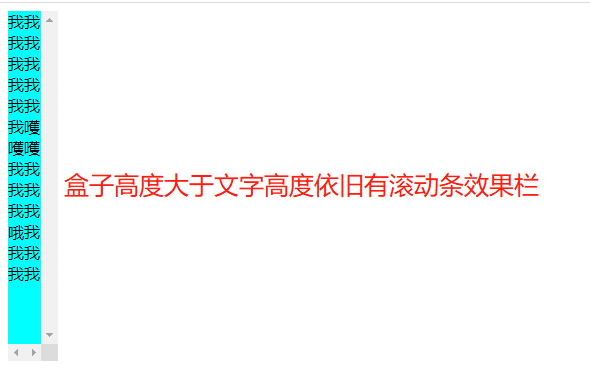
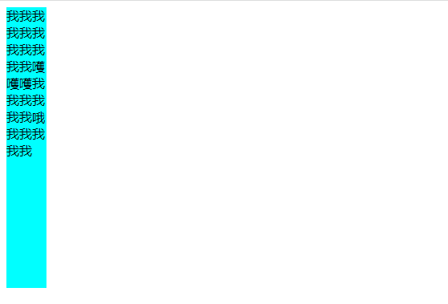
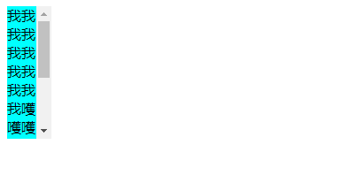

>[success] # overflow-溢出

* 如下代码 
~~~
<!DOCTYPE html>
<html lang="en">
    <head>
        <meta charset="UTF-8" />
        <meta http-equiv="X-UA-Compatible" content="IE=edge" />
        <meta name="viewport" content="width=device-width, initial-scale=1.0" />
        <title>Document</title>
    </head>
    <body>
        

            我我我我我我我我我我我嚄嚄嚄我我我我我我哦我我我我我
        

    </body>
</html>

~~~
1.  `visible`默认值。内容不会被修剪，会呈现在元素框之外 

2.  `hidden`内容会被修剪，并且其余内容不可见盒子有多少显示多少,如果上述代码设置该属性后展示效果盒

3. `scroll`内容会被修剪，浏览器会显示滚动条以便查看其余内容，会一直显示滚动条区域，滚动条区域占用的空间属于width、height，简单说即使盒子高度宽度大于内容展示效果依然有滚动条

4. `auto`由浏览器定夺，如果内容被修剪，就会显示滚动条,否则隐藏
* 不显示滚动条

* 显示滚动条
