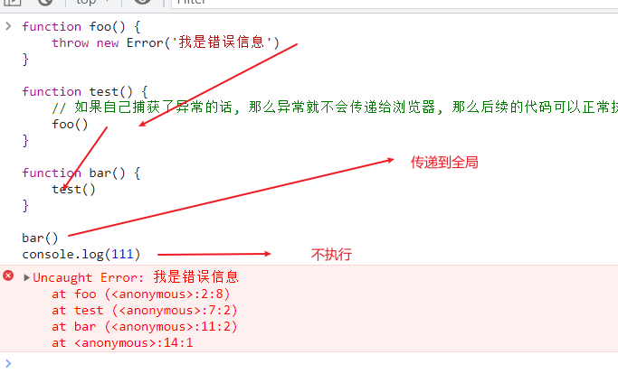

>[success] # try...catch 处理异常
~~~
1.当需要处理一些异常，或者将一些异常抛出的时候，
就是可以使用'try...catch' 代码块,在我现阶段工作中，
异步处理会经常用到这个
~~~
>[danger] ##### 异常的传递
1. 在调用一个函数时，**这个函数抛出了异常**，但是我们并没有对这个异常进行处理，那么这个异常会继续传递到上一个函数调用中；
而**如果到了最顶层（全局）的代码中依然没有对这个异常的处理代码，这个时候就会报错并且终止程序的运行**
~~~
function foo() {
	throw new Error('我是错误信息')
}

function test() {
	// 如果自己捕获了异常的话, 那么异常就不会传递给浏览器, 那么后续的代码可以正常执行
	foo()
}

function bar() {
	test()
}

bar()
console.log(111)
~~~

>[info] ## 使用异常的捕获 防止报错全局阻塞代码
~~~
1.使用起来常见的三种格式：
    1.1 try...catch 
    1.2 try...finally
    1.3 try...catch...finally

2.try 中放着可能会导致错误的代码，catch 如果在try块里有
异常被抛出时执行的语句。finally在try语句块之后执行的语句块。
无论是否有异常抛出或捕获这些语句都将执行 。

3.catch 块会接受一个包含错误信息的对象，这里要说明如果抛出
的是 'Error' 对象，那么可以使用它的'message'属性获取报错信息

4.一共有七种错误对象类型，其中六种继承了'Error':
    4.1 Error
    4.2 EvalError -- 在使用eval()  异常时候抛出
    4.3 RangeError -- 数值超出相应范围 例如数组 new Aarray(-20)
    4.4 ReferenceError -- ReferenceError（引用错误） 对象代表当一个不存在的变量被引用时发生的错误。
    4.5 SyntaxError -- 语法错误
    4.6 TypeError -- 类型错误
    4.7 URIError -- 错误的方式使用全局URI处理函数而产生的错误
~~~
>[danger] ##### 基础案例
~~~
try{
    // 没问题的代码只走我和finally
    new Array(-20)
}catch (e) {
    // try 发生的错我我全都接受
    console.log(e.message)
}finally {
    // 不管你走的是try还是catch 都会走我
    console.log('wowoow')
}
// 打印结果：
Invalid array length
wowoow
~~~
>[danger] ##### Error类型
1. JavaScript已经给我们提供了一个Error类
~~~
new Error('msg')
~~~
2. **Error包含三个属性**：
2.1. **messsage**：创建Error对象时传入的message；
2.2. **name**：Error的名称，通常和类的名称一致；
2.3.  **stack**：整个Error的错误信息，包括函数的调用栈，当我们直接打印Error对象时，打印的就是stack
3. Error有一些自己的子类：
RangeError：下标值越界时使用的错误类型；
SyntaxError：解析语法错误时使用的错误类型；
TypeError：出现类型错误时，使用的错误类型；
>[danger] #####  了解一下throw 解释一下message
~~~
1.只用是通过'Error'对象产生的在catch接收才会有'message'属性
2.throw 会 抛出异常被catch 接受到
3.throw语句用于抛出一个用户自定义的异常；当遇到throw语句时，当前的函数执行会被
停止（throw后面的语句不会执行）
4. throw关键字可以跟上基本数据类型：比如number、string、Boolean
对象类型：对象类型可以包含更多的信息
~~~
~~~
try{
    throw '错误'
}catch (e) {
    // 抛出产生的错误不是Error对象所以e没有message属性的
    console.log(e)
}finally {
    // 不管你走的是try还是catch 都会走我
    console.log('wowoow')
}
~~~
~~~
try{
    throw new Error('错误')
}catch (e) {
    // 抛出产生的错误是Error对象所以e有message属性的
    console.log(e.message)
}finally {
    // 不管你走的是try还是catch 都会走我
    console.log('wowoow')
}
~~~
>[danger] ##### 嵌套多层 try...catch
~~~
// 可以尝试这种将报错抛出都交给最后一层抓
try {
  try {
    throw new Error("oops");
  }
  catch (ex) {
    console.error("inner", ex.message);
    throw ex;
  }
  finally {
    console.log("finally");
  }
}
catch (ex) {
  console.error("outer", ex.message);
}
~~~
>[danger] ##### 在工作中对ajax 常用的写法
~~~
 async getDataSourceFields(params: { dataSourceId: string; dataSourceType: string }) {
        try {
            AppModule.showWaiting()
            const pamrams = await DashboardApi.fetchDatasourceFields(params)
            console.log(pamrams)
        } catch (e) {
           // 做了兼容处理 既能包含非Error 对象返回的错误信息
            console.error(`获取数据源失败${ e.message || e}`)
        } finally {
            // 会在最后无论有没有异常都关闭等待
            AppModule.closeWaiting()
        }
    }
~~~