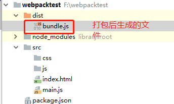
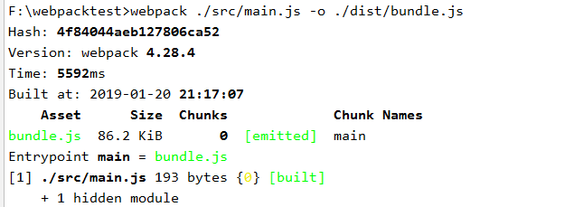
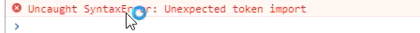

[TOC]

 
>[success] # webpack 安装
~~~
1. 第一种全局运行npm i webpack -g全局安装webpack，这样就能在全局使
用webpack的命令
2.第二种在项目根目录中运行npm i webpack --save-dev安装到项目依赖中
开发环境中
~~~
*   在webpack4中还需安装下面这个
~~~
1.npm i webpack-cli -g 如果 webpack 安装在全局，那么 CLI 也需要装在全局
2.npm i webpack-cli --save-dev 安装在开发环境
~~~
>[danger] ##### 结构目录说明
~~~
1.dist  是指编译后的文件，可以理解为压缩发布版
2.src   源码文件，适合动手能力强的童鞋
3.docs 文档
4.examples 示例文件
5.test 测试脚本
6..gitignore 告诉git哪些文件不要上传到 GitHub，比如数据库配置文件等
7.LICENSE.txt  授权协议 
8.README.md 自述文件，整个项目的简介、使用方法等
9.bower.json Bower 包管理器配置文件
10.package.json npm 包管理器配置文件
11.webpack.config.js  webpack配置文件
~~~
>[success] # 使用案例 -- 奇偶行变色

* 结构目录
~~~
.
├── dist     // 打包后的文件
├── src      //  源码文件
|   ├── css
|   └── js
|   └── index.html  
|   └── main.js    // 这是 main.js 是我们项目的JS入口文件
└──  package.json   // npm init 生成的NPM包的所有相关信息，其中sprict可以脚本
~~~
>[danger] ##### 步骤
~~~
1.创建一个上面的结构目录
2.nmp init 生成一个package.json 配置文件
3.安装webpack两种方式任选:npm i webpack -g全局安装/npm i webpack --save-dev安装开发环境中
4.如果使用的是webpack4 还需要安装:npm i webpack-cli -g 
5.webpack ./src/main.js ./dist/bundle.js 第一路径是要被打包文件的路径，第二个
是打包位置，这个方法支持 webpack3
6.webpack ./src/main.js -o ./dist/bundle.js 支持webpack4
~~~
* main.js
~~~
1.直接在html中引入下面编写的main,js的内容就会报错想解决报错的话，就使用
webpack打包。
2.webpack ./src/main.js ./dist/bundle.js 第一路径是要被打包文件的路径，第二个
是打包位置，这个方法支持 webpack3
3.webpack ./src/main.js -o ./dist/bundle.js 支持webpack4
~~~
* 打包后的效果

~~~
// 这是 main.js 是我们项目的JS入口文件
// 1. 导入 Jquery
// import *** from *** 是ES6中导入模块的方式
// 由于 ES6的代码，太高级了，浏览器解析不了，所以，这一行执行会报错
// 需要解释中的第二条进行打包，为什么会报错参考上一篇困惑（主要是浏览器支持import方式）
import $ from 'jquery'

$(function () {
    $('li:odd').css('backgroundColor', 'yellow');
    $('li:even').css('backgroundColor', function () {
        return '#' + 'D97634'
    })
});
~~~
* index.html 内容
~~~
1.注意： 不推荐直接在这里引用任何包和任何CSS文件
2.当我们直接引入main.js 的时候发现浏览器报错，可以参考上一篇文章，由于浏
览器不支持import导入导致的
3.解决问题二，就给通过 webpack 这么一个前端构建工具， 把 main.js 做了一下
处理，在dist目录生成了一个 bundle.js 的文件 ，具体参考main.js解释中的第二条
4.这时候直接使用webpack 在dist生成的js 即可
5. 当使用 html-webpack-plugin 之后，我们不再需要手动处理 bundle.js 的引用路
径了，因为 这个插件，已经帮我们自动 创建了一个 合适的 script , 并且，引用了 
正确的路径 
6.css 或发起二次请求，不推荐这么搞 :<link rel="stylesheet" href="./css/index.css"> 
~~~
* 直接使用import 报错

~~~
<!DOCTYPE html>
<html lang="en">
<head>
    <meta charset="UTF-8">
    <title>Title</title>
    <!-- 通过 webpack 这么一个前端构建工具， 把 main.js 做了一下处理，生成了一个 bundle.js 的文件 -->
    <!--  -->
</head>
<body>

<ul>
    <li>第一</li>
    <li>第二</li>
    <li>第三</li>
    <li>第四</li>
</ul>

</body>
</html>
~~~
>[danger] ##### 总结
~~~
经过刚才的演示，Webpack 可以做的事
1. webpack 能够处理 JS 文件的互相依赖关系；这样只需要一个main.js
2. webpack 能够处理JS的兼容问题，把 高级的、浏览器不是别的语法，转为 低级的，浏览器能正常识别的语法，例如import 导入这个es6语法在浏览器中也可以
使用。
3.可能有些文章提到'babelrc',但这里没有使用'babelrc' 也把import 转换成低
级浏览器的语法的原因是，webpack 是可以处理部分es6 语法从高级到低级
~~~