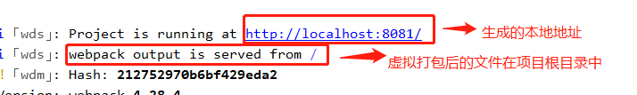
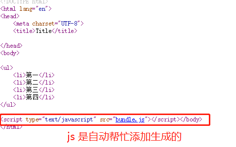
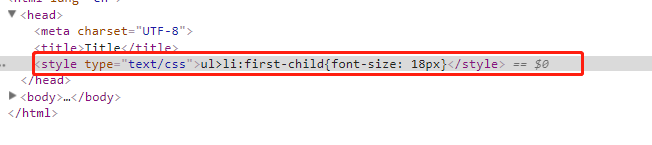
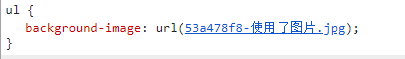

[TOC]
>[success] # webpack.config.js 配置
* 结构目录
~~~
.
├── dist     // 打包后的文件
├── src      //  源码文件
|   ├── css
|   └── js
|   └── index.html  
|   └── main.js    // 这是 main.js 是我们项目的JS入口文件
├── package.json   // npm init 生成的NPM包的所有相关信息，其中sprict可以脚本
├── .babelrc //将高级语法转换成低级语法
└── webpack.config.js // 配置webpack的配置文件

~~~
>[danger] ##### 配置打包的文件的出入口
~~~
1.在上篇文章中使用的是webpack ./src/main.js -o ./dist/bundle.js，命令进行的打
包，因此使用配置文件后，可以在配置文件直接配置好打包
2.打包主要需要一个入口文件，和一个生成文件因此在配置文件中也要做到这两点
~~~
* webpack.config.js 配置出入口
~~~
1.需要导入一个路径包，一个webpack包
2.还需要使用 module.exports 将整个文件暴露出去
3.配置入口文件entry，和出口文件 output.
4.这次打包就不用输入那么长的指令，只需要在控制台输入webpack 即可
~~~
~~~
const path = require('path');
const webpack = require('webpack');

module.exports = {
    entry:path.join(__dirname,'/src/main.js') , // 入口，表示，要使用 webpack 打包哪个文件
    output: {                                   // 输出文件相关的配置
        path: path.join(__dirname, '/dist'),   // 指定 打包好的文件，输出到哪个目录中去
        filename: 'bundle.js'                   // 这是指定 输出的文件的名称
    },
}
~~~
* 配置webpack.config.json 打包
~~~
1.直接在控制台输入webpack 即可
~~~
* 执行顺序
~~~
1. 首先，webpack 发现，我们并没有通过命令的形式，给它指定入口和出口
2. webpack 就会去 项目的 根目录中，查找一个叫做 `webpack.config.js` 的配置文件
3. 当找到配置文件后，webpack 会去解析执行这个 配置文件，当解析执行完配置文件后，就得到了 配置文件中，导出的配置对象
4. 当 webpack 拿到 配置对象后，就拿到了 配置对象中，指定的 入口  和 出口，然后进行打包构建；
~~~
>[danger] ##### 构建一个实时打包 -- webpack-dev-server
~~~
1.每一次代码更给都要进行一次编译，因此有了webpack-dev-server 实时打包
2.你启动webpack-dev-server后，你在目标文件夹中,也就是这个项目中dist文件
夹，是看不到编译后的文件的,实时编译后的文件都保存到了内存当中。因此使用
webpack-dev-server进行开发的时候都看不到编译后的文件.
~~~
* 安装
~~~
1.npm i webpack-dev-server --save-dev
~~~
* 配置启动
~~~
1.第一种，在webpack.config.js中配置了对应的devServer，然后再在
  packjson.json做下面操作即可，这个配置可以快速启动webpack-dev-server 
  指令，具体在webpack.config.js配置见下文
"scripts": {
    "dev": "webpack-dev-server"
  },
2.输入npm run dev 执行webpack-dev-server( 见图具体分析)，生成的文件是在内存中的，在整个项目的根目录中
3.如果没有在'webpack.config.js' 里进行配置可以直接在' packjson.json'配置
如下:
 "scripts": { 
    "dev": "webpack-dev-server --open --port 3000 --contentBase src --hot",
      },
open // 自动打开浏览器
port: 3000, // 设置启动时候的运行端口
contentBase: 'src', // 指定托管的根目录
hot: true // 启用热更新 可以页面无刷新自动更新更改的代码
~~~
* 第二条

* 为什么放在内存中:
~~~
1.由于需要实时打包编译，所以放在内存中速度会非常快
~~~
* webpack.config.js 配置
~~~
const path = require('path');
const webpack = require('webpack'); // 启用热更新的 第2步

module.exports = {
    entry:path.join(__dirname,'/src/main.js') , // 入口，表示，要使用 webpack 打包哪个文件
    output: {                                   // 输出文件相关的配置
        path: path.join(__dirname, '/dist'),   // 指定 打包好的文件，输出到哪个目录中去
        filename: 'bundle.js'                   // 这是指定 输出的文件的名称
    },
    devServer: {
        open: true, // 自动打开浏览器
        port: 3000, // 设置启动时候的运行端口
        contentBase: 'src', // 指定托管的根目录
        hot: true // 启用热更新 的 第1步
    },
    plugins: [ // 配置插件的节点
        new webpack.HotModuleReplacementPlugin(), // new 一个热更新的 模块对象， 这是 启用热更新的第 3 步
        //具体为什么怎么做以及配置信息见下文
    ],
}
~~~
>[danger] #####   对html配置 -- html-webpack-plugin
~~~
1. 自动在内存中根据指定页面生成一个内存的页面
2. 自动，把打包好的 bundle.js 追加到页面中去，简单的说会帮我们将html 和js自
动做匹配
~~~
* 安装
~~~
1.npm i html-webpack-plugin --save-dev
~~~
* 配置启动
~~~
const htmlWebpackPlugin = require('html-webpack-plugin')
plugins: [
        new webpack.HotModuleReplacementPlugin(), // new 一个热更新的 模块对象， 这是 启用热更新的第 3 步
        new htmlWebpackPlugin({ // 创建一个 在内存中 生成 HTML  页面的插件
            template: path.join(__dirname, './src/index.html'), // 指定 模板页面，将来会根据指定的页面路径，去生成内存中的 页面
            filename: 'index.html' // 指定生成在内存的页面的名称
        })
    ],
~~~
* 图解

>[danger] ##### css配置 -- loader
* loader 作用
~~~
1.webpack, 默认只能打包处理 JS 类型的文件，无法处理 其它的非 JS 类型的文件；
2.如果要处理 非JS类型的文件，我们需要手动安装一些 合适 第三方 loader 加载器；
~~~
* 安装
~~~
1.npm i style-loader css-loader --save-dev  // 安装处理style  和css
2.npm i less-loader less -D                 // 安装处理less
3.npm i sass-loader node-sass --save-dev   // 安装处理 sass
~~~
* 配置
~~~
1.打开 webpack.config.js 这个配置文件，在 里面，新增一个 配置节点，叫做 
module, 它是一个对象；在 这个 module 对象身上，有个 rules 属性，这个 rules 
属性是个 数组；这个数组中，存放了，所有第三方文件的 匹配和 处理规则；
~~~
~~~
module: { // 这个节点，用于配置 所有 第三方模块 加载器 
  rules: [ // 所有第三方模块的 匹配规则
    { test: /\.css$/, use: ['style-loader', 'css-loader'] }, //  配置处理 .css 文件的第三方loader 规则
    { test: /\.less$/, use: ['style-loader', 'css-loader', 'less-loader'] }, //配置处理 .less 文件的第三方 loader 规则
    { test: /\.scss$/, use: ['style-loader', 'css-loader', 'sass-loader'] }, // 配置处理 .scss 文件的 第三方 loader 规则
  ]
}
~~~
* 在当前文件目录main.js 导入css
~~~
import $ from 'jquery'
// 导入css
文件下的index.css 文件
import './css/index.css' 

$(function () {
    $('li:odd').css('backgroundColor', 'red');
    $('li:even').css('backgroundColor', function () {
        return '#' + 'D97634'
    })
});
~~~
* 打包后会在页面生成内部样式

* loader 执行顺序
~~~
1. 发现这个 要处理的文件不是JS文件，然后就去 配置文件中，查找有没有对应的第三方 loader 规则
2. 如果能找webpack.config.js对应的module里面的规则， 就会调用 对应的 
loader 处理 这种文件类型；
3. 在调用loader 的时候，是从后往前调用的；例如['style-loader', 'css-loader'] 先
执行css-loader,在执行style-loader
4. 当最后的一个 loader 调用完毕，会把 处理的结果，直接交给 webpack 进行 打包合并，最终输出到  bundle.js 中去
~~~
>[danger] ##### css -- background中的url
* 安装
~~~
1.npm install url-loader file-loader --save-dev
~~~
* 配置
~~~
1.打开 webpack.config.js 这个配置文件，在 里面，新增一个 配置节点，叫做 
module, 它是一个对象；在 这个 module 对象身上，有个 rules 属性，这个 rules 
属性是个 数组；这个数组中，存放了，所有第三方文件的 匹配和 处理规则；
2.limit 给定的值，是图片的大小，单位是 byte
3.如果我们引用的 图片，大于或等于给定的 limit值，则不会被转为base64格式的字符串， 如果 图片小于给定的 limit 值，则会被转为 base64的字符串
4.如果不指定图片名字，图片名字会自动转换成hase，是为了防止重名
[name].[ext]，[name]的含义是保持图片原来名称，[ext]保持原来图片后缀
5.这里的[hash:8] 截取哈希值前八位为了防止重名
~~~
~~~
module: { // 配置所有第三方loader 模块的
    rules: [ 
      { test: /\.(jpg|png|gif|bmp|jpeg)$/, use: 'url-loader?limit=7631&name=[hash:8]-[name].[ext]' }
    ]
  }
~~~
* 具体案例就是在css 的background中使用了url
~~~
.box2{
    width: 220px;
    height: 120px;
    background: url('../images2/使用了图片.jpg');
    background-size: cover;
  }
~~~

>[danger] ##### css -- 处理字体图标
* 安装
~~~
   1.npm install url-loader file-loader --save-dev
~~~
* 配置
~~~
1.打开 webpack.config.js 这个配置文件，在 里面，新增一个 配置节点，叫做 
module, 它是一个对象；在 这个 module 对象身上，有个 rules 属性，这个 rules 
属性是个 数组；这个数组中，存放了，所有第三方文件的 匹配和 处理规则；
2.配置文字的和图片的用的是一个loader 但是配置的时候建议分开配置
~~~
~~~
module: { // 配置所有第三方loader 模块的
    rules: [ 
            { test: /\.(ttf|eot|svg|woff|woff2)$/, use: 'url-loader' }, // 处理 字体文件的 loader 
    ]
  }
~~~
* 通过npm 安装引入的css 文件
~~~
1.上面的字体以bootstrap 为例，当我们通过nmp 下载了bootstrap时候，
如果直接 import bootstrap from 'bootstrap' 引入的是js文件
2.但我们想引入css 文件要做的，首先所有的nmp 下载的包都在
node_modules文件中 ，因此bootstrap 的css 文件也其中，我们只需要去指定具体的css 目录即可
3.如果要通过路径的形式，去引入 node_modules 中相关的文件，可以直接
省略 路径前面的 node_modules 这一层目录，直接写 包的名称，然后后面
跟上具体的文件路径
4.不写 node_modules 这一层目录 ，默认 就会去 node_modules 中查找
~~~
* 在main.js 导入的写法
~~~
import 'bootstrap/dist/css/bootstrap.css'
~~~

>[danger] ##### 把js 高级语法es6 转成低级语法

~~~
1. 在 webpack 中，默认只能处理 一部分 ES6 的新语法，一些更高级的ES6语法
或者 ES7 语法，webpack 是处理不了的；这时候，就需要 借助于第三方的 
loader，来帮助webpack 处理这些高级的语法，当第三方loader 把 高级语法转为 
低级的语法之后，会把结果交给 webpack 去打包到 bundle.js 中
2.通过 Babel ，可以帮我们将 高级的语法转换为 低级的语法
3.目前，我们安装的 babel-preset-env, 是比较新的ES语法， 之前， 我们安装的是 babel-preset-es2015, 现在，出了一个更新的 语法插件，叫做 babel-preset-env ，它包含了 所有的 和 es***相关的语法
~~~

* 安装
~~~
// 一下方法只支持npm install -D babel-loader@7 babel-core babel-preset-env
1.npm i babel-core babel-loader babel-plugin-transform-runtime -D
2.npm i babel-preset-env babel-preset-stage-0 -D
~~~

* webpack.config.js 配置
~~~
1. 注意： 在配置 babel 的 loader规则的时候，必须 把 node_modules 目录，通过 exclude 选项排除掉：原因有俩：
2. 如果 不排除 node_modules， 则Babel 会把 node_modules 中所有的 第三方 JS 文件，都打包编译，这样，会非常消耗CPU，同时，打包速度非常慢；
3. 哪怕，最终，Babel 把 所有 node_modules 中的JS转换完毕了，但是，项目也无法正常运行！
~~~
~~~
module: { // 配置所有第三方loader 模块的
    rules: [ 
            { test:/\.js$/, use: 'babel-loader', exclude:/node_modules/ }, 
    ]
  }
~~~

* 在根目录创建.babelrc文件进行配置
~~~
1.在项目的 根目录中，新建一个 叫做 .babelrc  的Babel 配置文件，这个配置文件，属于JSON格式，所以，在写 .babelrc 配置的时候，必须符合JSON语法规范： 不能写注释，字符串必须用双引号
~~~
~~~
 {
         "presets": ["env", "stage-0"],
          "plugins": ["transform-runtime"]
   }
~~~