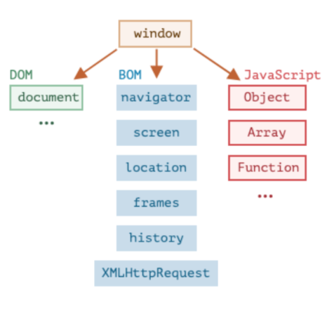

>[success] # window

1. 在**ECMAScript规范** 中提出要提供全局变量，在浏览器中为`window`,在node环境中为`global`,但现在为统一目前已经指定了对应的标准，称之为**globalThis**
2. var定义的变量会被添加到window对象
3. window默认给我们提供了全局的函数和类：setTimeout、Math、Date、Object等