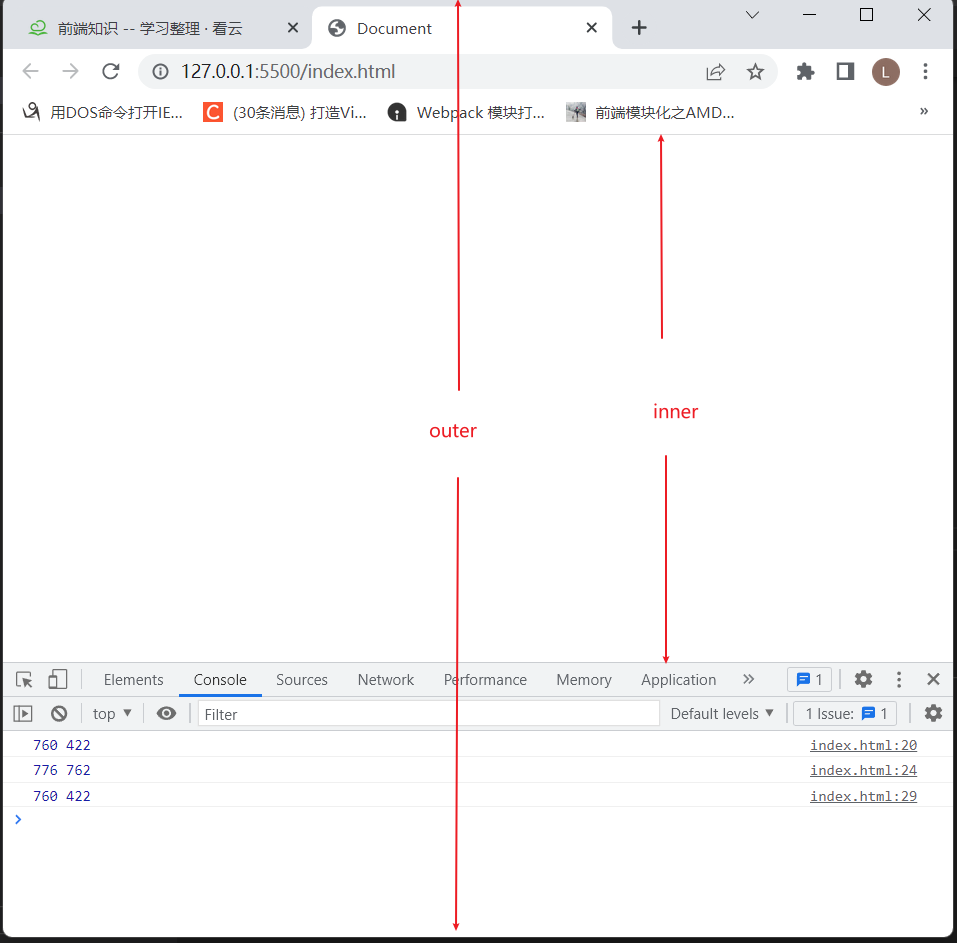

>[success] # windows -- 大小和滚动

>[danger] ##### 浏览器窗口大小获取
1. **innerWidth、innerHeight**：获取window窗口的宽度和高度（包含滚动条）
2. **outerWidth、outerHeight**：获取window窗口的整个宽度和高度（包括调试工具、工具栏）
3. **documentElement.clientHeight、documentElement.clientWidth**：获取html的宽度和高度（不包含滚动条）**说明** `documentElement` 是`<html>` 标签因此获取`html`标签的宽度和高度也相当于获取了window 窗口的宽度和高度
~~~
<!DOCTYPE html>
<html lang="en">
	<head>
		<meta charset="UTF-8" />
		<meta http-equiv="X-UA-Compatible" content="IE=edge" />
		<meta name="viewport" content="width=device-width, initial-scale=1.0" />
		<title>Document</title>
		
	</head>
	<body>
		
	</body>
</html>

~~~

>[danger] ##### 滚动
1. **scrollX**：X轴滚动的位置 或 **pageXOffset**

2. **scrollY**：Y轴滚动的位置 或 **pageYOffset**
~~~
<!DOCTYPE html>
<html lang="en" style="height: 200%">
	<head>
		<meta charset="UTF-8" />
		<meta http-equiv="X-UA-Compatible" content="IE=edge" />
		<meta name="viewport" content="width=device-width, initial-scale=1.0" />
		<title>Document</title>
		
	</head>
	<body>
		
	</body>
</html>

~~~
>[danger] ##### 滚动到指定位置
1. **方法 scrollBy(x,y)** ：将页面滚动至 相对于当前位置的 (x, y) 位置；
2. **方法 scrollTo(pageX,pageY)** 将页面滚动至 绝对坐标