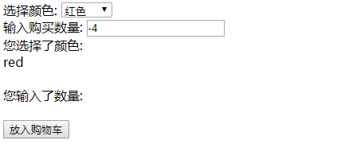

>[success] # 书中的第二个案例 -- 一个购买手机的案例
~~~
1.一个手机购买的页面，通过用户选择一些在商城关于手机的信息，来提示用户手机
还有还剩多少
~~~

>[info] ## 传统思路的代码实现
~~~
1.最简单最传统的思路就是，去监听颜色的'下拉框触发的onchange事件'，输入'购买数量框的onInput事件'
,这些事件改变的时候走我们的判断逻辑，来判断手机库存的量
2.但这时候有个问题，如果后续我们希望给用户一个可以选择手机内存的选项，你需要依旧做一个事去监听
选择手机内存的触发事件来判断手机的内存，这样维护起来必然不是我们想要的
~~~
~~~
<!DOCTYPE html>
<html lang="en">
<head>
    <meta charset="UTF-8">
    <title>Title</title>
</head>
<body>

    选择颜色:
    <select id="colorSelect">
        <option value="">请选择</option>
        <option value="red">红色</option>
        <option value="blue">蓝色</option>
    </select>

 

     输入购买数量:
     <input type="text" id="numberInput"/>
 

您选择了颜色: 

 
您输入了数量: 

 
<button id="nextBtn" disabled="true">请选择手机颜色和购买数量</button>
</body>

</html>
~~~
>[info] ## 利用中介者模式来实现
~~~
1.现在我们来引入中介者对象，所有的节点对象只跟中介者通信。当下拉选择框 colorSelect、
memorySelect 和文本输入框 numberInput 发生了事件行为时，它们仅仅通知中介者它们被改变了，
同时把自身当作参数传入中介者，以便中介者辨别是谁发生了改变。
2.所有事情都交给中介者对象来完成，这样一来，无论是修改还是新增节点，都只需要改动中介者对象里的代码。
~~~
>[danger] ##### 代码实现（中介者）
~~~
var goods = { // 手机库存
    "red|32G": 3,
    "red|16G": 0,
    "blue|32G": 1,
    "blue|16G": 6
};
var mediator = (function(){
    var colorSelect = document.getElementById( 'colorSelect' ),
        memorySelect = document.getElementById( 'memorySelect' ),
        numberInput = document.getElementById( 'numberInput' ),
        colorInfo = document.getElementById( 'colorInfo' ),
        memoryInfo = document.getElementById( 'memoryInfo' ),
        numberInfo = document.getElementById( 'numberInfo' ),
        nextBtn = document.getElementById( 'nextBtn' );
    return {
        changed: function( obj ){
            var color = colorSelect.value, // 颜色
                memory = memorySelect.value,// 内存
                number = numberInput.value, // 数量
                stock = goods[ color + '|' + memory ]; // 颜色和内存对应的手机库存数量
            if ( obj === colorSelect ){ // 如果改变的是选择颜色下拉框
                colorInfo.innerHTML = color;
            }else if ( obj === memorySelect ){
                memoryInfo.innerHTML = memory;
            }else if ( obj === numberInput ){
                numberInfo.innerHTML = number;
            }
            if ( !color ){
                nextBtn.disabled = true;
                nextBtn.innerHTML = '请选择手机颜色';
                return;
            }
            if ( !memory ){
                nextBtn.disabled = true;
                nextBtn.innerHTML = '请选择内存大小';
                return;
            }
            if ( ( ( number - 0 ) | 0 ) !== number - 0 ){ // 输入购买数量是否为正整数
                nextBtn.disabled = true;
                nextBtn.innerHTML = '请输入正确的购买数量';
                return;
            }
            nextBtn.disabled = false;
            nextBtn.innerHTML = '放入购物车';
        }
    }
})();
~~~
>[danger] ##### 代码调用
~~~
// 事件函数：
colorSelect.onchange = function(){
     mediator.changed( this );
};
memorySelect.onchange = function(){
     mediator.changed( this );
};
numberInput.oninput = function(){
     mediator.changed( this );
}; 
~~~
 