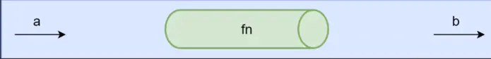
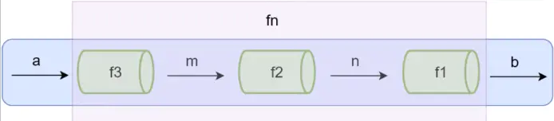

[TOC]
>[success] # 函数组合
~~~
1.纯函数和柯里化很容易写出洋葱代码 h(g(f(x)))，形成层级嵌套的效果，举个例子：
    1.1.获取数组的最后一个元素再转换成大写字母， _.toUpper(_.first(_.reverse(array)))
2.想解决这种层级不停函数嵌套的形式，就可以使用'函数组合'：
    2.1.函数组合可以让我们把细粒度的函数重新组合生成一个新的函数
    2.2.如果一个函数要经过多个函数处理才能得到最终值，这个时候可以把中间
       过程的函数合并成一个函数
    2.3.把中间过程形成的函数就像是数据的管道，函数组合就是把这些管道连接起来，
        让数据穿过多个管道形成最终 结果
    2.4.函数组合默认是从右到左执行
~~~
[函数的组合文章推荐](https://www.dazhuanlan.com/2019/12/17/5df7df78c7e15/?__cf_chl_jschl_tk__=5686af4f074081fa844e5a2ded6cc22f6d401792-1602936568-0-ATGze-SfaXtb9rvAD8Oc41ZRwpV1HkARNrmVxVKG_4e3qe0rBro9V5XKaenUd6CZqKS1gzNSuLO8keFSRpLUTpW1NenDSbiUsYj5pdDiQWXxL5tvqFza4KAT77fTG6gC2PRF8hkFaoJNu2iiufnb1jGQZeLLSX3dGQ54v018DYGavHNtomOmUO7hCupaaPQ4PIUzg135IeHEBbgBjq7Xojfce196OQ62O2PtXT7NoxOvGftf5HBJBaRyFv8uTelwgbDKUs5WN3CogSoJbymgK-WX2JLklfn4dr5oGqubmoUz4A25zMjcjIETLTJfQtIgpg)
[文章推荐](https://juejin.im/post/6844903910834962446#heading-0)

>[info] ## 管道概念
~~~
1.现在有一个需求先转成大写，在倒叙展示字符串，正常的话代码就像案例一一样，
封装了一个'toUpperAndReverse' 并且将整个逻辑全部都附加进去，换一种思路如果使用的是
函数式，我们将'split' ,'reverse','join' 这些执行步骤封装成函数式，形成拼图形式的组合，
但又不想形成洋葱模型形式的代码，我们就需要定义一个'管道'来帮忙处理
2.案例二，尝试使用案例一引申提出的假设，将代码重构
3.通过案例二这种不停的分割写法，在定义感觉上反而感觉更加麻烦了，但是好处就是配合函数
式编程让整个条件的组合情况变得更多
~~~
[关于链式和组合](https://zhuanlan.zhihu.com/p/60768220)
>[danger] ##### 结合律
~~~
1.结合律死一个数学的概念指在一个包含有二个以上的可结合运算子的表示式，
只要算子的位置没有改变，其运算的顺序就不会对运算出来的值有影响公式表示：'a+(b+c)=(a+b)+c'
2.函数组合还要符合结合律，也就是这个管道函数'compose'传参要符合结合律的形式举个列子：
compose(f, compose(g, h))
// 等同于
compose(compose(f, g), h)
// 等同于
compose(f, g, h)
因此组合函数必须是纯函数
~~~
>[danger] ##### 案例一

~~~
let str = 'jspool';

// 先转成大写，在倒叙数组的形式展示
function toUpperAndReverse(str) {
    let upperStr = str.toUpperCase();
    return upperStr.split('').reverse().join('');
}

console.log(toUpperAndReverse(str)) // LOOPSJ
~~~
>[danger] ##### 案例二

~~~
1.案例二不在进行大写这一步
2.管道的参数遵守'从右到左执行'
~~~
~~~
const split = (format) => (str) => str.split(format)
const reverse = (list) => list.reverse()
const join = (format) => (str) => str.join(format)

// 组合函数 
function compose(f, g, z) {
    return function (x) {
        // 先忽略洋葱形式
        return f(g(z(x)))
    }
}

const x = join('')
const z = split('')

// 使用我们的管道
const fn = compose(x, reverse, z)
console.log(fn(str)) // loopsj
~~~
>[info] ## Lodash函数组合 
~~~
1.Lodash 作为函数式的代表也有一个函数组合的方法'flow()' 和 'flowRight()'
    1.1.flow() 是从左到右运行
    1.2.flowRight() 是从右到左运行，使用的更多一些
~~~
>[danger] ##### 使用效果
~~~
const _ = require('lodash')

const reverse = arr => arr.reverse()
const first = arr => arr[0]
const toUpper = s => s.toUpperCase()

const f = _.flowRight(toUpper, first, reverse)
console.log(f(['one', 'two', 'three']))
~~~
>[danger] ##### lodash 在组合函数中使用结合律效果
~~~
const _ = require('lodash')
// const f = _.flowRight(_.toUpper, _.first, _.reverse)
// const f = _.flowRight(_.flowRight(_.toUpper, _.first), _.reverse)
const f = _.flowRight(_.toUpper, _.flowRight(_.first, _.reverse))
console.log(f(['one', 'two', 'three']))
~~~
>[info] ## 实现一个自己的管道函数
~~~
1.上面我们自己的管道是通过洋葱的形式，写死的，这个就要手动实现一个，像lodash一样
的动态的管道函数
~~~
>[danger] ##### 代码的实现
~~~
1.注意组合函数，一般默认是'从右往左',下面就有两种思路实现一种是反转数组配合'reduce',
另外一种是配合'reduceRight'直接从右往左
2.这里还要对'reduce'做个说明，首先函数式的原因是有输入和输出的，因此 acc累加器上一次调用回调函数
拿到的结果实际是之前回调 处理过的返回值，其实就是一个扁平化的洋葱
~~~
~~~

const split = (format) => (str) => str.split(format)
const reverse = (list) => list.reverse()
const join = (format) => (str) => str.join(format)

const x = join('')
const z = split('')

// 仿写一个函数组合 的管道

function compose(...fns) {
    return function (val) {
        // 从右往往左 先反转 如果不想反转直接使用reduceRight
        return fns.reverse().reduce((acc, fn) => {
            return fn(acc);
        }, val)
    }
}
var fn = compose(x, reverse, z)
console.log(fn(str)) // loopsj

// es6
// const compose = (...args) => value => args.reverse().reduce((acc, fn) => fn(acc), value)
~~~
>[info] ## 调试
~~~
1.现在将原本捏合在一起的代码通过 函数式的形式进行了重新切割编程了一个个函数式，整体的调试
如果是在有源码的情况，可以在每个函数式的代码中增加console，但如果想'lodash' 这种现成封装好的
库需要用另外一种思路
2.首先思考在管道中执行的代码顺序是从右往左一次执行，如果在对应的两者参数直接加一个打印的函数式
就可以将数据劫持来观察数据格式是否正确
~~~
>[danger] ##### 代码实现
~~~
1.下面实现了一个'trace'方法，这里要说明注意的是，为了能让trace 更加形象的标记出来对应函数打印的
'console.log',这里在定义的时候会传两个参数，但是问题来了，对应的管道中的函数只能接受一个参数，
在执行的时候就会出现代码错误，解决方法同样我们可以使用'函数的柯里化'，将一个多元函数变成一个
一元的函数来解决这种管道问题
~~~
~~~
let str = 'jspool';

// 柯里化函数
function curry(func) {
    return function curriedFn(...args) {
        // 如果实参小于形参那么就是返回回调函数
        if (args.length < func.length) {
            // 返回函数
            return function () {
                // 将之前函数的参数拼接回来
                return curriedFn(...args.concat(Array.from(arguments)))
            }
        }
        // 如果相等返回实际结果
        return func(...args)
    }
}
// 功能方法用来监控数据变化
const trace = curry((tag, v) => {
    console.log(tag, v)
    return v
})

const split = (format) => (str) => str.split(format)
const reverse = (list) => list.reverse()
const join = (format) => (str) => str.join(format)

const x = join('')
const z = split('')

// 仿写一个函数组合 的管道

function compose(...fns) {
    return function (val) {
        // 从右往往左 先反转 如果不想反转直接使用reduceRight
        return fns.reverse().reduce((acc, fn) => {
            return fn(acc);
        }, val)
    }
}
var fn = compose(x, trace('reverse'), reverse, trace('z'), z)
console.log(fn(str)) // loopsj
~~~