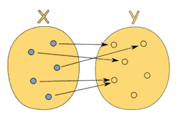
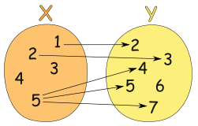

>[success] # 纯函数
1. **纯函数**存在于函数式编程，js 符合函数式编程的范式，因此也具备**纯函数的概念**
2. 纯函数定义：
2.1. 相同的**输入**永远会得到相同的**输出**，站在数学的角度来说的(用来描述输入和输出之间的关系)，**y = f(x)**，简单的说就是对于每套输入，都存在一个输出。一个函数会接受输入，并返回相对应的输出并且相同输入总是会**返回相同的输出**
* 纯函数相同的输入永远会得到相同的输出

* 就不是函数输入值 5 指向了多个输出，注意他连函数都不是

2.2. **函数的输出和输入**值以外的其他**隐藏信息或状态无关**，也和由I/O设备产生的外部输出无关
2.3. 该函数不能有语义上可观察的**函数副作用**

* **总结**
* 一个函数只有在给出相同输入，总是产生相同输出的时候，才是纯函数
* 函数在执行过程中，不能产生副作用

>[danger] ##### 副作用
1. **副作用**（side effect）是医学的一个概念，经常说吃什么药本来是为了治病，可能会产生一些其他的**副作用**；在计算机表示在执行**一个函数时**，除了**返回函数值之外**，还对调用函数产生了**附加的影响**，比如**修改了全局变量**，**修改参数或者改变外部的存储**
2. **副作用**也使得方法通用性下降**不适合扩展和可重用性**，同时副作用会给程序中带来安全隐患给程序带来不确定性，但是副作用不可能完全禁止，尽可能控制它们在可控范围内发生。
3. 常见的副作用**配置文件,数据库,用户输入** 这些外部因素
~~~
// 不纯的
let mini = 18 // 外部不可控的

function checkAge(age) {
    return age >= mini
}
// 纯的
function checkAge(age) {
    let mini = 18 // 在内部可控的
    return age >= mini
}
~~~
~~~
let totalApples = 5
const applesBought = 5
const addApplesToTotal = (num) => {
	totalApples = applesBought + totalApples + num
	return totalApples
}

// 每次输入相同 输出却不同不是纯函数
console.log(addApplesToTotal(10)) // 20
console.log(addApplesToTotal(10)) // 35

~~~
>[danger] ##### slice 和 splice

1. slice 输入0，3无论调用多少次返回值的结果都是一样的，但是splice就不是这样
~~~
let numbers = [1, 2, 3, 4, 5]
// 纯函数
numbers.slice(0, 3)// => [1, 2, 3]
numbers.slice(0, 3)// => [1, 2, 3]
numbers.slice(0, 3)// => [1, 2, 3]

// 不纯的函数
numbers.splice(0, 3)// => [1, 2, 3]
numbers.splice(0, 3)// => [4, 5]
numbers.splice(0, 3)// => []
~~~
>[info] ## 纯函数好处
1. 保证了函数的纯度，只是单纯实现自己的业务逻辑即可，不需要关心传入的内容是如何获得的或者依赖其他的外部变量是否已经发生了修改
2. 你确定你的输入内容不会被任意篡改，并且自己确定的输入，一定会有确定的输出
3. **可缓存**因为纯函数，相同的输入总是对应相同的输出，因此我们可以利用这个做缓存,如果10 = f(5)输入5会得到10，那么下次输入5的时候经过上次已经知道结果是10，可以变相跳过函数中间过程
4. **可测试**纯函数让测试更方便，因为不受外界干扰
>[danger] ##### 做一个缓存函数用来 -- 缓存纯函数

~~~
function memoize(f) {
    let cache = {}
    return function () {
        let arg_str = JSON.stringify(arguments)
        cache[arg_str] = cache[arg_str] || f.apply(f, arguments)
        return cache[arg_str]
    }
}

// 需要定义一个纯函数
// 相同的输入一定会有相同的输入
function getArea(r) {
    console.log('如果是输入相同我执行一次，因为下次走了缓存')
    return Math.PI * r * r
}

// 用缓存的函数 缓存一下这个纯函数
let getAreaWithMemory = memoize(getArea)

console.log(getAreaWithMemory(5))
console.log(getAreaWithMemory(5))

// 打印结果：
如果是输入相同我执行一次，因为下次走了缓存
78.53981633974483
78.53981633974483
~~~
>[info] ## 纯函数在开发过程中
* 下面函数都依赖**el**元素，如果环境改变了 此时函数的结果也会更改，需要将其构建一个严格的纯函数，是具有**确定性**、**无副作用**，**幂等**的特点，不管什么时候调用，只要参数确定，返回值就确定

~~~
export function setStyle(el, key, value) {
  el.style[key] = value;
}

export function setStyles(els, key, value) {
  els.forEach(el => setStyle(el, key, value));
}
~~~
* 虽然`setStyle`依然不是纯函数，但是`batch`是一个纯函数，想具备类似功能函数只要去调用`batch`
~~~
function batch(fn) {
  return function (subject, ...args) {
    if(Array.isArray(subject)) {
      return subject.map((s) => {
        return fn.call(this, s, ...args);
      });
    }
    return fn.call(this, subject, ...args);
  };
}

const setStyle = batch((el, key, value) => {
  el.style[key] = value;
});

const items = document.querySelectorAll('li:nth-child(2n+1)');

setStyle([...items], 'color', 'red');
~~~
* 这种封装一次，和下面直接这种将需求写死有什么区别
~~~
function setStyle(el, key, value) {
  if(Array.isArray(el)) {
    return el.forEach((e) => {
      setStyle(e, key, value); // 直接写死进行调用
    });
  }
  el.style[key] = value;
}
~~~
* 区别在于实际工作中不仅仅只会set 赋值操作，也可能有remove 删除操作等等，我们代码可能就变成下面
~~~
function addState(el, state) {
  if(Array.isArray(el)) {
    return el.forEach((e) => {
      addState(e, state);
    });
  }
  removeState(el, state);
  el.className = el.className ? `${el.className} ${state}` : state;
}

function removeState(el, state) {
  if(Array.isArray(el)) {
    return el.forEach((e) => {
      removeState(e, state);
    });
  }
  el.className = el.className.replace(new RegExp(`(^|\\s)${state}(\\s|$)`, 'g'), '');
}
~~~
* 相比较 同一抽象后进行处理的代码
~~~
// 统一的批量化处理
addState = batch(addState);
removeState = batch(removeState);
~~~
>[danger] ##### 参考
[前端工程师进阶 10 日谈](https://juejin.cn/book/6891929939616989188)