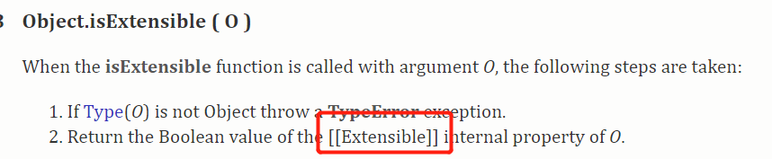
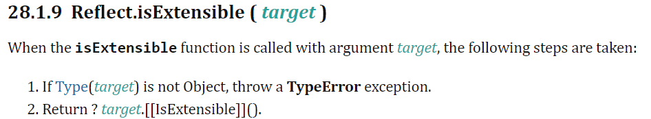

>[success] # 反射和代理 -- Reflect/ Proxy
~~~
1.在了解这两个之前需要知道'JavaScript' 规范以及引擎都带有一系列'内部方法',
例如'[[Get]]' '[[Set]]' '[[propertype]]' 等这种用双'[]'包裹的属性，这类属性被叫做
'内部槽和内部方法(Internal slots)',它们不是对象属性不能作为 JavaScript 代码的
属性直接访问,ECMAScript 引擎中的每个对象都与一组定义其运行时行为的内部方
法相关联。这些内部方法不是 ECMAScript 语言的一部分。它们由本规范定义，纯粹
是为了说明目的。但是，ECMAScript 实现中的每个对象都必须按照与其关联的内部
方法所指定的行为,简单的说js 是运行在引擎上这些引擎可能是通过其他语言或者其他方式
实现的，当在调用对象属性例如'Object.getPrototype'他其实需要去映射到引擎对'内部属性'
引擎会调用 '[[GetPrototypeOf]]' 内部方法，并且返回 '[[Prototype]]' 内插槽的值,不同的引擎
可能'内部插槽和内部方法'实现不一样他们都需接受相同规范规则

2.简单说内部插槽和内部方法有助于实现对象的一致行为和实现者（JavaScript引擎）可
以通过查看规范来正确提供这些实现,这些属性或方法由 JavaScript 引擎实现，但它们是
从运行时抽象出来的，因此您将无法像普通属性一样在对象上访问它们

3.下表总结了规范使用的一些'内部插槽和内部方法'
~~~
| 内部方法 | 签名 | 描述 |
| --- | --- | --- |
| \[\[GetPrototypeOf\]\] | ( ) → Object / Null | 确定为该对象提供继承属性的对象。`null`表示没有继承属性。[Object.getPrototypeOf()](https://developer.mozilla.org/zh-CN/docs/Web/JavaScript/Reference/Global_Objects/Object/GetPrototypeOf) |
| \[\[SetPrototypeOf\]\] | (Object / Null) → Boolean | 将此对象与提供继承属性的另一个对象相关联。传`null`表示没有继承属性。返回`true`表示操作成功，返回`false`表示操作失败。（[Object.setPrototypeOf()](https://developer.mozilla.org/zh-CN/docs/Web/JavaScript/Reference/Global_Objects/Object/setPrototypeOf)） |
| \[\[IsExtensible\]\] | ( ) → Boolean | 确定是否允许向该对象添加其他属性。（对应[Object.isExtensible()](https://developer.mozilla.org/zh-CN/docs/Web/JavaScript/Reference/Global_Objects/Object/isExtensible)） |
| \[\[PreventExtensions\]\] | ( ) → Boolean | 控制新属性是否能被加入对象内。返回`true`表示操作成功，返回`false`表示操作失败。（PS：如果为`false`，即使`[[IsExtensible]]`为`true`，添加新属性操作也会失败。[Object.preventExtensions()](https://developer.mozilla.org/zh-CN/docs/Web/JavaScript/Reference/Global_Objects/Object/preventExtensions)） |
| \[\[GetOwnProperty\]\] | (propertyKey) → Undefined /[Property Descriptor](https://github.com/lizhongzhen11/lizz-blog/issues/48#PropertyDescriptor) | 返回此对象自身属性的属性描述符，如果没有对应的属性，返回`undefined`。[Object.getOwnPropertyDescriptor()](https://developer.mozilla.org/zh-CN/docs/Web/JavaScript/Reference/Global_Objects/Object/getOwnPropertyDescriptor)和[Object.getOwnPropertyDescriptors()](https://developer.mozilla.org/zh-CN/docs/Web/JavaScript/Reference/Global_Objects/Object/getOwnPropertyDescriptors) |
| \[\[DefineOwnProperty\]\] | (propertyKey, PropertyDescriptor) → Boolean | 创建或更改自己的属性，该属性对应传入的`propertyKey`，属性描述符对应传入的`PropertyDescriptor`。如果操作成功返回`true`，否则返回`false`。（对应[Object.defineProperty()](https://developer.mozilla.org/zh-CN/docs/Web/JavaScript/Reference/Global_Objects/Object/defineProperty)和[Object.defineProperties()](https://developer.mozilla.org/zh-CN/docs/Web/JavaScript/Reference/Global_Objects/Object/defineProperties)） |
| \[\[HasProperty\]\] | (propertyKey) → Boolean | 返回一个布尔值，该值指示此对象是否其自身已具有或继承的键为传入的`propertyKey`的属性。（对应[Object.prototype.hasOwnProperty()](https://developer.mozilla.org/zh-CN/docs/Web/JavaScript/Reference/Global_Objects/Object/hasOwnProperty)） |
| \[\[Get\]\] | (propertyKey, Receiver) → any | 返回对象中属性名为参数`propertyKey`的值。如果必须执行ECMAScript代码来找到属性值，参数`Receiver`会被当作`this`来用。 |
| \[\[Set\]\] | (propertyKey, value, Receiver) → Boolean | 将参数`value`设置为对象中属性名为参数`propertyKey`的值。参数`Receiver`会被当作`this`来用。如果操作成功返回`true`，否则返回`false`。 |
| \[\[Delete\]\] | (propertyKey) → Boolean | 删除对象中属性名为参数`propertyKey`的属性。删除成功返回`true`，否则返回`false`。（类似js中的`delete`关键字） |
| \[\[OwnPropertyKeys\]\] | ( ) →[List](https://github.com/lizhongzhen11/lizz-blog/issues/48#list)of propertyKey | 返回一个列表，其元素都是对象自己的所有属性键。（[Object.getOwnPropertyNames()](https://developer.mozilla.org/zh-CN/docs/Web/JavaScript/Reference/Global_Objects/Object/getOwnPropertyNames)和[Object.getOwnPropertySymbols()](https://developer.mozilla.org/zh-CN/docs/Web/JavaScript/Reference/Global_Objects/Object/getOwnPropertySymbols)） |

* 函数对象所支持的其他基本内部方法：

| 内部方法 | 签名 | 描述 |
| --- | --- | --- |
| \[\[Call\]\] | (any, a List of any) → any | 执行与此对象关联的代码。通过函数调用表达式调用。第一个参数`any`表示`this`，`a List of any`表示传入的参数列表。实现此内部方法的对象是可调用的。 |
| \[\[Construct\]\] | (a List of any, Object) → Object | 创建一个对象。通过`new`或`super`操作调用。`a List of any`表示包含运算符参数的列表。第二个参数`Object`表示`new`操作的初始应用对象。实现该内部方法的对象称为`constructors`。函数对象不一定要有`constructor`并且非构造函数对象没有`[[Construct]]`内部方法。 |
>[info] ## Reflect
~~~
1.'Reflect'对象不是函数对象。它没有'[[Construct]]'内部方法。不能将Reflect对象与new运
算符一起用作构造函数。Reflect对象也没有'[[Call]]'内部方法。不能将Reflect对象作为函数
调用,因此在使用时候只是调用 'Reflect' 的静态方法,使用'Reflect' 往往是'Reflect.静态方法(target,其他参数)'
这样'target'对象的一些内部方法或者内插槽的属性就会被访问,Reflect 实际上是所有那些仅通过 JavaScript 
引擎内部可用的“内部方法”的集合

2.如果你已经使用过'Reflect' 和 'Object' 在对'内部方法或者内插槽'上很多地方能做的事情都类似，出于向后兼
容的目的，Object上的静态方法不太可能消失，为什么会单独出现'Relfect',使用单个对象来容纳这些方法是保持 JavaScript 其余部分整洁的

3.如图两个实现说明可以看出实际映射对应的'内插槽'
~~~
* Object 的isExtensible实现说明

* Reflect 的isExtensible实现说明

>[info] ## Proxy
~~~
1.用法上'new Proxy(target, handler)',其中'handler' 这个参数构造对象上的属性其实都对应Reflect
proxy = new Proxy({}, {
  apply: Reflect.apply,
  construct: Reflect.construct,
  defineProperty: Reflect.defineProperty,
  getOwnPropertyDescriptor: Reflect.getOwnPropertyDescriptor,
  deleteProperty: Reflect.deleteProperty,
  getPrototypeOf: Reflect.getPrototypeOf,
  setPrototypeOf: Reflect.setPrototypeOf,
  isExtensible: Reflect.isExtensible,
  preventExtensions: Reflect.preventExtensions,
  get: Reflect.get,
  set: Reflect.set,
  has: Reflect.has,
  ownKeys: Reflect.ownKeys,
});

~~~
>[info] ## 参考
[tc39.es插槽定义](https://tc39.es/ecma262/#sec-object-internal-methods-and-internal-slots)
[ecmascript 6 - Are internal slot and internal methods actually implemented by JavaScript engines? - Stack Overflow](https://stackoverflow.com/questions/60119316/are-internal-slot-and-internal-methods-actually-implemented-by-javascript-engine/60123171#60123171)
[【译】JavaScript中的 "Internal Slots" 和 "Internal Methods" 到底是什么？](https://juejin.cn/post/7059344609473724430)