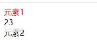
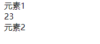
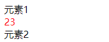

>[success] # 伪元素选择器
* `:nth-child(n)` ： 匹配属于其父元素的第 N 个子元素，不论元素的类型
  * `:nth-child(1)`，是父元素中的**第1个子元素**
  * ` :nth-child(2n)`,是父元素中的第**偶数个子元素**,跟`:nth-child(even)同义`
  * `:nth-child(2n + 1)`,是父元素中的第**奇数个子元素**,跟`:nth-child(odd)同义`
  * `nth-child(-n + 2)`,代表前**2个子元素**
* `:nth-last-child()`的语法跟:nth-child()类似，不同点是:nth-last-child()从**最后一个子元素开始往前计数**
* `nth-of-type()`计数时只计算**同种类型的元素**
* `nth-last-of-type()`从最后一个这**种类型的子元素开始往前计数**

*****
* 案例说明 -- 下面案例中 找到`outer` 元素下第一个子元素且不限制类型，因此span 标签字体颜色变成红色
~~~html
<!DOCTYPE html>
<html lang="en">
<head>
	<meta charset="UTF-8">
	<meta http-equiv="X-UA-Compatible" content="IE=edge">
	<meta name="viewport" content="width=device-width, initial-scale=1.0">
	<title>Document</title>
	
</head>
<body>
	

		元素1
		
23

		
元素2

	

</body>
</html>
~~~

* 如果限制元素 -- `outer` 下第一个元素且为div 的标签字体颜色变红，因为第一个子元素为span 标签因此没有变红
~~~html
<!DOCTYPE html>
<html lang="en">
<head>
	<meta charset="UTF-8">
	<meta http-equiv="X-UA-Compatible" content="IE=edge">
	<meta name="viewport" content="width=device-width, initial-scale=1.0">
	<title>Document</title>
	
</head>
<body>
	

		元素1
		
23

		
元素2

	

</body>
</html>
~~~

* 想指定计算同类元素`:nth-of-type()`,整体用法规则和 **:nth-child()类似**，下面案例中意思是指定 `outer` 下类型是div的第一个子元素字体变红
~~~html
<!DOCTYPE html>
<html lang="en">
<head>
	<meta charset="UTF-8">
	<meta http-equiv="X-UA-Compatible" content="IE=edge">
	<meta name="viewport" content="width=device-width, initial-scale=1.0">
	<title>Document</title>
	
</head>
<body>
	

		元素1
		
23

		
元素2

	

</body>
</html>
~~~

>[danger] ##### root 和 empty
~~~
1. `:root`，根元素，就是HTML元素
2  `:empty` 代表里面完全空白的元素,当元素内部为空例如

~~~
* 案例
~~~
:root{
   color: brown;
 }
'等同于'
html{
    color: brown;
}
~~~
>[danger] ##### 否定伪类
* `:not(x)`表示**除x以外的元素**,x 表示为元素选择器、通用选择器、属性选择器、类选择器、id选择器、伪类
