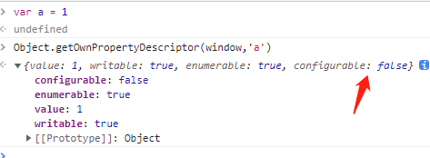

>[success] # delete -- 运算符
~~~
1.首先delete 会调用引擎内部的[[Delete]]方法 (PropertyName) 他主要做的是：从对象中移除指定的属性
~~~
* 推荐文章
[kangax 文章讲解](http://perfectionkills.com/understanding-delete/)
[mdn 中的delete](https://developer.mozilla.org/zh-CN/docs/Web/JavaScript/Reference/Operators/delete)
>[info] ## 通过MDN 了解 -- delete
~~~
1.MDN中对delete 操作符'解释'是：用于删除对象的某个属性
2.'语法'为'delete expression'，其中'expression' 表示的是某个属性的引用
3.对于所有情况都是true，除非属性是一个自己不可配置的属性，在这种情况下，非严格模式返回 false。
简单的说就是删除成功返回true 失败false
4.'异常'在严格模式下，如果是属性是一个自己不可配置的属性，会抛出'Global_objects/SyntaxError'。
简单的说：会抛出一个语法错误（ SyntaxError）而不是返回false。
~~~
>[danger] ##### MDN 文档中对delete 几种考虑情况的说明
~~~
1.删除不存在的属性，delete 虽然不起任何作用但是返回的是true
2.delete操作只会在自身的属性上起作用，即当前对象的原型上和当前对象有相同属性名，
删除属性之后会使用原型对象上的属性
3.不能删除var 变量声明的属性不能从全局作用域或者函数中删除，简单的说var声明的变量
delete 删除不掉
    3.1. 在对象(object)中的函数是能够用delete操作删除的
4.任何用let或const声明的属性不能够从它被声明的作用域中删除    
5.不可设置的(Non-configurable)属性不能被移除。这意味着像Math, Array, Object内置对象的属性以
及使用Object.defineProperty()方法设置为不可设置的属性不能被删除。
~~~
>[danger] ##### 对上面的五条逐一案例分析
* 删除不存在的属性，delete 虽然不起任何作用但是返回的是true
~~~
var test = {
    age:10,
    name:'wang'
}
console.log(delete test.age) // true
console.log(delete test.sex) // 删除一个不存在的属性返回的true

console.log(test) // {name: "wang"}
~~~
* delete操作只会在自身的属性上起作用
~~~
var Test = function () {
    this.name = 'wang'
    this.age = '10'
}
Test.prototype.age = '20'
Test.prototype.sex = '男'

var test = new Test()
console.log(test.age) // 10
console.log(delete test.age) // true
console.log(delete test.sex) // true
console.log(test.age) // 20
console.log(test.sex) // 男
// 再次删除也不能删除指向原型链的
console.log(delete  test.age) // true

console.log(test.age) // 20
// 从原型上删除属性
delete Test.prototype.sex
~~~
* 不能删除var / let /const 定义的属性 和 函数
~~~
// 在全局作用域创建 adminName 属性
adminName = 'xyz';            

// 在全局作用域创建 empCount 属性
// 因为我们使用了 var，它会标记为不可配置。同样 let 或 const 也是不可配置的。
var empCount = 43;

// adminName 是全局作用域的一个属性。
// 因为它不是用 var 创建的，所在可以删除。
// 因此，它是可配置的。
delete adminName;       // 返回 true

// 相反，empCount 是不可配置的， 
// 因为创建它时使用了 var。
delete empCount;       // 返回 false 

// -------------- 函数 -----------
function func() {}
console.log(delete func) // false
console.log((func))
~~~

* 可以删除Object 中的属性
~~~
console.log(delete Object.is) // true 这里is不是内置对象的属性，虽然它是Object 一个属性方法
Object.is(NaN,NaN) // 报错提示没有这个方法
// 实际常用的删除自己定义属性
var test = {
    name:'wang'
}
delete test.name // true
~~~
* 不可设置的(Non-configurable)属性、内置对象的属性不能被移除
[关于js中内置对象文章参考](https://segmentfault.com/a/1190000011467723)

~~~
console.log(delete Object.prototype) // false
console.log(delete Math.E) // false

// Object.defineProperty()方法设置为不可设置的属性不能被删除
var obj = {name: 'John'};
Object.defineProperty(obj, "key", {
  configurable: false,
  value: "static"
});
delete obj.name; // true
delete obj.key // false
~~~
>[danger] ##### 关于更多 那些是否可以删除的文章
[关于delete 删除的更多案例](https://www.cnblogs.com/snandy/archive/2013/03/06/2944815.html)
>[info] ## 通过kangax 文章更进一步了解
* kangax  文章中对三种可执行的代码分类
~~~
1.ECMAScript中有3种类型的可执行代码：'Global code', 'Function code','Eval code'。这些类型在某种程度上是自我
描述的，但这里有一个简短的概述：
    1.1当源文本被视为程序时，它将在全局范围内执行，并被视为'Global code'。在浏览器环境中，SCRIPT元素的内
容通常被解析为程序，因此被评估为'Global code'。
    1.2.直接在函数中执行的任何操作都被视为'Function code'。在浏览器中，
通常将事件属性的内容
（例如）解析为'Function code'。
    1.3.将提供给内置eval函数的文本解析为'Eval code'。
~~~
* 对kangax  属性里的属性讲解
~~~
1.kangax  文章中讲到每个属性都都会具有下面说的的属性中0个或多个属性组成分别是是：
  'ReadOnly' ,'DontEnum','DontDelete','Internal' 依次为'只读','不可枚举'，'不可删除'，'内部'
~~~
>[danger] ##### kangax  文章中举的案例为什么隐式变量可以删除/var全局变量不可以
~~~
var GLOBAL_OBJECT = this;

/* `foo`是一个全局对象的属性。
    它是通过变量声明创建的，所以有DontDelete属性。
    这就是它不能被删除的原因 */
var foo = 1;
delete foo; // false
typeof foo; // "number"

/*  `bar`是一个全局对象的属性。
    它是通过函数声明创建的，所以有DontDelete属性。
    这也是它不能被删除的原因。 */

function bar(){}
delete bar; // false
typeof bar; // "function"

/*  `baz`也是一个全局对象的属性。
    但是，它是通过属性分配创建的，因此没有DontDelete属性。
    这就是为什么它可以被删除。*/

GLOBAL_OBJECT.baz = 'blah';
delete GLOBAL_OBJECT.baz; // true
typeof GLOBAL_OBJECT.baz; // "undefined"

\* create global property via undeclared assignment; property has no DontDelete \*
bar = 2;
delete bar; // true
typeof bar; // "undefined"
~~~
>[danger] ##### 具有'DontDelete' 属性一些特殊内置对象属性
~~~
1.下面的案例解释了为什么特殊的内置对象的属性不能被移除
~~~
~~~
(function(){

    /* 不能删除 `arguments`, 因为它有 DontDelete属性 */

    delete arguments; // false
    typeof arguments; // "object"

    /* 不能删除 function's `length`; 因为它有 DontDelete属性 */

    function f(){}
    delete f.length; // false
    typeof f.length; // "number"

})();
~~~
* 函数的形参也是不可以删除的
~~~
  (function(foo, bar){

    delete foo; // false
    foo; // 1

    delete bar; // false
    bar; // 'blah'

  })(1, 'blah');
~~~
>[danger] ##### 在属性创建期间确定属性的（即未设置任何属性）。以后的分配不会修改现有属性的属性
~~~
/* foo 是用DontDelete创建的属性 */
function foo(){}

/* 以后的赋值不会修改属性，所以删除不掉即使foo 看起来是一个隐式全局变量 */
foo = 1;
delete foo; // false
typeof foo; // "number"

/* 但是给一个不存在的属性赋值，
   使用空属性创建该属性(因此不使用DontDelete) */

this.bar = 1;
delete bar; // true
typeof bar; // "undefined"
~~~
>[danger] ##### 总结一下
~~~
1.Variables（我的理解就是var） and function声明是Activation或Global objects的属性（他们是具有DontDelete）
2.属性中的'DontDelete'负责是否可以删除一个属性。当然也有mdn中说到的Object.defineProperty()
方法设置为不可设置的属性
3.Eval代码中的变量和函数声明总是在不使用DontDelete的情况下创建属性。因此他们是可以删除的
~~~