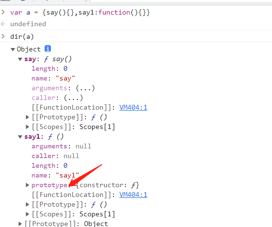

>[success] # 总结
~~~
1.大部分“函数数据类型”的值都具备“prototype（原型/显式原型）”属性，属性值本身是一个对象「浏览器会默认为其
开辟一个堆内存，用来存储实例可调用的公共的属性和方法」，在浏览器默认开辟的这个堆内存中「原型对象」有一个
默认的属性“constructor（构造函数/构造器）”，属性值是当前函数/类本身
2.具备prototype的函数
 2.1.普通函数（实名或者匿名函数）
 2.2.构造函数/类「内置类/自定义类」
 2.3.生成器函数 Generator
 .....
3.不具备prototype的函数
 3.1.箭头函数
 3.2.基于ES6给对象某个成员赋值函数值的快捷操作
~~~
[使用dir](https://blog.csdn.net/jeremyjone/article/details/93041139)
* 注对3.2的说明

>[info] ## function 和 Object
~~~
1.Object作为一个类（函数），是 Function类的实例
  Object instanceof Function => true 
 Object.__proto__ ===Function prototype 
2.Function作为一个类（函数），是 Function类的实例
  Function instanceof Function = true 
  Function. __proto__===Function prototype只有这样我们才可保证：所有函数都可调用 call/apply/bind等方法
3.函数也是对象Function作为一个普通对象，它是 Object类的实例
 Function instanceof Object => true 
 Function. __proto__. __proto__=Object.prototype 
4.Object作为一个普通对象，它是 Object类的实例
 Object instanceof Object => true 
 Object.__proto__.__proto__===Object. prototype只有这样，我们才可以保证，所有对象都可以调用
 Object.prototype上的属性方法「万物皆对象」

在es5 时候想定义静态方法时候其实也可以看出function 是对象举个例子
function AA(){}
AA.getAge = function(){}
~~~
 