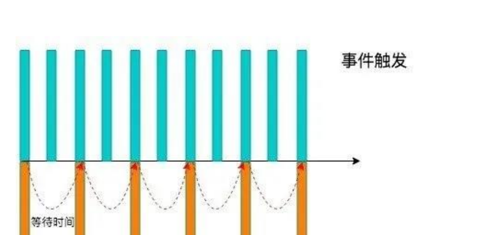

>[success] # 节流函数
1. js高级程序语言设计中的解释：**函数节流背后的思想是指某些代码不可以在没有间断的情况下连续重复执行**。
2. **实现的描述** **第一次调用函数，创建一个定时器，在指定的时间间隔之后运行代码**。当**第二次**调用该函数时，**它会清除前一次的定时器并设置另一个**。如果前一个定时器已经执行过了，这个操作就没有任何意义。然而，如果**前一个定时器尚未执行，其实就是将其替换为一个新的定时器**。目的是只有在执行函数的请求停止了一段时间之后才执行。
3. 节流意义 ，**实现函数的基本模式如下就是指连续触发事件但是在 n 秒中只执行一次函数。节流会减少函数的执行频率。**

4. 解决场景**当用户快速做某种操作的时候他的时间间隔短且不固定，节流就是按照固定节奏去，固定执行频率，而不再是取决于用户手速操作**，一般来说页面滚动可以使用节流，鼠标移动事件，用户频繁点击按钮操作
* 注：
'**节流**' 这个词理解成水龙头滴水，他是在规定时间有顺序的一滴一滴水，不会因为在不改变水龙头阀门大小（相当于定时器时间）的情况下而影响到他水流速度

5. 如图理解
5.1. 当事件触发时，会执行这个事件的响应函数， 如果这个事件会被频繁触发，那么节流函数会按照一定的频率来执行函数
5.2. 不管在这个中间有多少次触发这个事件，执行函数的频繁总是固定的

>[danger] ##### js 设计模式与开发实践的例子
~~~
1.下面的throttle 函数的原理是，将即将被执行的函数用setTimeout延迟一段时间执行。
如果该次延迟执行还没有完成，则忽略接下来调用该函数的请求。throttle函数接受2个参数，
第一个参数为需要被延迟执行的函数，第二个参数为延迟执行的时间
~~~
~~~
var throttle = function ( fn, interval ) {

    var __self = fn,    // 保存需要被延迟执行的函数引用
        timer,      // 定时器
        firstTime = true;    // 是否是第一次调用

    return function () {
        var args = arguments,
            __me = this;

        if ( firstTime ) {    // 如果是第一次调用，不需延迟执行
            __self.apply(__me, args);
            return firstTime = false;
        }

        if ( timer ) {    // 如果定时器还在，说明前一次延迟执行还没有完成
            return false;
        }

        timer = setTimeout(function () {  // 延迟一段时间执行
            clearTimeout(timer);
            timer = null;
            __self.apply(__me, args);

        }, interval || 500 );

    };

};

window.onresize = throttle(function(){
    console.log( 1 );
}, 500 );
~~~
>[danger] ##### 不使用定时器做节流
~~~
function throttle(fn, interval, { leading = true, trailing = false } = {}) {
	// 计时器
	let startTime = 0
	let timer = null

	// 不能使用箭头函数 为了保证this指向
	// 实际调用函数就是 inner 因此要接受一些传参
	function inner(...args) {
		// 获取当前时间 时间戳
		const nowTime = +new Date()
		// 计算间隔时间 当前设置节流时间 - (当前记录时间 - 上次节流已出发时间)
		const waitTime = interval - (nowTime - startTime)

		// 对立即执行进行控制(第一次节流触发)
		if (!leading && startTime === 0) {
			startTime = nowTime
		}

		if (waitTime <= 0) {
			// 如果触发说明 可以将尾部记录的删除
			if (timer) clearTimeout(timer)
			fn.apply(this, args)
			// 记录本次节流时间
			startTime = nowTime
			timer = null
			return
		}

		/**
		 * 是否需要执行尾部，例如当执行节流是5s 一组间隔
		 * 但我最后一次输入是4.9秒那这最后一次输入是进入
		 * 不到节流 就需要使用 我们记录触发
		 *
		 * */
		if (trailing && !timer) {
			timer = setTimeout(() => {
				// console.log("执行timer")
				fn.apply(this, args)
				startTime = new Date().getTime()
				timer = null
			}, waitTime)
		}
	}

	inner.cancel = function () {
		if (timer) clearTimeout(timer)
		startTime = 0
		timer = null
	}

	return inner
}

~~~