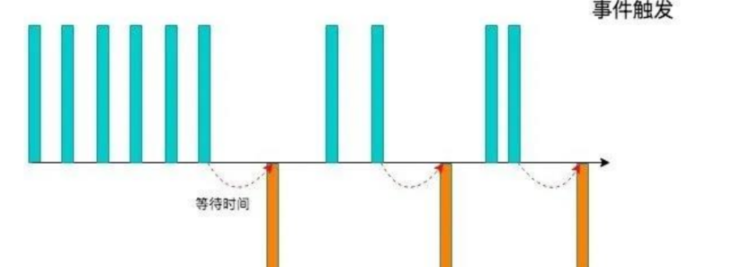

>[success] # 防抖
1. 为了解决对于某些**频繁**的事件处理会造成性能的**损耗**
2. 在用户频繁触发某个行为的时候，我们只识别一次即可'**开始边界**：第一次点击触发  **结束边界**：等到最后一次触发'，当用户快速点击一个按钮，实际本质我们仅仅只是他最后一次点击执行成功即可，**剩下之前的点击可以忽略**
3. 常用的防抖场景，**输入框中频繁的输入内容**，**搜索或者提交信息**，**频繁的点击按钮触发某个事件**，**监听浏览器滚动事件**，**用户缩放浏览器的resize事件**

>[danger] ##### 代码案例
~~~
/*
 * debounce:函数防抖
 *  @params
 *    func:自己最终要执行的任务
 *    time:多久操作一次算是频繁触发「默认值:500ms」
 *    immediate:控制触发的边界 「默认值:false结束边界  true开始边界」
 *  @return
 *    operate处理函数，处理函数会在频繁触发的时候，频繁执行；函数内部，控制我们想要操作的func只执行一次；
 */
const debounce = function (fn, time, immediate) {
    if (typeof func !== 'function') throw new TypeError('func must be an function!')
    if (typeof time === 'boolean') immediate = time
    if (typeof time !== 'number') time = 500
    if (typeof immediate !== 'boolean') immediate = false
    let timer = null
    return (...args) => {
      // 当定时器一次没有执行过并且是立即执行则立即执行
      let now = !timer && immediate,

        if (timer) {
            clearTimeout(timer)
            timer = null
        }
        timer = setTimeout(() => {
            clearTimeout(timer)
            timer = null
            if (!now) fn.apply(this,args)
        }, time)
        if (now) func.apply(this, args)

    }
}
~~~
>[danger] ##### 代码案例 二
1.下面代码具备功能 **防抖时间设置 和 是否能立即执行 取消当前防抖计时** 操作
2. 要注意点就是 下面案例中`inner` 函数不能是箭头函数，否则因为this指向了最外层函数导致this不是所期待调用内部函数this指向
3. 分清调用关系，在`debounce` 仅是一个声明，实际执行的防抖是内部`inner` 只是利用了闭包去缓存了某些变量
4. `debounce` 参数 `fn` 作为回调参数，他的执行时机其实在`inner` 中，因此实际要将`fn` 变成和`inner` 具备一样的参数和this指向
5. 拆解看 当我们执行一个`oninput` 事件绑定时候 `inputEl.oninput = function(event){}` 其实绑定这个函数 就是我们防抖的`inner`，因此 **inner** 接受的参数和例子中`function(event){}` 等同的，执行我们将执行二次转交给了回调函数`fn`

~~~

function debounce(fn, delay, immediate = false) {
	let timer = null

	// 原则: 一个函数进行做一件事情, 一个变量也用于记录一种状态
	// 因此记录立即执行变量在这里 有重新定义了一个
	let isInvoke = false

	// 清除setTimeout
	function clear() {
		clearTimeout(timer)
		timer = null
	}

	// 真正执行函数，即若是触发事件的话则是触发事件执行函数
	// 这里不能使用箭头函数 ，如果使用了导致fn.apply this 指向了window
	function inner(...args) {
		// 第一次操作是不需要延迟
		if (immediate && !isInvoke) {
			fn.apply(this, args)
			isInvoke = true
			return
		}

		if (timer) clear()

		timer = setTimeout(() => {
			// 将真正执行函数传入接受的值，给到传入的回调函数
			fn.apply(this, args)
			clear()
		}, delay)
	}

	// 取消 当前定时间 让函数直接执行
	inner.cancel = function () {
		
~~~
* 使用 时候也要注意不要用箭头函数
~~~html
<!DOCTYPE html>
<html lang="en">
	<head>
		<meta charset="UTF-8" />
		<meta http-equiv="X-UA-Compatible" content="IE=edge" />
		<meta name="viewport" content="width=device-width, initial-scale=1.0" />
		<title>Document</title>
		
	</head>
	<body>
		

			<input />
			<button class="cancel">取消</button>
		

	</body>
	
</html>

~~~
>[danger] ##### 案例三 -- 使用Promise 让其具备获取返回值
1. 目前看这种和事件搭配使用意义不大
~~~

// 原则: 一个函数进行做一件事情, 一个变量也用于记录一种状态
function hydebounce(fn, delay, immediate = false, resultCallback) {
  // 1.用于记录上一次事件触发的timer
  let timer = null
  let isInvoke = false

  // 2.触发事件时执行的函数
  const _debounce = function(...args) {
    return new Promise((resolve, reject) => {
      try {
        // 2.1.如果有再次触发(更多次触发)事件, 那么取消上一次的事件
        if (timer) clearTimeout(timer)

        // 第一次操作是不需要延迟
        let res = undefined
        if (immediate && !isInvoke) {
          res = fn.apply(this, args)
          if (resultCallback) resultCallback(res)
          resolve(res)
          isInvoke = true
          return
        }

        // 2.2.延迟去执行对应的fn函数(传入的回调函数)
        timer = setTimeout(() => {
          res = fn.apply(this, args)
          if (resultCallback) resultCallback(res)
          resolve(res)
          timer = null // 执行过函数之后, 将timer重新置null
          isInvoke = false
        }, delay);
      } catch (error) {
        reject(error)
      }
    })
  }

  // 3.给_debounce绑定一个取消的函数
  _debounce.cancel = function() {
    if (timer) clearTimeout(timer)
    timer = null
    isInvoke = false
  }

  // 返回一个新的函数
  return _debounce
}

~~~
* 使用
~~~
 const myDebounceFn = hydebounce(function(name, age, height) {
      console.log("----------", name, age, height)
      return "哈哈哈哈"
    }, 1000, false)

    myDebounceFn("w", 18, 1.88).then(res => {
      console.log("拿到执行结果:", res) // 哈哈哈哈
    })
~~~