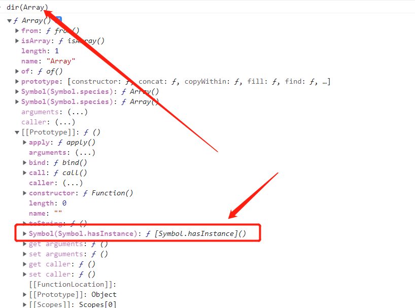
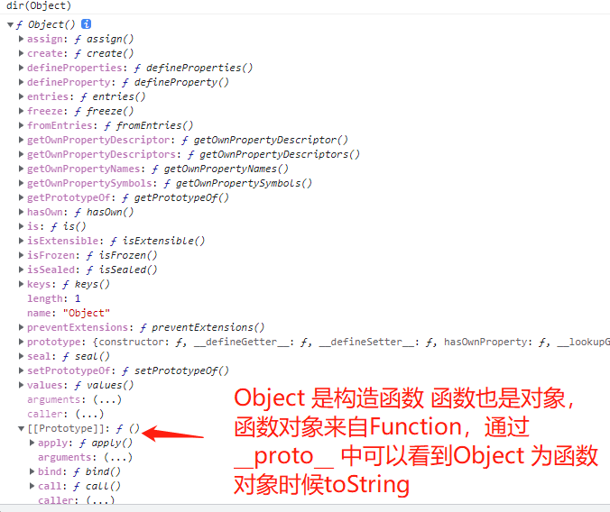

[TOC]
>[info] ## 判断类型
~~~
1.判断类型常用方法'typeof'、'instanceof'、'Object.prototype.toString'、'constructor'
~~~
>[info] ## 使用typeof 区分数据类型
~~~
1.'typeof' 是一个操作符，不是方法因此使用的时候可以加括号，也可以省略
2.虽然'typeof'是用来区分数据类型的但是8个数据类型中'null'可以理解成是空
对象(object),并多了一个function 检测 因此还是可以检测类型依旧是8种类依次是用来区分'undefined','function','boolean','number','string','object','bigInt','symbol'
3.因此简单的说'null' 在使用typeof 验证的时候是'object'
4.typeof检测未被声明的变量，不会报错，结果是 'undefined' 举个例子
    // 报错 因为a变量没有声明
    if (!a) {
        console.log(a)
    }
    
    // typeof 即使对没声明的变量也不会报错
    if (typeof a !== 'undefined') {
        console.log(a)
    }
 针对这种特性在封装第三方包的时候就可以使用，在node 环境中是没有window 变量，相对的在浏览器环境中没有
 module和module.exports这种cjs 导出变量，为了让我们封装的东西可以在两个环境运行就可以利用typeof 这种对
 未声明变量的不报错的性质做出下面形式的写法
// 支持浏览器导入 && 支持NODE端运行{CommonJS规范}
(function () {
    let utils = {
        // ...
    };

    /!* 暴露API *!/
    if (typeof module === "object" && typeof module.exports === "object") module.exports = utils;
    if (typeof window !== "undefined") window.utils = utils;
})(); 
但是在es6出现后 let const在其被声明之前对块中的 let 和 const 变量使用 typeof 会抛出
一个 ReferenceError。块作用域变量在块的头部处于“暂存死区”，直至其被初始化，在这
期间，访问变量将会引发错误。
    typeof undeclaredVariable === 'undefined';
    
    typeof newLetVariable; // ReferenceError
    typeof newConstVariable; // ReferenceError
    typeof newClass; // ReferenceError
    
    let newLetVariable;
    const newConstVariable = 'hello';
    class newClass{};
~~~
>[danger] ##### 案例说明
~~~
var num = 10;
var str = "小白";
var flag = true;
var nll = null;
var undef;
var obj = new Object();
var a = function(){}
//是使用typeof 获取变量的类型
console.log(typeof num); // number
console.log(typeof str); // string
console.log(typeof flag); // boolean
console.log(typeof nll); // object
console.log(typeof undef); // undefined
console.log(typeof obj); // object
console.log(typeof a); // function

// 这个小案例
typeof object // undefined 未定义 他就是一个变量名
typeof Object // function 他是一个构造函数

/ 除 Function 外的所有构造函数的类型都是 'object'
var str = new String('String');
var num = new Number(100);

typeof str; // 返回 'object'
typeof num; // 返回 'object'

var func = new Function();

typeof func; // 返回 'function'

~~~
>[danger] ##### 为什么 typeof null === 'object' 最开始的设计bug
~~~
1.所有的数据类型值，在计算机底层中都是以2进制形式存储的{64位},并且相对的二进制检测类型效率更高，
在js 中这也类型相应的储存形式信息：
    000：对象
    1：整数
    010：浮点数
    100：字符串
    110：布尔
    000000…. null
可以发现由于 null 的存储单元（全是 0）最后三位和 object 完全一样是 000 因此判断null 也为
Object但是内部识别为对象后，会再次检测这个对象有没有内部实现[[call]]，如果实现了，结果
是'function'，没有实现就是'object'
~~~
[参考链接](https://segmentfault.com/q/1010000011846328)
[参考链接](https://2ality.com/2013/10/typeof-null.html)
>[danger] ##### 判断是否是对象
~~~
1.在function 也是对象但是typeof function 得到是function  ，当想对是否为对象判断时候
并且包含function 可以写成
if (val !== null && /^(object|function)$/i.test(typeof val)) {
    // ...
} 
~~~

>[info] ## instanceof -- 检测引用类型
~~~
1.a instanceof B a是不是B的实例，即a的原型链上是否有B
var a = [1,2,3]
console.log(a instanceof Array)  // 变量 A 是数组么
打印结果:
true
2.在`ECMAScript7`规范中的`instanceof`操作符则是根据'Symbol.hasInstance' 进行，用于判断某对象是否为某构
造器的实例。因此你可以用它自定义 instanceof 操作符在某个类上的行为。'Symbol.hasInstance' 属性特
点'writable/enumerable/configurable'都为false 不可写，不可枚举 不可修改属性即不可以属性赋值
  
    var arr = []
    Array[Symbol.hasInstance](arr) // true

数组构造函数上的'Symbol.hasInstance' 属性从哪里来，如图可以发现是继承Function 上的,`ECMAScript7`规范中，
在`Function`的`prototype`属性上定义了`Symbol.hasInstance`属性

    Array[Symbol.hasInstance] = function (){return false }
    arr instanceof Array // true

上面的案例看起来并不像我们设想的那样，打印结果为false 因为之前说'Symbol.hasInstance' 属性 不可写，不可枚举
不可修改，即在普通的构造函数上想直接修改是不行的
MDN 中给案例通过class 是可以重写的
class Fn {
    static[Symbol.hasInstance](obj) {
        console.log('OK');
        if (Array.isArray(obj)) return true;
        return false;
    }
}
let f = new Fn;
let arr = [10, 20, 30];
console.log(f instanceof Fn); //=>false
console.log(arr instanceof Fn); //=>true
console.log(Fn[Symbol.hasInstance](f)); //=>true 

3.如果在没有Symbol.hasInstance 属性浏览器上则会像以前一样去原型链上中

4.弊端：不能检测原始值类型的值
console.log(new Number(1) instanceof Number); //=>true
console.log(1 instanceof Number); //=>false

5.小提示：
O instanceof C在内部会调用InstanceofOperator(O, C)抽象操作，该抽象操作的步骤如下：

如果C的数据类型不是对象，抛出一个类型错误的异常
~~~
* 图

[
参考ECMAScript7规范中的instanceof操作符](https://segmentfault.com/a/1190000037689078)
>[danger] ##### 参考案例
~~~
class A extends Array{}
const a = new A()
a instanceof A // true
a instanceof Array // true
Array[Symbol.hasInstance](a) // true
A[Symbol.hasInstance](a) // true
A[Symbol.hasInstance](new Map) // false
~~~
>[danger] ##### 实现一个instanceof
~~~
function myInstanceof(left, right) {
  // 这里先用typeof来判断基础数据类型，如果是，直接返回false
  if(typeof left !== 'object' || left === null) return false;
  // getProtypeOf是Object对象自带的API，能够拿到参数的原型对象
  let proto = Object.getPrototypeOf(left);
  while(true) {                  //循环往下寻找，直到找到相同的原型对象
    if(proto === null) return false;
    if(proto === right.prototype) return true;//找到相同原型对象，返回true
    proto = Object.getPrototypeof(proto);
    }
}
// 验证一下自己实现的myInstanceof是否OK
console.log(myInstanceof(new Number(123), Number));    // true
console.log(myInstanceof(123, Number));                // false
~~~
>[info] ## 利用Object.prototype.toString
~~~
1.toString() 是 Object 的原型方法，调用该方法，可以统一返回格式为 '[object Xxx]' 的字符串,Xxx 就是对象的类型
Object 对象，直接调用 toString() 就能返回 [object Object]；其他对象，需要通过 call 来调用
2.这是JS中唯一一个检测数据类型没有任何瑕疵的，可以检测内置类型例如
"[object Number/String/Boolen/Null/Undefined/Symbol/BigInt/Object/Function/Array/RegExp/Date/Math/Error...]"

3.检测返回值遵循规则,一般都是返回当前实例所属的构造函数信息但是如果实例对象拥有 'Symbol.toStringTag' 属性，
属性值是啥，最后返回的就是啥，例如：Math[Symbol.toStringTag]="Math"  => Object.prototype.toString.call(Math)  
“[object Math]”
正常没有重写'Symbol.toStringTag'
class Fn {
  
  
}
let f = new Fn;
console.log(Object.prototype.toString.call(f)); // [object Object]
重写'Symbol.toStringTag'
class Fn {
  
    [Symbol.toStringTag] = 'Fn';
}
let f = new Fn;
console.log(Object.prototype.toString.call(f)); //[object Fn]
~~~
~~~
Object.prototype.toString({})       // "[object Object]"

Object.prototype.toString.call({})  // 同上结果，加上call也ok

Object.prototype.toString.call(1)    // "[object Number]"

Object.prototype.toString.call('1')  // "[object String]"

Object.prototype.toString.call(true)  // "[object Boolean]"

Object.prototype.toString.call(function(){})  // "[object Function]"

Object.prototype.toString.call(null)   //"[object Null]"

Object.prototype.toString.call(undefined) //"[object Undefined]"

Object.prototype.toString.call(/123/g)    //"[object RegExp]"

Object.prototype.toString.call(new Date()) //"[object Date]"

Object.prototype.toString.call([])       //"[object Array]"

Object.prototype.toString.call(document)  //"[object HTMLDocument]"

Object.prototype.toString.call(window)   //"[object Window]"

~~~
>[danger] ##### typeof 和 Object.prototype.toString 搭配来判断数据类型
~~~
function getType(obj){
    let type  = typeof obj;
    if (type !== "object") {    // 先进行typeof判断，如果是基础数据类型，直接返回
      return type;
    }
    // 对于typeof返回结果是object的，再进行如下的判断，正则返回结果或者用slice(8,-1)来截取获得
    return Object.prototype.toString.call(obj).replace(/^\[object (\S+)\]$/, '$1');  // 注意正则中间有个空
  }
  
  /* 代码验证，需要注意大小写，类型首字母大写就是toString 小写就是typeof */ 
  getType([])     // "Array" typeof []是object，因此toString返回
  getType('123')  // "string" typeof 直接返回 
  getType(window) // "Window" toString返回
  getType(null)   // "Null"首字母大写，typeof null是object，需toString来判断
  getType(undefined)   // "undefined" typeof 直接返回
  getType()            // "undefined" typeof 直接返回
  getType(function(){}) // "function" typeof能判断，因此首字母小写
  getType(/123/g)      //"RegExp" toString返回
~~~
>[danger] #### 为什么不能用 Object.toString.call()
~~~
1.如果当你使用Object.toString.call 来判断类型你会发现，会报错，其中提示内容是报错内容如下
"Function.prototype.toString requires that 'this' be a Function"，内置的Object构造函数是一个 Function
（就像所有的原生构造函数一样），所以它在它自己的原型属性之前从Function.prototype继承
'Object[[Prototype]] -> Function.prototype -> Object.prototype -> null'所以实际调用的是
'Function.prototype.toString'，可以通过查看 下面的两个链接可以知道
若 'this' 不是 Function 对象，则 toString() 方法将抛出 TypeError 
 ("Function.prototype.toString called on incompatible object") 异常
2.简单的理解Object.toString 此时是把Object 看作对象，要知道构造函数也是对象(虽然他的typeof 是function)
作为对象时候掉属性自身没有会去[[Prototype]]去找此时链接查找路线就像第一条说那样
举个例子说明
var  a = new Object()
a.toString.call(1) // '[object Number]' 
因为 a 是通过Object 创建的实列，此时a.toString 找到就是Object.prototype.toString ，也可以
得到想要的效果
~~~

~~~
console.log(typeof Object); // function
console.log(typeof Object.prototype); // object

// Object.toString.call([]) // 报错

function a () { }

Object.toString.call(a) // 不报错因为a 是function
~~~
[ecma-262](http://www.ecma-international.org/ecma-262/5.1/index.html#sec-15.3.4
)

[Mdn-toString](https://developer.mozilla.org/zh-CN/docs/Web/JavaScript/Reference/Global_Objects/Function/toString)
[阶段参考](https://stackoverflow.com/questions/26333923/different-between-object-tostring-and-object-prototype-tostring)
>[info] ## constructor
~~~
const array = []
console.log( array.constructor)

const num = 1
console.log(num.constructor)

打印结果
ƒ Array() { [native code] }
ƒ Number() { [native code] }

var a = [];
a.constructor === Array;
~~~
>[info] ## 总结关于检测数据类型
~~~
1.typeof 在引用类型检测的时候不能具体，除了function 可以判断出来，剩下的引用类型和null统一都是'object'
2.instanceof 可以准确地判断复杂引用数据类型，但是不能正确判断基础数据类型；
3.Object.prototype.toString 万能方法最终解
~~~
