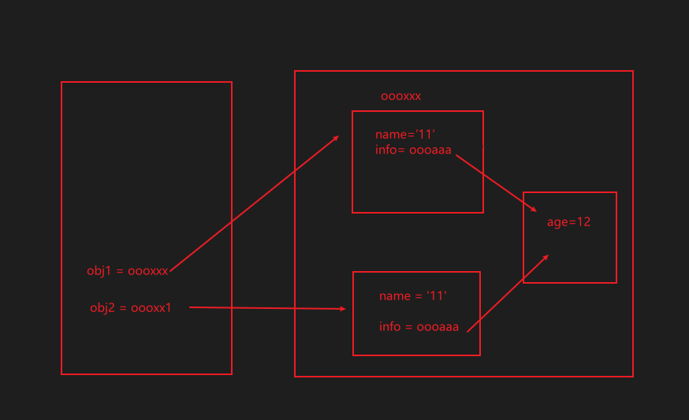
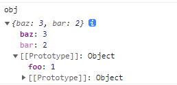

[TOC]

>[success] # 几种值传递操作
1. **引入的赋值**：指向同一个对象，相互之间会影响；
2. **对象的浅拷贝**：只是浅层的拷贝，内部引入对象时，依然会相互影响；
3. **对象的深拷贝**：两个对象不再有任何关系，不会相互影响
>[success] # 引用赋值
~~~
const obj = {
name: "123",
age: 18,
height: 1.88,
friend: {
	name: "456"
}
}

// 1.引用赋值
const info1 = obj
~~~
>[success] # 深浅拷贝
~~~
1.由于引用类型在赋值时只传递指针，这种拷贝方式称为'浅拷贝'。
2.而创建一个新的与之相同的引用类型数据的过程称之为'深拷贝'。
~~~
>[info] ## 浅copy -- 的方法

>[danger] ##### object.assign
~~~
1.object.assign 的语法为：Object.assign(target, ...sources)
2.它不会copy 原型链上共享的属性，不会copy 不可枚举属性，可以copy 'symbol' 类型
~~~
~~~
const obj = {a:{b:1},c:1,d:Symbol(10)}
Object.defineProperty(obj,'e',{
    value:"不可枚举",
    enumerable:false
})

const copyObj = {}

// 返回值是目标对象 即Object.assign 整体的返回值也是copyObj
Object.assign(copyObj,obj)

console.log(copyObj) // { a: { b: 1 }, c: 1, d: Symbol(10) }

obj.c = 100
obj.a.b = 200
console.log(copyObj); // { a: { b: 200 }, c: 1, d: Symbol(10) }
~~~
* 关于原型链上共享的属性
~~~
1.原型链上共享的属性
~~~
~~~
const obj = Object.create({foo: 1}, { // foo 是个继承属性。
    bar: {
        value: 2  // bar 是个不可枚举属性。
    },
    baz: {
        value: 3,
        enumerable: true  // baz 是个自身可枚举属性。
    }
});

const copy = Object.assign({}, obj);
console.log(copy); // { baz: 3 }
~~~
* 如图

>[danger] ##### 扩展运算符
~~~
1.扩展运算符的语法为：let cloneObj = { ...obj }
2.它不会copy 原型链上共享的属性，不会copy 不可枚举属性，可以copy 'symbol' 类型
~~~
~~~
const obj = {a:{b:1},c:1,d:Symbol(10)}
Object.defineProperty(obj,'e',{
    value:"不可枚举",
    enumerable:false
})
const copyObj = {...obj}
console.log(copyObj) // { a: { b: 1 }, c: 1, d: Symbol(10) }

obj.c = 100
obj.a.b = 200
console.log(copyObj); // { a: { b: 200 }, c: 1, d: Symbol(10) }

~~~
>[danger] ##### concat 拷贝数组
~~~
let arr = [1, 2, 3];

let newArr = arr.concat();

newArr[1] = 100;

console.log(arr);  // [ 1, 2, 3 ]

console.log(newArr); // [ 1, 100, 3 ]
~~~
>[danger] #### slice 拷贝数组
~~~
let arr = [1, 2, {val: 4}];
let newArr = arr.slice();
newArr[2].val = 1000;
console.log(arr);  //[ 1, 2, { val: 1000 } ]
~~~
>[danger] ##### 实现一个自己的浅拷贝
~~~
1.实现的思路只要将数组或者是对象类型的数据最外层进行重新内存指向
~~~
~~~
const shallowClone = (target)=>{
    // 浅拷贝将对象或者数组最外层copy一份
    if(typeof target === "object" && target !==null){
        const cloneTarget = Array.isArray(target)?[]:{}
        for(let key in target){
            cloneTarget[key] = target[key]
        }
        return cloneTarget
    }else{
        // 基本类型直接返回
        return target
    }
}
~~~
>[info] ##  深copy 

>[danger] ##### 30s js 的案例

~~~
const deepClone = obj => {
  if (obj === null) return null;
 // 先浅copy 一层
  let clone = Object.assign({}, obj);
  Object.keys(clone).forEach(
    key =>
      (clone[key] =
        typeof obj[key] === 'object' ? deepClone(obj[key]) : obj[key])
  );
  if (Array.isArray(obj)) {
    clone.length = obj.length;
    return Array.from(clone);
  }
  return clone;
};
~~~

>[danger] ##### JSON.stringfy() 
~~~
1.使用JSON.stringfy() 和 JSON.parse() 的方法将JSON 字符串生成一个新的对象，日常的简单开发已经
够用了
2.对应弊端
  2.1.拷贝的对象的值中如果有函数、undefined、symbol 这几种类型，经过 JSON.stringify 序列化之后
  的字符串中这个键值对会消失
  2.2.拷贝 Date 引用类型会变成字符串；
  2.3.无法拷贝不可枚举的属性；
  2.4.无法拷贝对象的原型链；
  2.5.拷贝 RegExp 引用类型会变成空对象；
  2.6.对象中含有 NaN、Infinity 以及 -Infinity，JSON 序列化的结果会变成 null；
  2.7.无法拷贝对象的循环应用，即对象成环 (obj[key] = obj)。
~~~

>[danger] ##### 第一版
~~~
1.深copy 时候，需要遍历object 的key，遍历一般采用'Object.keys 获取键名或 for...in 方式遍历',但是
这种处理方式不能针对'Symbol'类型做'key',想解决这个问题可以使用 'getOwnPropertyNames' 和
 'getOwnPropertySymbols' 函数将键名组合成数组
2.getOwnPropertyNames 不单单可以获取可枚举属性包括不可枚举属性，'Object.keys' 仅仅是对象自己的属性，
非原型链上的,'for..in'循环遍历整个原型链 二者都不能对不可枚举 和symbols 数据返回，因此需要 
'getOwnPropertyNames' 和'getOwnPropertySymbols' 函数将键名组合成数组
3.也可以使用Reflect.ownKeys(target)Reflect.ownKeys 方法返回一个由目标对象自身的属性键组成的数组。
它的返回值等同于Object.getOwnPropertyNames(target).concat(Object.getOwnPropertySymbols(target))
~~~
[for...in 和 Object.keys
](https://www.kancloud.cn/cyyspring/more/2079489)
~~~
function clone(data) {
  let result = {}
  // Reflect.ownKeys(data)
  const keys = [...Object.getOwnPropertyNames(data), ...Object.getOwnPropertySymbols(data)]
  if(!keys.length) return data
  keys.forEach(key => {
    let item = data[key]
    // null 的type类型也是object
    if (typeof item === 'object' && item) {
      result[key] = clone(item)
    } else {
      result[key] = item
    }
  })
  return result
}
~~~
* 吸取30s 数组也支持改进
~~~
function clone (data) {
    if (typeof data === null || typeof data !== 'object') return data
    const result = {}
    // 获取所有key
    const keys = Reflect.ownKeys(data)
    keys.forEach(key => {
        result[key] = typeof data[key] === 'object' ? clone(data[key]) : data[key]
    })
    // length 因为使用了获取不可枚举的属性相当于一获取了 所以不用length 重新赋值
    return Array.isArray(data) ? Array.from(result) : result
}
~~~
>[danger] ##### 解决循环引用问题
~~~
1.添加一个 WeakMap 来记录已经拷贝过的对象，如果当前对象已经被拷贝过，那么直接从 WeakMap 中取出，
否则重新创建一个对象并加入 WeakMap 中
var a = {}
var b = {}
a.b = b
b.a = a
~~~
~~~
function clone(obj) {
  let map = new WeakMap()
  function deep(data) {
    let result = {}
    const keys = [...Object.getOwnPropertyNames(data), ...Object.getOwnPropertySymbols(data)]
    if(!keys.length) return data
    const exist = map.get(data)
    if (exist) return exist
    map.set(data, result)
    keys.forEach(key => {
      let item = data[key]
      if (typeof item === 'object' && item) {
        result[key] = deep(item)
      } else {
        result[key] = item
      }
    })
    return result
  }
  return deep(obj)
}
~~~
>[danger] ##### 在升级思考
~~~
1.当参数为 Date、RegExp 类型，则直接生成一个新的实例返回
2.考虑原型链上需要被原型链上的方法和属性
~~~
~~~
const isComplexDataType = obj => (typeof obj === 'object' || typeof obj === 'function') && (obj !== null)

const deepClone = function (obj, hash = new WeakMap()) {
  if (obj.constructor === Date) 
  return new Date(obj)       // 日期对象直接返回一个新的日期对象 可以使用instanceof 作为判断
  if (obj.constructor === RegExp)
  return new RegExp(obj)     //正则对象直接返回一个新的正则对象
  //如果循环引用了就用 weakMap 来解决
  if (hash.has(obj)) return hash.get(obj)
  let allDesc = Object.getOwnPropertyDescriptors(obj)
  //遍历传入参数所有键的特性 这一步 如果是数组生成的就变成了数组
  let cloneObj = Object.create(Object.getPrototypeOf(obj), allDesc)
  //继承原型链
  hash.set(obj, cloneObj)
  for (let key of Reflect.ownKeys(obj)) { 
    cloneObj[key] = (isComplexDataType(obj[key]) && typeof obj[key] !== 'function') ? deepClone(obj[key], hash) : obj[key]
  }
  return cloneObj
}

~~~
>[info] ## jq 深浅copy
~~~
// $.extend(obj1,obj2,obj3) // 浅
// $.extend(true,obj1,obj2,obj3) // 深
jQuery.extend = jQuery.fn.extend = function () {

    var options, name, src, copy, copyIsArray, clone,
        target = arguments[0] || {},
        i = 1,
        length = arguments.length,
        deep = false;

    // 保证target是一个对象「第一个如果是布尔类型，是控制深浅合并的，让其赋值给deep，并且让target等于第二个实参{对象}」
    if (typeof target === "boolean") {
        deep = target;
        target = arguments[i] || {};
        i++;
    }
    if (typeof target !== "object" && !isFunction(target)) target = {};

    // 只传递了一个对象，这种情况下，是为了给$/$.fn扩充方法的「也可以理解为，把传递对象中的每一项和$/$.fn进行合并」
    if (i === length) {
        target = this;
        i--;
    }

    // target是多个对象合并中，被覆盖的那个对象，我们拿其他传递的对象，依次覆盖他即可
    for (; i < length; i++) {
        // options就是剩余传递的某个对象
        if ((options = arguments[i]) != null) {
            // 迭代options中的每一项，用其替换target中对应的项(如果target中没有这一向，就是直接新加一个)
            for (name in options) {
                copy = options[name];
                // 循环引用
                if (name === "__proto__" || target === copy) {
                    continue;
                }

                // 实现深度合并
                if (deep && copy && (jQuery.isPlainObject(copy) ||
                        (copyIsArray = Array.isArray(copy)))) {
                    // src是要被替换的项  copy拿它替换src
                    src = target[name];
                    if (copyIsArray && !Array.isArray(src)) {
                        clone = [];
                    } else if (!copyIsArray && !jQuery.isPlainObject(src)) {
                        clone = {};
                    } else {
                        clone = src;
                    }
                    copyIsArray = false;
                    target[name] = jQuery.extend(deep, clone, copy);
                } else if (copy !== undefined) {
                    // 浅合并
                    target[name] = copy;
                }
            }
        }
    }
    return target;
}; 
~~~
* 作为类工具类仿照
~~~
class Tools {
    /**
     * 描述jq 的深浅copy
     * @date 2022-01-15
     * @param {target} 合并的目标对象例如 extends(a,b) 则b和并到a 上，a为目标对象
     * @param {options} 合并的配置对象例如 extends(a,b) 则b和并到a 上，b为被copy配置对象
     * @param {deep} 深浅copy 默认浅copy 用法extends(true,a,b) b合并到a进行深copy
     * @param {name} 对象的key
     * @returns {any}
     */
    extends() {
        var options,
            name,
            src,
            copy,
            copyIsArray,
            clone,
            target = arguments[0] || {},
            i = 1,
            length = arguments.length,
            deep = false

        // 判断是否为深度拷贝参数，如果是的话赋值给deep，并且设置拷贝目标为arguments[1]
        // 且修改类数组的长度i为2
        // 举例子 extends(false,a,b) 此时明确了是采用浅copy，因此实际合并对象就是从第二个参数开始
        // 因此需要依次前移目标参数
        if (typeof target === 'boolean') {
            deep = target
            target = arguments[1] || {}
            i = 2
        }

        // 判断传入合并对象参数必须为对象,如果不是对象重置为对象
        if (typeof target !== 'object') target = {}

        // 判断参数长度是否等于i 来决定最后和调用本身进行合并
        // 递归到最后来和自己本身合并
        if (length === i) {
            target = this
            --i
        }

        // 开始前一个赋值给后一个对象 举个例子
        // extends(false,a,b) 即 b 合并给目标a
        for (; i < length; i++) {
            if ((options = arguments[i]) !== null) {
                // 对被拷贝的对象属性进行循环 for...in 不能copy 不可枚举的属性
                for (name in options) {
                    src = target[name]
                    copy = options[name]
                }
                // 防止循环引用
                if (target === copy) continue
                // 判断是否是深度拷贝，并且进行相应的操作
                if (
                    (deep && copy && typeof copy === 'object') ||
                    (copyIsArray = Array.isArray(copy))
                ) {
                    // 如果目标对象为 {ls:1} 被克隆对象为{ls:[1,2,3]}
                    // 则此时要把目标对象 合并 转换为数组即 {ls:1} => {ls:[]}
                    // 对象和数组同理
                    if (copyIsArray) {
                        copyIsArray = false
                        clone = src && Array.isArray(src) ? src : []
                    } else {
                        clone = src && typeof src === 'object' ? src : {}
                    }

                    // 使用递归进行深度拷贝，且不修改原对象
                    target[name] = this.extend(deep, clone, copy)

                    // 如果拷贝的对象为undefined则不进行拷贝
                } else if (copy !== undefined) {
                    target[name] = copy
                }
            }
        }
    }
}

~~~