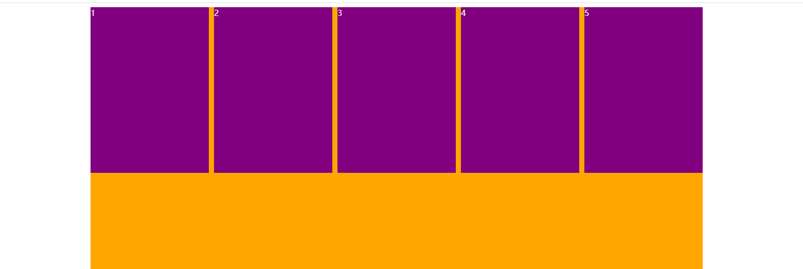

>123

>[success] # 案例
* 实现效果

1. 使用弹性盒子
2. 使用浮动，犹豫需要设置盒子直接'margin-rigth' 边距因此最后盒子宽度为 230 边距 10 `230*5+5*10 = 1200 大于版心1900` 会出现下移因此解决方式如下
 2.1. 使用`:nth-child(5n)` 伪元素去掉 5倍数的右边距
 2.2. 使用定义一个类凡是五的倍数都加上该类型入下`.item.last-item`
 2.3. 使用版心内在套一个版心，例如下面`content` 嵌套了一个`box` 版心，box 的最大宽度应该是和父元素 content 宽度一致的，此时将box `margin-right:-10px` 那么为了符合等于父最大宽度1190 ，那么box 宽度给到达1200，`1200 - 左右边距 = 实际宽度`，此时box 为1200 就可以正好放下 `230*5+5*10 = 1200 `,更简单的理解最后因为五的倍数盒子多 `margin-right:10px` 边距 因此设置负边距减去
~~~html
<!DOCTYPE html>
<html lang="en">
<head>
  <meta charset="UTF-8">
  <meta http-equiv="X-UA-Compatible" content="IE=edge">
  <meta name="viewport" content="width=device-width, initial-scale=1.0">
  <title>Document</title>
  
</head>
<body>
  
  

    

      
1

      
2

      
3

      
4

      
5

    

  

</body>
</html>
~~~
>[danger] ##### 其他
如果boder 重叠 也可以使用 边距负数形式来解决