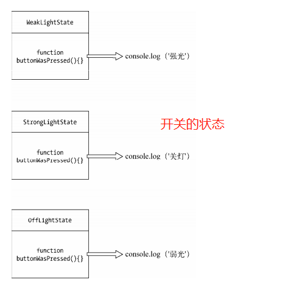
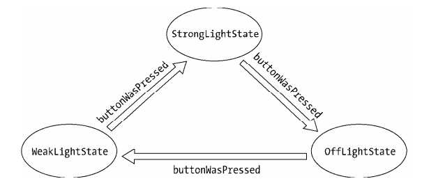

>[success] # 状态模式
~~~
1.GoF 中 对状态模式的定义： 允许一个对象在其内部状态改变时改变它的行为，对象看起来似乎修改了它的类。
2.设计状态模式的思路：当我们设计类，给一个类做封装的时候一般都会优 '先封装对象的行为'，
而'不是对象的状态'。'状态模式'中'刚好相反'，状态模式的关键是把事物的'每种状都封装成单独的类'，
跟'状态有关的行为'都被'封装在这个类的内部'。
3.简单的的说：
    3.1.'是将状态封装成独立的类，并 将请求委托给当前的状态对象，当对象的内部状态改变时，会带来不同的行为变化'
    3.2.'是从客户的角度来看，我们使用的对象，在不同的状态下具有截然不同的行为，这 个对象看起来是从不同的类'
'中实例化而来的，实际上这是使用了委托的效果'
    3.3.还要注意他遵循的方式属于'是循规蹈矩的 A→B→C→A'
~~~
>[info] ## 书中的开关灯案例
~~~
1.通过状态模式概念的解释'行为是基于它的状态改变的。这种类型的设计模式属于行为型模式'，
就可以理解状态控制行为是这模式一个特点，生活中最常见的这种案例就是开关灯，通过改变
开关的状态来改变灯的效果
~~~
>[danger] ##### 传统意义上的开关灯代码实现
~~~
1.我么创建一个灯的对象，给这个对象增加一个初始化方法叫'init',这个方法主要用来创建开关
，这个对象还有一个属性'state'用来记录当前开关的状态从而控制灯
~~~
~~~
var Light = function () {
    this.state = 'off'
    this.button = null
}

// 初始化按钮
Light.prototype.init = function () {
    var button = document.createElement('button'),
        self = this

    button.innerHTML = '开关'
    this.button = document.body.appendChild(button)
    this.button.onclick = function () {
        self.buttonWasPressed()
    }
}
// 按钮点击事件
Light.prototype.buttonWasPressed = function () {
    if(this.state === 'off'){
        console.log('开灯')
        this.state = 'on'
    }else if (this.state === 'on'){
        console.log('关灯')
        this.state = 'off'
    }
}

var light = new Light()
light.init()
~~~
>[danger] ##### 这样的缺点
~~~
1.这样的缺点就是，以后如果这个灯可以调节灯光的强弱，问题来了我们的'buttonWasPressed '
方法里面可能会充斥着大量的和状态有关的'if - else' 判断，就会这样：
    Light.prototype.buttonWasPressed = function(){
        if ( this.state === 'off' ){
            console.log( '弱光' );
            this.state = 'weakLight';
        }else if ( this.state === 'weakLight' ){
            console.log( '强光' );
            this.state = 'strongLight';
        }else if ( this.state === 'strongLight' ){
            console.log( '关灯' );
            this.state = 'off';
        }
    };

2.'buttonWasPressed' 方法是违反开放封闭原则的，每次新增或者修改 light 的状态，
都需要改动 buttonWasPressed 方法中的代码   
3.状态的切换非常不明显，仅仅表现为对 state 变量赋值，比如 this.state = 'weakLight'。
在实际开发中，这样的操作很容易被程序员不小心漏掉。我们也没有办法一目了然地明
白电灯'一共有多少种状态'
~~~
>[danger] ##### 通过状态模式来写开关灯
~~~
1.我们做的是根据状态来封装我们的类，把这个请求委托给当前的状态对象即可，该状态对象
会负责渲 染它自身的行为，引用书中的两个图做说明
~~~
* 状态

* 通过按钮去和这样状态连接到一起

>[danger] ##### 状态模式开关灯的代码实现
* 三种状态封装成类
~~~
// 根据现在三种状态封装的类依次是
// 'OffLightState' -- 关灯状态
// 'WeakLightState' -- 弱光状态
// 'StrongLightState' -- 强光状态

// OffLightState：
var OffLightState = function( light ){
    this.light = light;
};
OffLightState.prototype.buttonWasPressed = function(){
    console.log( '弱光' ); // offLightState 对应的行为
    this.light.setState( this.light.weakLightState ); // 切换状态到 weakLightState
};
// WeakLightState：
var WeakLightState = function( light ){
    this.light = light;
};
WeakLightState.prototype.buttonWasPressed = function(){
    console.log( '强光' ); // weakLightState 对应的行为
    this.light.setState( this.light.strongLightState ); // 切换状态到 strongLightState
};
// StrongLightState：
var StrongLightState = function( light ){
    this.light = light;
};
StrongLightState.prototype.buttonWasPressed = function(){
    console.log( '关灯' ); // strongLightState 对应的行为
    this.light.setState( this.light.offLightState ); // 切换状态到 offLightState
};
~~~
* 灯的类来调度状态
~~~
1.不再使用一个字符串来记录当前的状态，而是使用'状态对象'。在 Light 类的构造函数里
为每个状态类都创建一个状态对象，这样一来我们可以 很明显地看到电灯一共有多少种状态
2.使用'setState '方法，状态对象可以通过这个方法来切换 light对象的状态,来替代'if-else'语句
都在状态类中调用这个方法
3.以后扩展的话只需要在构造函数中加上对应的状态扩展类即可
~~~
~~~
var Light = function(){
    this.offLightState = new OffLightState( this );
    this.weakLightState = new WeakLightState( this );
    this.strongLightState = new StrongLightState( this );
    this.button = null;
};

Light.prototype.setState = function( newState ){
    this.currState = newState;
};
Light.prototype.init = function(){
    var button = document.createElement( 'button' ),
        self = this;
    this.button = document.body.appendChild( button );
    this.button.innerHTML = '开关';
    this.currState = this.offLightState; // 设置当前状态
    this.button.onclick = function(){
        self.currState.buttonWasPressed();
    }
};
~~~
>[danger] ##### 现在模板模式的问题
~~~
1.js 不像java有接口的概念，那么我们就要保证一个问题就是上面的代码中每个根据状态写的类，
都需要去实现'buttonWasPressed'方法这种重复工作很容易出错，但是可以使用'模板方法模式'
方式抛出异常
~~~