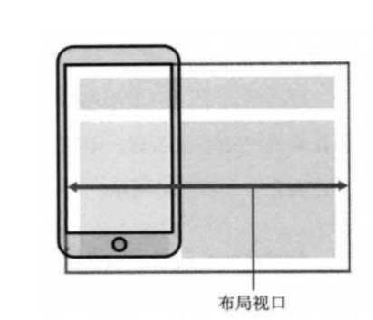

>[success] # css 视口viewport
1. 在一个浏览器中，我们可以看到的区域就是**视口**（viewport）；
2. **fixed**就是相对于**视口来进行定位**的；
3. 在PC端的页面中，我们是不需要对视口进行区分，因为我们的布局视口和视觉视口是同一个；
4. 移动端布局窗口和视图窗口大小并不一致，布局大小按照宽度为980px来布局一个页面的盒子和内容，然后视图窗口往往小于布局窗口，因此会对默认对页面进行缩放以显示到用户的可见区域

5. 进行缩放后产生的问题设置100px，那么显示缩放后的逻辑像素就不在是100px

>[danger] ##### 解决移动端问题
1.   这段代码的意思是让页面的布局视口(layout viewport)的宽度等于视觉视口(virsual viewport)的宽度，此时页面元素会以设备逻辑像素宽度做为文档宽度进行布局。
2.  如果不加，则页面元素会以980px的文档宽度进行布局，然后980px的宽度再缩小填充整个屏幕。会导致页面元素看起来比较小。
~~~
1.声明<meta name="viewport"> 设置视口的标签  在head里面并且应该紧接着编码设置，通过设置
2.viewport 一些参数介绍：
	2.1. width    可以设置宽度   (device-width 当前设备的宽度)
    2.2. height   可以设置高度
    2.3. initial-scale  可以设置默认的缩放比例
    2.4. user-scalable  可以设置是否允许用户自行缩放
    2.5. maximum-scale  可以设置最大缩放比例
    2.6. minimum-scale  可以设置最小缩放比例
    在<meta name="viewport" content="" >  content="" 使用以上参数
    2.7. width=device-width   宽度一致比例是1.0
    2.8 .initial-scale=1.0    宽度一致比例是1.0
    2.9. user-scalable=no     不允许用户自行缩放  （yes，no  1,0）
    标准适配方案：
    <meta name="viewport" content="width=device-width,initial-scale=1.0,user-scalable=0">
    meta:vp + tab  快捷方式
~~~
[# meta 设置viewport到底有何用](https://zhuanlan.zhihu.com/p/337930222)