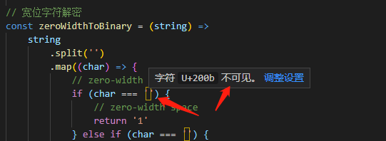
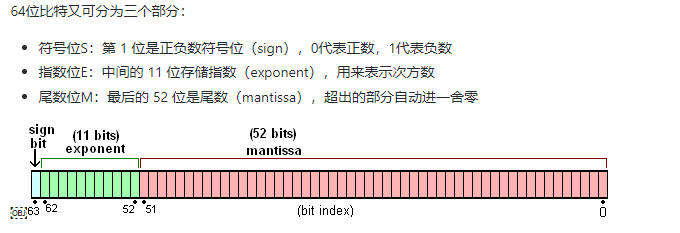

[TOC]
>[success] # 类型的小知识

>[info] ## toString
~~~
1.十进制的 Number 可以带小数，小数点前后部分都可以省略，但是不能同时省略例如这些都是合法的:
    .01
    12.
    12.01
~~~
* 那么下面的案例
~~~
1.这时候12. 会被当做省略了小数点后面部分的数字而看成一个整体，如果过直接连在一起写'12.toString()'
就会报错，但是如果将 12 和 '.toString()' 这两个部分用空格进行分割'12 .toString()' 是会正常打印的，
或者'12.'为一个整体那么就是'12..toString()' 也是会打印正确的
2.这里分享一个有趣的文章，如果利用这个'js' 词法的技巧做一个知道那个用户复制了什么信息
'https://www.codesky.me/archives/be-careful-what-you-copy-invisibly-inserting-usernames-into-text-with-zero-width-characters.wind'
3.12.toString() // 这是一个错误用法
~~~
* 对第二条进行说明

~~~
将内容转换为二进制，利用零宽在页面不显示的原理，将其转译和解析
~~~
~~~
// 宽位字符加密
const binaryToZeroWidth = (binary) =>
    binary
        .split('')
        .map((binaryNum) => {
            const num = parseInt(binaryNum, 10)
            if (num === 1) {
                return '​'
            } else if (num === 0) {
                return '‌'
            }
            return '‍'
        })
        .join('')

// 宽位字符解密
const zeroWidthToBinary = (string) =>
    string
        .split('')
        .map((char) => {
            // zero-width no-break space
            if (char === '​') {
                // zero-width space
                return '1'
            } else if (char === '‌') {
                // zero-width non-joiner
                return '0'
            }
            return ' ' // add single space
        })
        .join('')

~~~
>[info] ## 数字类型 -- 精度问题
~~~
1.JavaScript 中的 Number 类型基的双精度浮点数规则，这中规则就会有下面两种问题：
    1.1.小数计算精度丢失，比如 0.1+0.2 不等于 0.3
    1.2.整数最大范围整数是按最大54位来算最大(253 - 1，Number.MAX_SAFE_INTEGER,9007199254740991)
        最小(-(253 - 1)，Number.MIN_SAFE_INTEGER,-9007199254740991) 安全整数范围的。只要超过这个范围，
        就会存在被舍去的精度问题。
2.JavaScript 中有 +0 和 -0，在加法类运算中它们没有区别，但是除法的场合则需要特别留意区分，
    如果除以-0得到的是负无穷大，因此除法为了区分 +0 和 -0 的方式，正是检测 '1/x 是 Infinity 还是 -Infinity'。
3.对于出现精度问题原因，JavaScript 引擎会先将十进制数转换为二进制，然后进行加法运算，
再将所得结果转换为十进制。在进制转换过程中如果小数位是无限的，就会出现误差。

~~~
>[danger] ##### 解决0.1+0.2 不等于0.3问题
~~~
1.比较方法是使用 JavaScript 提供的最小精度值,检查等式左右两边差的绝对值是否小于最小精度
2.'Number.EPSILON':为浮点数计算设置一个误差范围。因为浮点数的计算是不精确的。
如果误差小于Number.EPSILON,我们就可以认为得到了正确的结果
3.toPrecision:如果该参数是一个非整数值，将会向下舍入到最接近的整数
~~~
~~~
console.log( Math.abs(0.1 + 0.2 - 0.3) <= Number.EPSILON);
~~~
 * 或者
~~~
// 一般选12就能解决掉大部分0001和0009问题，而且大部分情况下也够用了
parseFloat((0.1 + 0.2).toPrecision(12)) // 0.3
~~~

>[danger] ##### 小数四舍五入问题
~~~
1.在解决四舍五入的时候不要使用'toFixed' 
2.使用Math.round 来解决先扩大在缩小
~~~
[JavaScript 浮点数陷阱及解法 写的超级好读他](https://github.com/camsong/blog/issues/9)
[关于为什么不要使用toFixed](https://www.meiwen.com.cn/subject/jrpznxtx.html)

~~~
function round(number, precision) {
    return Math.round(+number + 'e' + precision) / Math.pow(10, precision);
    //same as:
    //return Number(Math.round(+number + 'e' + precision) + 'e-' + precision);
}
~~~
[mdn round里面的参考案例可以看一下](https://developer.mozilla.org/zh-CN/docs/Web/JavaScript/Reference/Global_Objects/Math/round)
>[danger] ##### 元转换分
~~~
1.现在输入框用户输入是元传递给后台要是分的表现形式，正常第一反应输入的数乘100就好了，但是
问题来了32.3*100 在js 输出的结果为'3229.9999999999995' 其实可以现在做限制在输入的位置显示小数点
后最多两位。
这样 可以用 32.3.toFixed(2).repalce(".","")
~~~
 >[danger] ##### 实现十进制转换二进制
~~~
1.十进制转二进制规则
 1.1.整数部分十进制转化二进制 将十进制除以2（二进制满二进一）并对商取整，直到结果是0为止
 1.2.小数部分乘2取整
举个例子 10.12 转换 二进制 :
    拆分'整数'部分10 小数部分0.5
    10/2 = 5  rem = 0
    5/2  = 2  rem = 1
    2/2  = 1  rem = 0
    1/2  = 0  rem = 1
    得到0101 需要逆转1010 即为10的二进制表现形式
    拆分'小数'部分
    0.12 * 2 = 0.24，取整0
    0.24 * 2 = 0.48，取整0
    0.48 * 2 = 0.96，取整0
    0.96 * 2 = 1.92，取整1，取小数继续乘
    0.92 * 2 = 1.84，取整1，取小数继续乘
    0.84 * 2 = 1.68，取整1，取小数继续乘
    .......
    依次类推得到0001111010111000010100011110101110000101000111101小数部分
    0.12的二进制表现形式，当然这里只是做了截取实际二进制结果比现在的还要长
2.都知道在做数字计算的时候计算机会将数字转换成二进制，做运算后将二进制转换回
十进制但因为计算机最多只能存 52 位，除了 0.5，其余在转换过程中都会进行截断，于
是就出现了精度缺失
3.在实际开发中可以用使用'toString'帮助实现数字进制转换
const num = 10.12;
console.log(num.toString(2));
~~~
* 自己实现一个十进制转换二进制代码
~~~
/**
 * 描述实现十进制转换进制
 * @param {Number} decNumber
 * @param {Number} max=49 表示小数二进制表现最长位数
 * @returns {String}
 */
function decimalToBinary(decNumber, max = 49) {
  let maxdecimalLen = max;
  let [integer, decimals] = decNumber.toString().split('.');

  const integerLs = [];
  const decimalsLs = [];
  integer = Number(decNumber);
  decimals = Number(`0.${decimals}`);
  let rem;
  let binaryString = '';
  let decimalsFirst;
  let decimalsLast;
  // 整数部分
  while (integer > 0) {
    // 先取余数
    rem = Math.floor(integer % 2);
    integerLs.push(rem);
    integer = Math.floor(integer / 2);
  }

  // 小数部分算法
  while (maxdecimalLen > 0) {
    [decimalsFirst, decimalsLast] = String(decimals * 2).split('.');
    decimals = typeof decimalsLast === 'undefined' ? 0 : Number(`0.${decimalsLast}`);
    decimalsLs.push(decimalsFirst);
    if (decimals === 0) break;
    maxdecimalLen -= 1;
  }
  if (integerLs.length > 0)binaryString = integerLs.reverse().join('');
  if (decimalsLs.length > 0)binaryString += `.${decimalsLs.join('')}`;
  return binaryString;
}
console.log(decimalToBinary(10.5, 49));
~~~
* 更优雅的小数部分二进制处理
~~~
function fractionToBinary(num) {
  if (!num) return "0";
  let result = [];
  let count = 0;
  while (num && count < 13) {
    let temp = num * 2;
    let i = Math.floor(temp);
    result.push(i);
   // 取小数 举个例子 1.26 -1 则小数部分为0.26

    num = temp - i;
    count++;
  }
  return result.join("");
}
~~~
* 用正则去判断
~~~
// 把十进制格式的“整数”转换为二进制格式的字符串
Number.prototype.decimal2binary = function decimal2binary() {
    // this->new Number(28)  decimal->28
    let decimal = +this;
    if (/\./.test(decimal)) {
        // 包含小数
        throw new RangeError('处理的数字必须是整数');
    }
    // 整数
    let sk = new Stack;
    if (decimal === 0) return '0';
    while (decimal > 0) {
        sk.enter(decimal % 2);
        decimal = Math.floor(decimal / 2);
    }
    return sk.value().reverse().join('');
};

let num = 28;
console.log(num.toString(2));
console.log(num.decimal2binary()); 
~~~
>[danger] ##### 二进制转换十进制思路
~~~
1.二进制转换十进制，以1010.0001111010111000010100011110101110000101000111101二进制为例 
整数部分1010 先逆转0101 计算公式 0*2^0 + 1*2^1 + 0*2^2 + 1*2^3 = 10
小数部分 0*1*2^-1 +  0*1*2^-2 +0*1*2^-3 +0*1*2^-1 + 1 * 2^-4 + 1* 2^-5 + 1*2^-6 + 1* 2^-7
最后小数和整数部分转换整合后得到10.1171875 ，因为计算机52位导致原本10.12变成
精度缺失的现象
~~~
[这里可以更直观看到计算结果](https://babbage.cs.qc.cuny.edu/IEEE-754.old/Decimal.html)

js 使用parseInt 进行转换例如 `parseInt(0101,10)` 结果 `65`
>[danger] ##### 结合理解
~~~
1.计算机底层都是按照二进制值来存储数据的,十进制的小数转换为二进制，会出现无限循环对于无限循环的情况，
会自动裁切掉多余的部分=>十进制的小数，在计算机底层存储的时候，就已经失真0.1+0.2在进行运算的时候，
是按照二进制来进行计算，把计算的结果变为10进制，交给客户端呈现浏览器呈现的数值是有长度限制的，
超过长度限制的也会截取掉从最后一位向前数，全是零的干掉，遇到0.30000000000000004零的就要保留了
~~~

[JavaScript 符号位、指数位、尾数位](https://juejin.cn/post/6844903849866559501)
>[danger] ##### 解决精度问题
~~~

1.将数字转成整数「扩大系数」
    // 获取系数
    const coefficient = function coefficient(num) {
        num = num + '';
        let [, char = ''] = num.split('.'),
            len = char.length;
        return Math.pow(10, len);
    };
    // 求和操作
    const plus = function plus(num1, num2) {
        num1 = +num1;
        num2 = +num2;
        if (isNaN(num1) || isNaN(num2)) return NaN;
        let coeffic = Math.max(coefficient(num1), coefficient(num2));
        return (num1 * coeffic + num2 * coeffic) / coeffic;
    };

2.三方库：Math.js 、decimal.js、big.js ...
~~~
