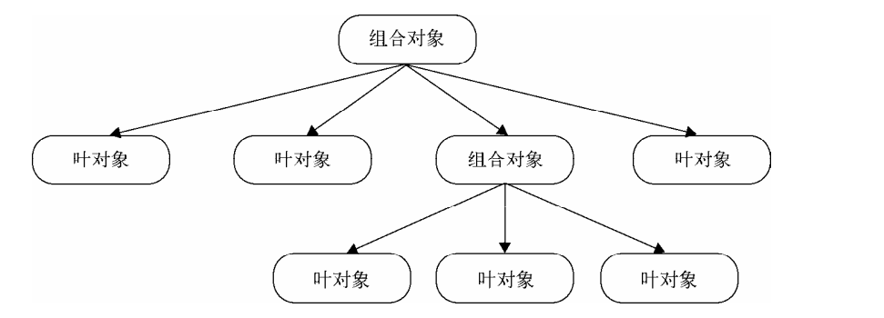

>[success] # 组合模式 --拆分了解
~~~
1.请求从树最顶端的对象往下传递，如果当前处理请求的对象是叶对象（普通 子命令），
叶对象自身会对请求作出相应的处理；如果当前处理请求的对象是组合对象（宏命令）， 组合对象则会
遍历它属下的子节点，将请求继续传递给这些子节点。

2.如果子节点是叶对象，叶对象自身会处理这个请求，而如果子节点还是组合对象，
请求会继续往下传递。叶对象下面不会再有其他子节点，一个叶对象就是树的这条枝叶的尽头，
组合对象下面可能还会有子节点

3.如图请求从上到下沿着树进行传递，直到树的尽头。作为客户，只需要关心树最顶层的组合对象，
客户只需要请求这个组合对象，请求便会沿着树往下传递，依次到达所有的叶对象。
~~~
>[danger] ##### 总结
~~~
1.组合模式实际使用是多态的性质，即同一操作，作用于不同对象产生不同结果，在
组合模式来看不同的对象 是叶子节点和枝干，他们的相同操作都是'execute'方法
但是枝干的'execute' 是循环当前枝干下的所有叶子的'execute',叶子的则是调用自己
~~~
~~~
// 利用多态 树枝 和 叶子都要实现execute
const qqCommand = {
    execute(){
        console.log("执行qq");
    }
}

const wxCommand = {
    execute(){
        console.log("执行微信");
    }
}
// 枝干需要实现 收集叶子 调用每个枝干

const macroCommand = function() {
    
    return{
        ls:[], // 收集叶子容器
        add(command){ // 收集叶子方法
            this.ls.push(command)
        },
        execute(){ // 利用多态统一调用
            ls.forEach((item)=>{
                // 注意这里的item 有两种情况
                // 一种item 是叶子 即调用叶子的方法
                // 一种是枝干 即调用枝干中循环每个枝干中叶子的execute方法
                item.execute()
            })
        }
    }
}
~~~

>[danger] #####  将上图抽象成代码来理解
~~~
1.将多个'叶子命令' 放入一个枝干中，再将这些枝干放回最后调用方法的主干中，
正式因为无论是'叶子命令'还是通过'叶子命令'组成的枝干，他们都实现了同一个
方法名才让他们在调用的时候变得简单方便.就像下面例子中的'execute' 方法一样
~~~
~~~
<html>
<head>
    <meta charset="utf-8">
</head>
<body>
<button id="button">按我</button>

</body>

</html>
~~~
