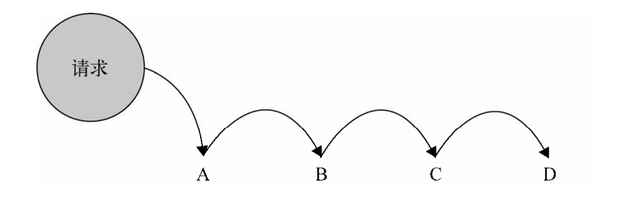

[TOC]
>[success] # 职责链前端角度
~~~
1.职责链就是不断传递的过程，这个过程传递需要一个头，也需要一个尾，为了防止
最后啥都找不到这个尾部通常是一个异常封装
2.如下图请求(传入的参数) A B C D 对传入的参数都能处理，但实际最后只有其中一个才能处理真正符合，
因此让参数可以形成传递直到交给符合的链上一个环境，让原本发散的形式形成链
~~~

>[info] ## 书中案例的需求分析
~~~
1.公司针对支付过定金的用户有一定的优惠政策。在正式购买后，已经支付过 500 元定金的用
户会收到 100 元的商城优惠券，200 元定金的用户可以收到 50 元的优惠券，而之前没有支付定金
的用户只能进入普通购买模式，也就是没有优惠券，且在库存有限的情况下不一定保证能买到。
~~~
>[danger] ##### 后台和前端规定接口字段
~~~
1.orderType：表示订单类型（定金用户或者普通购买用户），code 的值为 1 的时候是 500 元
定金用户，为 2 的时候是 200 元定金用户，为 3 的时候是普通购买用户。
2.pay：表示用户是否已经支付定金，值为 true 或者 false, 虽然用户已经下过 500 元定金的
订单，但如果他一直没有支付定金，现在只能降级进入普通购买模式。
3.stock：表示当前用于普通购买的手机库存数量，已经支付过 500 元或者 200 元定金的用
户不受此限制。
~~~
>[danger] ##### 正常直接写代码
~~~
1.直接判断'orderType' 类型来根据不同类型做出不同的判断
~~~
~~~
/*
* @param{Number} orderType 订单类型1 500定金，2 200 定金，3 普通用户
* @param{Boolean} pay 是否支付定金true已支付 false 没有支付
* @param{Number} stock 当前手机库存 支付定金用户不受影响
* */
var order = function (orderType,pay,stock) {
    if ( orderType === 1 ){ // 500 元定金购买模式
        if ( pay === true ){ // 已支付定金
            console.log( '500 元定金预购, 得到 100 优惠券' );
        }else{ // 未支付定金，降级到普通购买模式
            if ( stock > 0 ){ // 用于普通购买的手机还有库存
                console.log( '普通购买, 无优惠券' );
            }else{
                console.log( '手机库存不足' );
            }
        }
    }
    else if ( orderType === 2 ){ // 200 元定金购买模式
        if ( pay === true ){
            console.log( '200 元定金预购, 得到 50 优惠券' );
        }else{
            if ( stock > 0 ){
                console.log( '普通购买, 无优惠券' );
            }else{
                console.log( '手机库存不足' );
            }
        }
    }
    else if ( orderType === 3 ){
        if ( stock > 0 ){
            console.log( '普通购买, 无优惠券' );
        }else{
            console.log( '手机库存不足' );
        }
    }
}
order( 1 , true, 500);
~~~
>[danger] ##### 用粗略的职责链模式来重构代码
~~~
1.职责链的思路需要一个入口，一级一级传递知道找到符合自己执行方法
2.将500元，200元，和没有定金的三种情况封装成三个方法，500元是调用的开始，依次传递给
200元和没有定金
3.下面代码省去了部分条件语句，将三个模块拆分成三个小函数，但调用必须从五百元为入口，
出现一个问题，传递请求的代码被耦合在了业务函
会出现的问题：
    违反'开放-封闭原则'，如果有天我们要增加 300 元预订或者去掉 200 元预订，意味着就必须
改动这些业务函数内部。就像一根环环相扣打了死结的链条，如果要增加、拆除或者移动一个节点，
就必须得先砸烂这根链条。
~~~
~~~
// 500 元订单
var order500 = function( orderType, pay, stock ){
    if ( orderType === 1 && pay === true ){
        console.log( '500 元定金预购, 得到 100 优惠券' );
    }else{
        order200( orderType, pay, stock ); // 将请求传递给 200 元订单
    }};
// 200 元订单
var order200 = function( orderType, pay, stock ){
    if ( orderType === 2 && pay === true ){
        console.log( '200 元定金预购, 得到 50 优惠券' );
    }else{
        orderNormal( orderType, pay, stock ); // 将请求传递给普通订单
    }
};
// 普通购买订单
var orderNormal = function( orderType, pay, stock ){
    if ( stock > 0 ){
        console.log( '普通购买, 无优惠券' );
    }else{
        console.log( '手机库存不足' );
    }
};
// 整个代码的调用必须从五百元为入口
order500( 1 , true, 500); // 输出：500 元定金预购, 得到 100 优惠券
order500( 1, false, 500 ); // 输出：普通购买, 无优惠券
order500( 2, true, 500 ); // 输出：200 元定金预购, 得到 500 优惠券
order500( 3, false, 500 ); // 输出：普通购买, 无优惠券
order500( 3, false, 0 ); // 输出：手机库存不足
~~~
>[danger] ##### 改进上面的代码将职责链节点拆分成灵活
~~~
1.上面的代码有个问题就是将职责的节点根据业务写死，导致后期维护需要去改动整个职责链
，改进思路就是每条职责到下一节点的内容是动态，然代码动态和要请求的节点形成匹配

2.也就是说将代码每个方法变成'职责链节点'，'这些节点和可以相互定义之间的运行顺序'

3.需要'职责链上的节点'，'需要将这些节点链接成链式（即调用下个节点）'，'需要将请求的参数传递进节点中'，
按照这三点的设想需要有一个中间调度方法具备上面三点一个'Chain'类在初始化构造函数时候
接受方法或者对象将其变成职责链节点，有两个方法'setNextSuccessor'设置下一节点，'passRequest'调用
设置要传递的节点

4.总结一下职责链归根到底他是一个链，如果是链就是一层套着一层，所有这个'China' 链的方法
肯定要有一个参数来接受自己下一个链调用，那successor 就是用来存下一个链的，到时候
我们吧这些China 链生成的对象相互嵌套，就形成了链，还要有一个'setNextSuccessor '来调用
我们封装的方法，这里逻辑就是，如果你有'successor ' 下一层的链，你就要调用'successor '这个
链的'setNextSuccessor '让你的下个链去调用你下下个链
~~~
* 还是将三个方法单独封装，不过这一次不去指定他们的下一个节点
~~~
// 500 元订单
var order500 = function( orderType, pay, stock ){
    if ( orderType === 1 && pay === true ){
        console.log( '500 元定金预购, 得到 100 优惠券' );
    }else{
        return 'nextSuccessor'; // 我不知道下一个节点是谁，反正把请求往后面传递
    }};
// 200 元订单
var order200 = function( orderType, pay, stock ){
    if ( orderType === 2 && pay === true ){
        console.log( '200 元定金预购, 得到 50 优惠券' );
    }else{
        return 'nextSuccessor'; // 我不知道下一个节点是谁，反正把请求往后面传递
    }
};
// 普通购买订单
var orderNormal = function( orderType, pay, stock ){
    if ( stock > 0 ){
        console.log( '普通购买, 无优惠券' );
    }else{
        console.log( '手机库存不足' );
    }
};
~~~
* 定义一个可以组合链子的类es5
~~~

class China{
    constructor(fn){
        // 接受方法
        this.fn = fn;
        // 要传递的下一 个 职责链节点
        this.successor = null
    }
    // 当前节点中保存下一个节点对象
    setNextSuccessor(){
        return this.successor = successor
    }
    // 调用如果当前节点不能解决并且返回的是nextSuccessor
    // 则调用当前节点中 successor 存储的下一个节点来解决
    passRequest = function () {
        // 根据返回值来决定当前节点是否解决成功
        var ret = this.fn.apply( this, arguments );
        if ( ret === 'nextSuccessor' ){
            return this.successor && this.successor.passRequest.apply( this.successor, arguments );
        }
        return ret;
    }
}
~~~
* 定义一个可以组合链子的类es5
~~~
// 定义一个组合链子的类
var Chain = function (fn) {
    this.fn = fn
    this.successor = null
}
// 需要匹配的下一个节点
Chain.prototype.setNextSuccessor = function (successor) {
    return this.successor = successor
}
// 执行是否调用下一个节点
Chain.prototype.passRequest = function () {
    var ret = this.fn.apply( this, arguments );
    if ( ret === 'nextSuccessor' ){
        return this.successor && this.successor.passRequest.apply( this.successor, arguments );
    }
    return ret;
}
~~~
* 使用
~~~
// 使用 ---- 将需要形成职责链的方法放入chain函数中形成 --- 职责链节点对象
var chainOrder500 = new Chain( order500 );
var chainOrder200 = new Chain( order200 );
var chainOrderNormal = new Chain( orderNormal );
// 将职责节点对象 连接成链子
chainOrder500.setNextSuccessor( chainOrder200 );
chainOrder200.setNextSuccessor( chainOrderNormal );
// 使用
chainOrder500.passRequest( 1, true, 500 ); // 输出：500 元定金预购，得到 100 优惠券
chainOrder500.passRequest( 2, true, 500 ); // 输出：200 元定金预购，得到 50 优惠券
chainOrder500.passRequest( 3, true, 500 ); // 输出：普通购买，无优惠券
chainOrder500.passRequest( 1, false, 0 ); // 输出：手机库存不足
~~~
>[danger] ##### 总结灵活创建节点的好处
~~~
1.如果增加一个三百元节点西药做的就是直接增加一个节点即可
var order300 = function(){
 // 具体实现略
};
chainOrder300= new Chain( order300 );
chainOrder500.setNextSuccessor( chainOrder300);
chainOrder300.setNextSuccessor( chainOrder200); 
2.书中对这一部分的'总结'：
    对于程序员来说，我们总是喜欢去改动那些相对容易改动的地方，就像改动框架的配置文件
远比改动框架的源代码简单得多。在这里完全不用理会原来的订单函数代码，我们要做的只是增
加一个节点，然后重新设置链中相关节点的顺序。 
3.书中对这种实现现实代码'好处'举例：
    本来我们要被迫维护一个充斥着条件分支语句的巨大的函数，在例子里的购买过程中只打印了
一条 log 语句。其实在现实开发中，这里要做更多事情，比如根据订单种类弹出不同的浮层提示、
渲染不同的 UI 节点、组合不同的参数发送给不同的 cgi 等。 用了职责链模式之后，每种订单都有各
自的处理函数而互不影响
~~~
>[danger] ##### 职责链总结
~~~
1.'优点:'
    2.1.职责链模式的最大优点就是解耦了请求发送者和 N 个接收者之间的复杂关 系，
        由于不知道链中的哪个节点可以处理你发出的请求，所以你只需把请求传递给第
        一个节点即可。
    2.2.使用了职责链模式之后，链中的节点对象可以灵活地拆分重组。增加或者删除一个节
        点，或者改变节点在链中的位置都是轻而易举的事情
    2.3.请求并不是非得从链中的第一个 节点开始传递。可以控制开头这样减少传递
3.'缺点：'
    3.1.从性能方面考虑，我们要避 免过长的职责链带来的性能损耗。
    3.2.运行到最后也没找适合的职责节点，解决：在链尾增加一个保底的接受者节点来处理这种即将离
    开链尾的请求。
~~~