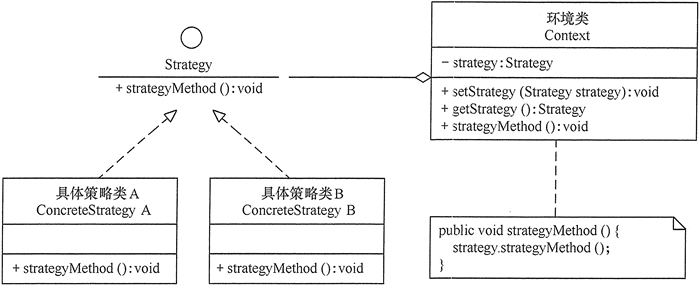
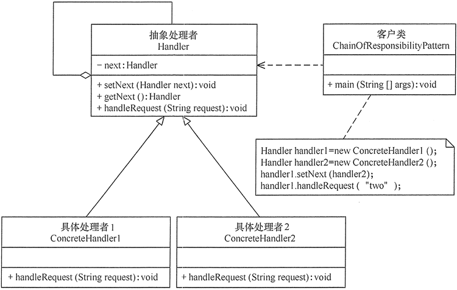

>[success] # 职责链和策略
~~~
1.如果是单纯的来看感觉二者都是在解决 if else 的问题但实际上
 1.1.策略模式：策略是关于拥有一个通用接口的，您可以使用该通用接口来提供算法的不同实现，
 或者提供具有某些公共依赖性的几种算法或逻辑块，因为js 特殊性质天生策略。因此直接使用对象
 定义好key value 的映射关系形成调用，'场景上'利用的是多态机制，实现同一行为在不同场景具有不同实现
 需要根据不同场景切换算法

 1.2.职责链是关于拥有一系列对象的，这些对象通常从更详细到更通用。链中的每个部分都可以提供答案，
  但是它们具有不同的详细程度，常见更多的'场景上'，处理一个任务，中间有多个角色，每个角色按序处理
  各自的多个任务多个对象处理同一请求，但具体由哪个对象处理则在运行时动态决定 动态指定一组对象处理 
  请求

2.策略模式和责任链模式很像，都是有多个对象去处理同一个请求不同之处在于对于同一个请求，策略模式是
可以选择哪个具体的策略类来进行处理而责任链模式不能根据请求去判断使用哪个类来处理，需要链路上的处
理类 全部来处理一遍才能得出结果
~~~
>[success] # 二者的类图
~~~
1.通过类图来看策略是要有统一的，抽象策略（Strategy）类：定义了一个公共接口，各种不同的算法以不同的
方式实现这个接口，环境角色使用这个接口调用不同的算
2.职责链每个链上的对象不用统一，最后通过和具体将每个环节连接一起的处理者将他们形成链子连接起来
~~~
>[danger] ##### 策略模式图

>[danger] ##### 职责链
 

>[danger] ##### 上面案例去拆分成策略模式来看
~~~
1.还需要转译 将类型1，2，3 对应到下面策略组对应key，整个案例来看A 不行B来处理要不就C来处理，
策略更多的感觉明确在调用时候就知道要用谁来做，职责链只是将请求参数不断下移给到真正能处理
，整个案例如果想明确知道谁来处理需要将条件转译对应策略组的key '以后再思考目前思考的感觉总结 '
~~~
~~~
// 单纯来看从策略模式来拆分
const orderStrategy = {
    orderType1(){
        if(pay){
            console.log("获得购物券100");
        }else{
            // 这里可能是缩写
            // this.orderType3()
            if(stock>0){
                console.log("正常购买");
            }else{
                console.log("没货了");
            }
        }
    },
    orderType2(){
        if(pay){
            console.log("获得购物券50");
        }else{
             // 这里可能是缩写
            // this.orderType3()
            if(stock>0){
                console.log("正常购买");
            }else{
                console.log("没货了");
            }
        }
    },
    orderType3(){
        if(stock>0){
            console.log("正常购买");
        }else{
            console.log("没货了");
        }
    }
}
~~~