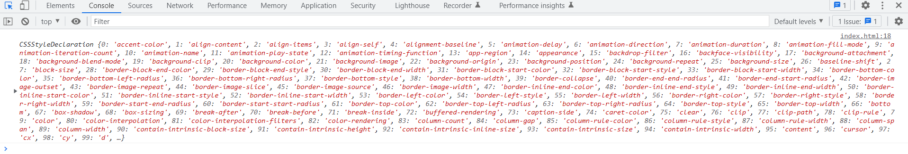

>[success] # 获取元素style的读取 - getComputedStyle
1. 获取元素的样式属性时候可以通过`通过style.*的方式读取到的`,单向获取对于**style、css文件中的样式** 需要使用 `getComputedStyle`

~~~
<!DOCTYPE html>
<html lang="en">
	<head>
		<meta charset="UTF-8" />
		<meta http-equiv="X-UA-Compatible" content="IE=edge" />
		<meta name="viewport" content="width=device-width, initial-scale=1.0" />
		<title>Document</title>
		
	</head>
	<body>
		
12eeeeeeeeeeeeeeee3

		
	</body>
</html>

~~~
