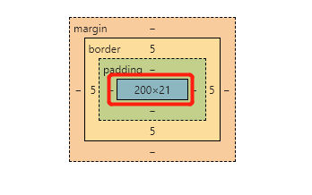

>[success] # 设置宽高
* **min-width：最小宽度**，无论内容多少，宽度都大于或等于min-width
* **max-width：最大宽度**，无论内容多少，宽度都小于或等于max-width
* **min-height：最小高度**，无论内容多少，高度都大于或等于min-height

* **max-height：最大高度**，无论内容多少，高度都小于或等于max-height

>[danger] ##### 宽度设置的只是盒子模型中内容宽度
* **盒子模型**分是个部分组成**外边距（margin）、边框（border）、内边距（padding）、内容（content）**，但设置宽度时候实际影响是**内容宽度**，一下为例实际盒子的宽度为`210`并不是`200`
~~~html
 
123

~~~

>[success] # 盒子模型
1. 标准盒模型设置：内容区域的宽，因此实际盒子的实际计算方式**宽度 = border + padding + width**，元素的实际占用**高度 = border + padding + height**
2. IE盒子模型（IE8以下浏览器）整个盒子所占有的宽度。因此设置多宽盒子即多宽

>[danger] ##### 实际开发
1. 实际开发过程IE 盒子模型比较合理，为了让非IE8 以下的浏览器达到IE 的效果设置**box-sizing用来设置盒子模型中宽高的行为**
 1.1. `box-sizing:content-box` 即内容为设置计算也就是标准盒子计算模式padding、border都布置在width、height外边
 1.2. `box-sizing:border-box` 即 IE盒子计算模式 padding、border都布置在width、height里边