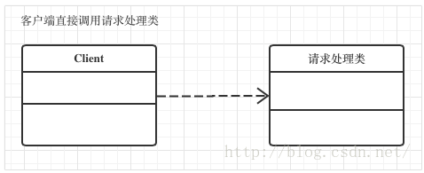
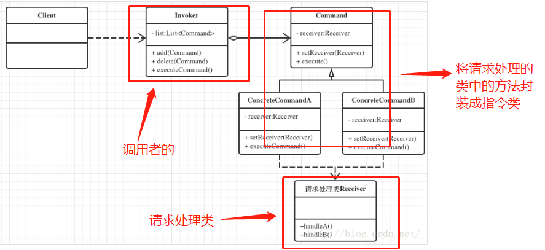

>[success] # 设计模式 -- 命令模式（菜鸟教程中代理模式总结）
~~~
1.定义：
      1.1将请求以命令的形式包裹在对象中，这个对象传递给调用者
      1.2.调用者寻找可以处理该命令的合适对象，这个对象会处理传过来命令
2.主要解决：行为请求者与行为实现者通常是一种紧耦合的关系，为了消除这种耦合关系
3.何时使用：命令执行过程较为复杂且可能存在变化，需要对执行命令动作本身进行额外操作，
此时可以考虑使用命令模式
4.如何解决：通过调用者调用接受者执行命令，顺序：调用者→接受者→命令。
5.关键代码：定义三个角色：1、received 真正的命令执行对象 2、Command(命令) 3、invoker 使用命令对象的入口
~~~
* 解释
~~~
1.站在主要解决上举个例子：比如电视它具有开和关的功能，用代码来表示的话就是一个'电视类'有两个方法'开电视'，
           '关电视'。一般执行的时候'电视.开电视'，对应上面说的'主要解决来讲'开电视这个行为和开电视这个实现
            都是电视来做的两者是在一起
2.站在定义上：这时候遥控器出现了，'开/关电视'的行为请求。可以看做两个命令，并且将这两个命令单独写成对象
              现在就多了两个对象'开电视' 和'关电视'他们是一组命令，多了个'遥控器'可以调用这些命令，并且把这些命令
              给了电视，电视依旧还是有'开电视', '关电视'的方法，不过不是直接请求调用而是遥控器间接调用了
   
~~~
>[danger] ##### 优缺点
* 优点
~~~
1.Invoker（调用者）的存在使命令执行之前有了更多的设计空间（日志记录、命令回滚、拒绝执行命令、命令队列等）
2.对命令进行封装，使命令易于扩展和修改
3.命令发出者和接受者解耦，使发出者不需要知道命令的具体执行过程即可执行
~~~
* 缺点
~~~
1、使用命令模式可能会导致某些系统有过多的具体命令类。
~~~
>[danger]使用场景
~~~
认为是命令的地方都可以使用命令模式，比如：
1、GUI 中每一个按钮都是一条命令。
2、模拟 CMD。
~~~
>[danger] ##### 简单的理解
~~~
1.当我们在定义类的时候，往往将对象的行为和动作进行统一，看做一个整体，对象去调用自己的行为，
这就需要调用者要知道对应的'行为' 属于哪一个'对象'，但是在像cmd 等输入脚本命令行界面，我们往往
根本不需要知道指令是在具体那个位置封装，而是直接发出输入指令，系统会帮助我们将指令和对应调用
对象进行匹配，生活中为例去饭店吃饭也是一样，我们只关心菜单上的菜，不会去必须要知道那个厨师
因为服务员会帮我们将菜单上的'指令' 和厨师进行匹配
2.命令模式依旧是遵循我们编程上的思想，依然需要定义某一类事物的具体行为和动作，比如'w厨师' 他会
做的每一道菜都是他的行为是属于他的整体，但是也需要将每个厨师会的每一道菜在单独抽离出来，这些
行为就是'指令' 形成个体，这些指令并不会自动触发，所以他们需要接受他们的调用者是谁。但是在使用层面
我们只需要执行组合好的'指令即可'，因为单独的指令层已经帮我们将调用者和'指令'组合好了
~~~
>[info] ## 延伸不错的讲解命令模式文章
[参考地址](https://cloud.tencent.com/developer/article/1056075)

>[danger] ##### 文章一什么是命令模式图解
~~~
1.假设现在有个请求处理，正常操作客户端直接调用请求处理的类
~~~
* 类似解释中没有遥控器的电视

~~~
1.引入命令模式后客户端的请求发送类和请求处理类之间增加一个Invoker类，再将请求发送类发送
的所有请求封装成对象，然后让Invoker（调用者）类去管理这些请求对象，并决定这些请求是否允许
执行、何时执行、按什么顺序执行。

2.好处：由于在请求发送类和请求处理类之间增加了请求转发者，因此这两个类之间的藕合度就大大降低。
3.分析图：'Infvoker (调用者) 遥控器'，'Command(命令)开机/关机'，'Receiver(接受者)就是电视类里面有开关机方法'
~~~
* 命令模式的类图

>[danger] ##### 对命令模式的划分
[命令模式](https://blog.csdn.net/weixin_42746530/article/details/90777275)
* 文章中的类图

* 文章中的说明
~~~
Client ： 即请求发出者，通过调用Invoker方法发出请求。
Invoker ： 请求的调用者，内部持有具体请求的引用。
ConcreteCommand ：封装的请求对象，内部持有Receiver对象。
Receiver：请求接受者，根据请求对象的指挥进行不同的反应。
~~~
>[success] # 前端命令模式
* 一定要看一二条这思维逻辑转换
~~~
1.传统的我们想法就是一个'Receiver'接受者，你需要调用啥我就直接这个对象点他对应的方法
2.命令模式思想转换，不在直接去调用这个'Receiver'接受者，我们通过分装一些命令，这些命令
类ConcreteCommand 去间接的调用这些'Receiver'接受者。和策略模式处理方式很像，但是出发
点不同，可以参看命令和策略的区别
3.书中举了一个例子，现在有个需求有十个按钮，让两个人来写，一个人负责按钮的绘制工作，
一个人负责写这个按钮点击后的具体行为封装到对象中

4.根据命令模式分析这个需求，参照上面'文章一什么是命令模式图解',可以发现'写按钮的一方是客户端'，
写这些'按钮事件功能的对应图中的请求处理类'，为了想让他俩解耦画按钮的如果比写逻辑的先完成，
我又不想读你的'事件触发的代码'等你写完后在加到和我按钮关联，这时候使用'命令模式'达到解耦

5.书上先说了命令模式的'场景':
       有时候需要向某些对象发送请求，但是并不知道'请求的接收者是谁'，'也不知道被请 求的操作是什么'，
    此时希望用一种松耦合的方式来设计软件，使得请求发送者和请求接 收者能够消除彼此之间的耦合关系。
根据这个场景书中的得到的'理由'：
     点击了按钮之后，必须向某些'负责具体行为的对象发送请求'，'这些对象就是请求的接收者'。
   但是目前并'不知道接收者是什么对象'，'也不知道 接收者究竟会做什么'。此时我们需要借助命令对象的帮助，
   以便解开按钮和负责具体行为对象之 间的耦合。
~~~
>[danger] ##### 根据上面分析实现代码
~~~
1.首先需要一个'Receiver' 请求的接受者，简单的理解这里面有上面所有按钮的'具体行为动作'
2.需要一个'ConcreteCommand ' 是每一个单独指令，这些单独指令对象中都有'Receiver'对象，
他们都会有一个共同的方法（在java 或者是ts中甚至es6我们会吧这个共同的方法定义在一个接口中）
3.需要一个'Invoker'请求的调用者，他将会具体调用某个指令对象（有点像代理模式，但区别是他的
调用方法不用像代理模式那样需要和被代理对象实现名字一样的方法）
~~~
* 代码实现
~~~
1.下面代码中的'Receiver' -- MenuBar 和 SubMenu 他们有所有按钮的具体行为动作
2.'ConcreteCommand ' -- 'RefreshMenuBarCommand','AddSubMenuCommand ','DelSubMenuCommand '
这些对象是将'Receiver' 中的每个具体行为拆分开来，他们都有一个特定，内部都有'Receiver'
也就是请求接受者的对象，有一个共同的方法'execute' 来调用这些'Receiver'中与之匹配的方法
3.'Invoker' -- 'setCommand' 也就是请求调用者，他们会接受'ConcreteCommand' 对象并且 调用他们
4.命令都有同一接口实现为什么这么做看'execute'方法
~~~
~~~
<html>
<head>
    <meta charset="utf-8">
</head>
<body>
    <button id="button1">点击按钮1</button>
    <button id="button2">点击按钮2</button>
    <button id="button3">点击按钮3</button>
</body>

</html>
~~~
>[danger] ##### es6 更清晰的写法
~~~
// 需求现在有个刷新菜单目录，增加子菜单，删除子菜单工 ，我们用命令模式实现
var button1 = document.getElementById('button1')
var button2 = document.getElementById('button2')
var button3 = document.getElementById('button3')

// 最开始 所有的方法都属于自己对象的
const MenuBar = {
    refresh () {
        console.log('刷新')
    }
}

const subMenu = {
    add () {
        console.log("增加");
    },
    del () {
        console.log("删除");
    }
}

// 现在需要 将每个对象中的方法 进行拆分成单独类
// 并且 这些拆分后的指令需要 实现统一的方法 才能统一调用
class BaseCommand {
    constructor(receiver) {
        if (new.target === BaseCommand) {
            throw new Error('这个类不能被实例化')
        }
        this._receiver = receiver
    }

    // 需要每个指令重写 这个方法
    execute () { }
}

// MenuBar 对应的方法只有一个因此拆分的指令类一个
class RefershMenuBarCommand extends BaseCommand {
    constructor(receiver) {
        super(receiver)
    }
    execute () {
        this.receiver.refresh()
    }
}
// subMenu 有两个方法这里拆成了两个指令类
class AddSubMenuCommand extends BaseCommand {
    constructor(receiver) {
        super(receiver)
    }
    execute () {
        this.receiver.add()
    }
}

class DeleteSubMenuCommand extends BaseCommand {
    constructor(receiver) {
        super(receiver)
    }
    execute () {
        this.receiver.del()
    }
}

// Invoker调用者 将 指令command 和 received 进行匹配
function setCommand (button, command) {
    button.onclick = function () {
        // 统一收口所有指令的调度方法是 被收口是这个方法调用
        command.execute()
    }
}

// 声明指令 ，将指令 和原始对象进行组合
const refershMenuBarCommand = new RefershMenuBarCommand(MenuBar)

setCommand(button1, refershMenuBarCommand)
~~~
* 结果分析
~~~
1.之前如果没有采用命令模式 出现的问题就是最开始提出的假设让两个人来写，一个人
负责按钮的绘制工作，一个人负责写这个按钮点击后的具体行为封装到对象中，两个
人的耦合性较高，负责按钮绘制的人必须等写按钮逻辑的人写完后才能调用按钮
具体调用的对象，现在站在命令模式的角度来开，绘制按钮的同学不在用关心你
按钮逻辑的具体写法，具体配合那个对象，因为所有的方法都被拆分为了指令，最后
的调用都被收口在'execute' 调用，只需要开发按钮逻辑的同学将指令传递到绘制
同学写的'setCommand ' 即'Invoker' 统一的调用者即可
~~~
>[danger] ##### 总结
~~~
1.书中举了一个订餐的例子，我们现在来看这个例子，结合代码分析这个理解，一个人去点餐，服务员
是一个调用者，点餐的不用知道那个厨师给我做的饭，只需要告诉调用者，调用者将这个指令告诉
对应的厨师即可
2.每一个厨师可以看作是一个对象会做的菜看做一个方法，菜单上的菜看作将每个对象
方法拆分出来的指令，点餐的不关心是谁做的，自然服务员 会将这个指令和对应厨师
这个对象做到匹配调用
~~~