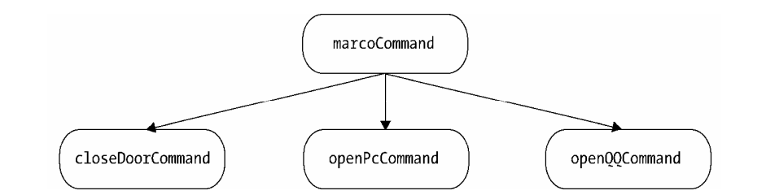

>[success] # 设计模式 --组合模式（菜鸟教程中组合模式总结）
~~~
1.定义：将对象组合成树形结构以表示"部分-整体"的层次结构。组合模式使得用户对单个对象和组合
对象的使用具有一致性。(理解成将对象关系变成'创建了对象组的树形结构')

2.主要解决：树型结构的问题中，模糊了简单元素和复杂元素的概念，客户程序可以像处理简
单元素一样来处理复杂元素，从而使得客户程序与复杂元素的内部结构解耦。

3.何时使用：
    3.1、您想表示对象的部分-整体层次结构（树形结构）。 
    3.2、您希望用户忽略组合对象与单个对象的不同，用户将统一地使用组合结构中的所有对象。
4.如何解决：树枝和叶子实现统一接口，树枝内部组合该接口
5.关键代码：
    5.1.Component抽象构件角色  
    定义参加组合对象的共有方法和属性，可以定义一些默认的行为或属性。
    5.2.Leaf叶子构件  
    Leaf叶子构件叶子对象，其下再也没有其他的分支，也就是遍历的最小单位。
    5.3.Composite树枝构件 
    树枝对象，它的作用是组合树枝节点和叶子节点形成一个树形结构。组合模式的重点就在树枝构件。
~~~
* 解释
~~~
1.组合模式： 简单的来说就是对树形结果的拆分，组合的过程，将树形结果的'叶子','枝干'，这些抽象成类，然后
组合成树
~~~
>[danger] ##### 优缺点
* 优点
~~~
1、高层模块调用简单。 
2、节点自由增加。
~~~
* 缺点
~~~
1、在使用组合模式时，其叶子和树枝的声明都是实现类，而不是接口，违反了依赖倒置原则。
~~~
>[danger]使用场景
~~~
1.部分、整体场景，如树形菜单，文件、文件夹的管理。
~~~
>[success] # js -- 组合模式
~~~
1.组合模式将对象组合成树形结构，以表示'部分-整体'的层次结构。 除了用来表示树形结 构之外，
组合模式的另一个好处是通过对象的多态性表现，使得用户对单个对象和组合对象的使 用具有一致性。
我的理解'就是让对象之间形成树的结构模型，是一种结构型，将类设计成树的结构模型'
~~~
>[danger] #####  书中的案例通过宏命令认识组合模式
*  下面案例书中给抽象化成图的效果

~~~
1.'marcoCommand' 被称为'组合对象'，
'closeDoorCommand'、'openPcCommand'、'openQQCommand'都是'叶对象'。
在 'macroCommand' 的 'execute' 方法里，并不执行真正的操作，而是'遍历它所包含的叶对象'，
把真正的 execute '请求委托给这些叶对象'
2.组合模式（'将对象用表示树形结构'）书里的形容：
    2.1.下面的例子，我们很容易找到组合模式的一个优点：提供了一 种遍历树形结构的方案，
通过调用组合对象的 'execute' 方法，程序会递归调用组合对象下 面的叶对象的 'execute' 方法，
所以我们的万能遥控器只需要'一次操作'，便能依次完成关门、 打开电脑、登录 QQ 这几件事情。
组合模式可以非常方便地描述'对象部分-整体层次结构'。
    2.2.利用对象多态性统一'对待组合对象'和'单个对象'。利用对象的'多态性'表现，可以使客户端 
忽略'组合对象'和'单个对象'的不同。在组合模式中，客户将统一地使用组合结构中的所有 对象，
而不需要关心它究竟是组合对象还是单个对象。
   
    2.3.这在实际开发中会给客户带来相当大的便利性，当我们往万能遥控器里面添加一个命令的时 候，
并不关心这个命令是宏命令还是普通子命令。这点对于我们不重要，我们只需要确定它是一 个命令，
并且这个命令拥有可执行的 execute 方法，那么这个命令就可以被添加进万能遥控器。 

    2.4.当宏命令和普通子命令接收到执行 execute 方法的请求时，宏命令和普通子命令都会做它们 各自认为
正确的事情。这些差异是隐藏在客户背后的，在客户看来，这种透明性可以让我们非常 自由地扩展这
个万能遥控器。

3.下面'MacroCommand' 调用者 乍一看和 观察者好像，虽然二者都是集中保存，
在统一调用，但别忘了观察者是会在统一调用的位置下发要传递通知的参数，
这里仅仅是调用
~~~
~~~
// 指令
var closeDoorCommand = {
    execute:function () {
        console.log('关门')
    }
}

var openPcCommand = {
    execute:function () {
        console.log('打开电脑')
    }
}

var openQQCommand = {
    execute:function () {
        console.log('打开QQ')
    }
}

// 调用者
var MacroCommand = function () {
    return{
        commandsList:[],
        add:function (command) {
            this.commandsList.push(command)
        },
        execute:function () {
            for(var i=0,command;command=this.commandsList[i++];){
                command.execute()
            }
        }
    }
}

var macroCommand = MacroCommand()
 macroCommand.add(closeDoorCommand)
 macroCommand.add(openPcCommand)
 macroCommand.add(openQQCommand)
 macroCommand.execute()
~~~