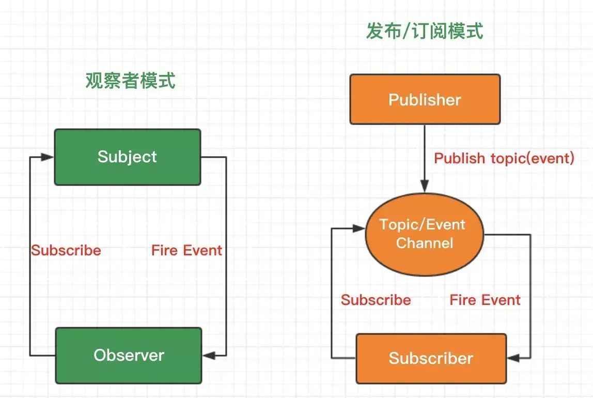

>[success] # 观察者（发布订阅模式）菜鸟教程的总结
~~~
1.定义：当对象间存在一对多关系时，则使用观察者模式（Observer Pattern）。
  比如，当一个对象被修改时，则会自动通知它的依赖对象。观察者模式属于行为型模式。
2.主要解决：一个对象状态改变给其他对象通知的问题，而且要考虑到易用和低耦合，保证高度的协作。
3.何时使用：一个对象（目标对象）的状态发生改变，所有的依赖对象（观察者对象）都将得到通知，进行广播通知。
4.如何解决：使用面向对象技术，可以将这种依赖关系弱化（针对java来说）
5.关键代码：在抽象类里有一个 ArrayList 存放观察者们。
（针对前端也适用就是说我们需要缓存这些要被通知的对象通过某种储存变量）
~~~
* 说明
~~~
1.有些文章是将观察者模式 和 发布订阅模式相区分，如果从定义上来说来着都是对象存在一对多的关系，当一个
被改变的时候通知其他依赖对象，所以二者在这个角度上来说我认为是相同的，但是从代码结构角度来说，二者
不同点就是'观察者模式'比'发布订阅模式'少了个中转
2.这里有点绕的地方
    2.1.'观察者模式'角度来说，一对多的关系中的多指的是'观察者'，这个一指的是用来收集这些观察
者的对象，当收集这些观察者的这个唯一对象发生了改变，那么这些多个'观察者'会随之变化
    2.2.'发布订阅模式'角度来说，一对多的关系中多指的是'订阅者'，一指的是发布者，也就说发布者出现了
变化所有的订阅者都会产生相应的变化
    2.3'观察者'这个词的理解就是，负责观察外界影响条件，来告诉被观察者需要接受或者改变。
~~~
>[danger] ##### 优缺点
* 优点
~~~
1、观察者和被观察者是抽象耦合的
2、建立一套触发机制。
~~~
* 缺点
~~~
1、如果一个被观察者对象有很多的直接和间接的观察者的话，将所有的观察者都通知到会花费很多时间
2、如果在观察者和观察目标之间有循环依赖的话，观察目标会触发它们之间进行循环调用，可能导致系统崩溃。
3、观察者模式没有相应的机制让观察者知道所观察的目标对象是怎么发生变化的，而仅仅只是知道观察目标发生了变化。
~~~
[另一篇参考链接](https://www.kancloud.cn/cyyspring/vuejs/2083506)
>[danger]使用场景
~~~
1、一个抽象模型有两个方面，其中一个方面依赖于另一个方面。将这些方面封装在独立的对象中使它们可以各自独立地改变和复用。
2、一个对象的改变将导致其他一个或多个对象也发生改变，而不知道具体有多少对象将发生改变，可以降低对象之间的耦合度。
3、一个对象必须通知其他对象，而并不知道这些对象是谁。
4、需要在系统中创建一个触发链，A对象的行为将影响B对象，B对象的行为将影响C对象……，可以使用观察者模式
创建一种链式触发机制。
~~~
>[success] # 前端观察者（发布订阅模式）
[有案例说服的文章](https://juejin.im/post/5b125ad3e51d450688133f22#heading-0)
~~~
1.当对象间存在一对多关系时，则使用观察者模式（Observer Pattern）。
  比如，当一个对象被修改时，则会自动通知它的依赖对象。观察者模式属于行为型模式。
2.实现一个观察者模式代码：
    2.1. 首先定义谁充当发布者
    2.2. 然后给发布者添加一个缓存列表，用于存放回调函数以便通知订阅者
    2.3.最后发布消息的时候，发布者会遍历这个缓存列表，依次触发里面存放的订阅者回调函
（可选）
    2.4.可以往回调函数里面填入一些参数，让订阅者可以接收到这些参数，订阅者接收到这些参数后，
进行可以处理
3.简单的说将代码拆分成'观察者（发布者）和被观察者（订阅者）'
4.站在需求业务角度来说，我个人的理解就是一些分散模块共同组成整体模块的时候可以使用，比喻一个不
恰当的例子，现在有个数据统计的页面，里面有'条形图'，'柱状图'，'饼状图'等一系列这种用来展示图标模块，
后台的接口会将这些模块一次返回，这时候我们可以创建一个发布者，这些数据展示模块是订阅者，去订阅
了这个发布者，当数据请求接口，发布者变会触发他的改变，通知下面的订阅者去触发自己展示效果
~~~
* 如图

* 缺点
~~~
1.发布—订阅模式虽然可以弱化对象之间的联系，但如果过度使用的话，对象和对象之间的必要联
系也将被深埋在背后，会导致程序难以跟踪维护和理解。特别是有多个发布者和订阅者嵌套到一
起的时候，要跟踪一个 bug 不是件轻松的事情
~~~
>[danger] ##### 书中的例子售楼处卖房子 
~~~
1.场景：售楼处卖房子很多的想买房子的人来咨询房子的事情，但是现在有些房子还需要等待最终的结果，
打算买房子的人就把自己的个人信息都给了售楼处的人，售楼处的人等这些房子有了消息，统一打电话
告诉打算房子人他们想要知道的消息，就不用每次都给来一趟售楼处来知道关于当前房子的事
2. 根据实现观察者模式的代码步骤来分析现状我们需要写的代码结构：
    2.1.需要一个发布者（售楼处）
    2.2.一个用来记录需要收到发布者发送消息的列表（主要记录谁？记录订阅者）
    2.3.当有关于房子信息的时候需要有一个方法用来遍历刚才列表来通知订阅者们收到消息
3.还是通过定义来理解：
    '当对象间存在一对多关系时，一个对象被修改时，则会自动通知它的依赖对象',像之前说的售楼处就是这个一，
 这些客户就是这些多，是当售楼处（发布者）这个一的'新楼盘推没推出'的状态改变了，来告诉这些订阅者，也就是
买房子的用户
~~~
* 第一版代码实现
~~~
// -------这种将消息给了所有订阅者 -------
    // 发布--订阅模式
    // 售楼处的例子，售楼处工作人员 对应多个客户，首先采集需要被通知的客户，
    // 售楼处工作人员然后在需要的时候将消息发送给这些客户

    var salesOffices = {} // 定义售楼处

    salesOffices.clientList = [] // 缓存列表，存放订阅者的回调函数

    salesOffices.listen = function (fn) { // 增加订阅者
       this.clientList.push(fn) // 订阅的消息添加进缓存列表
    }

    salesOffices.trigger = function () { // 发布消息
       for(var i=0,fn;fn=this.clientList[i++];){
           fn.apply(this,arguments) // 发布消息带的参数
       }
    }

    // 需要被通知的客户给售楼处登记
    salesOffices.listen(function (price, squareMeter) {
        console.log('价格='+price)
        console.log('平数='+squareMeter)
    })

    // 需要被通知的客户给售楼处登记
    salesOffices.listen(function (price, squareMeter) {
        console.log('价格='+price)
        console.log('平数='+squareMeter)
    })

// 现在开盘了倒计时 ，到了就开盘
setTimeout(()=>{
    salasOffice.tigger(2000,88)
    salasOffice.tigger(3000,87)
},5000)
~~~
~~~
1.上面代码打印结果是：
价格=200000
平数=88
价格=200000
平数=88
价格=200000
平数=87
价格=200000
平数=87
2.这段代码出现了很奇妙的问题，第一个订阅者想知道的是88平的房子多少钱一平，但实际运行后
把第二个订阅者要知道的87平房价也告诉了。要解决的是通知对应的订阅者他们想知道的消息
~~~
* 解决
~~~
1.现在要做的就是改改进缓存列表存储数据的格式，通过'key'和'value'的形式来进行通知时候区分
2.下面的代码打印结果：
    价格:200000
    价格:300000
3.满足我们刚才所想的只通知那些需要对应消息的人
~~~
~~~
var salesOffices = {} // 售楼处

salesOffices.clientList = {} // 缓存列表

salesOffices.listen = function (key, fn) { // 将需要接受相同类别的订阅者保存起来
    if(!this.clientList[key]){
        this.clientList[key] = []
    }
    this.clientList[key].push(fn)
}

salesOffices.trigger = function () { // 发布消息
    var key  = [].shift.call(arguments)
        fns  = this.clientList[key]
    if(!fns || fns.length === 0){ // 不存在要通知的订阅者
        return false
    }
    for(var i=0,fn;fn = fns[i++];){
        fn.apply(this,arguments) // 需要传递给订阅者回调方法的参数
    }
}

salesOffices.listen('squareMeter88',function (price) {
    console.log('价格:'+price)
})
salesOffices.listen('squareMeter100',function (price) {
    console.log('价格:'+price)
})

salesOffices.trigger('squareMeter88',200000)
salesOffices.trigger('squareMeter100',300000)
~~~