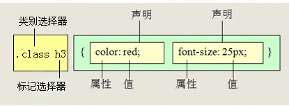
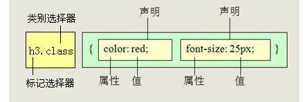
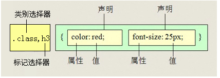
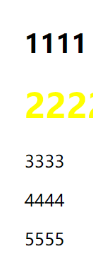
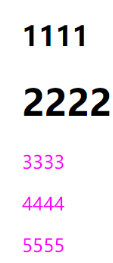

>[success] # 选择器

>[danger] ##### 基本选择器
 1. **元素选择器**（type selectors）, 使用`元素的名称`
 2. **类选择器**（class selectors）, 使用 `.类名 `;
 3. **id选择器**（id selectors）, 使用` #id`
 4. **通配符**，使用 `*`

>[danger] ##### 后代选择器
1. 所有的后代(直接/间接的后代),选择器之间以空格分割

>[danger] ##### 子元素选择器
1. 子元素选择器只能选择作为某元素子元素的元素。其写法就是把**父级标签写在前面，子级标签写在后面**，**中间跟一个>进行连接**，**注意**，符号左右两侧各保留一个空格。

>[danger] ##### 交集选择器
1. 需要同时符合两个选择器条件(两个选择器紧密连接)两个选择器之间不能有空格,通常为了精准的选择某一个元素;

>[danger] ##### 并集选择器
1. 给多个元素设置相同的样式，逗号隔开

>[danger] ##### 伪类选择器
[所有的伪类](https://developer.mozilla.org/zh-CN/docs/Web/CSS/Pseudo-classes)
>[danger] ##### 兄弟选择器
1. 相邻兄弟选择器，使用符号 \+ 连接
~~~
<!DOCTYPE html>
<html lang="en">
<head>
    <meta charset="UTF-8">
    <title>标题</title>
    
</head>
<body>
<h2>1111</h2>
<h1>2222</h1>

3333

4444

5555

</body>
</html>
~~~

2. 通用兄弟选择器，兄弟选择符，位置无须紧邻，只须同层级，`A~B`选择`A`元素之后所有同层级`B`元素
~~~
<!DOCTYPE html>
<html lang="en">
<head>
    <meta charset="UTF-8">
    <title>标题</title>
    
</head>
<body>
<h2>1111</h2>
<h1>2222</h1>

3333

4444

5555

</body>
</html>
~~~

>[danger] ##### 属性选择器
 属性选择器,根据标签中的属性最为选择器的定位
 1. 拥有某一个属性 [att]
 2. 属性等于某个值 \[att=val\]

| 选择器 | 含义 |
| --- | --- |
| E\[attr\] | 存在attr属性即可 |
| E\[attr=val\] | 属性值完全等于val |
| E\[attr\*=val\] | 属性值里包含val字符并且在“任意”位置 |
| E\[attr^=val\] | 属性值里包含val字符并且在“开始”位置 |
| E\[attr$=val\] | 属性值里包含val字符并且在“结束”位置 |
~~~
/* 获取到 拥有 该属性的元素 */
li[type] {
  border: 1px solid gray;
}
/* 获取 属性等于某个值的 元素 属性值 可以使用 引号进行包裹 */
li[type="vegetable"] {
  background-color: green;
}
/* 使用空格分隔的 多个属性 其中有某个属性即可获取 */
li[type~="hot"] {
  font-size: 40px;
}
/* 获取以某个属性开头的语法  */
li[color^='green'] {
  background-color: orange;
}
/* 获取以某个值 结尾的属性 */
li[type$='t']{
  color: hotpink;
  font-weight: 900;
}

/* 获取 属性中 拥有某个值的 元素 */
li[type*=ea] {
  font-size: 100px;
}
/*  如果属性的值 只有very 也能够获取  用来获取 多个属性 并且 使用-连接 */
li[price|='very'] {
  background-color: darkred;
}

<ul>
  <li type='fruit' color='green'>西瓜</li>
  <li type='vegetable' color='greenyellow'>西兰花</li>
  <li type='meat'>牛肉</li>
  <li type='meat hot'>猪肉</li>
  <li type='drink hot'>可乐</li>
  <li type='drink hot'>雪碧</li>
  <li price='very-cheap'>红酒</li>
  <li price='very'>白酒</li>
</ul>
~~~

>[info] ## 编写css
1.去除重复的代码(css)，将重复的逻辑放到一个单独的class中，不同的代码抽到不同的class
~~~html
<!DOCTYPE html>
<html lang="en">
<head>
  <meta charset="UTF-8">
  <meta http-equiv="X-UA-Compatible" content="IE=edge">
  <meta name="viewport" content="width=device-width, initial-scale=1.0">
  <title>Document</title>
</head>
<body>
  

    

    

  

</body>

</html>
~~~