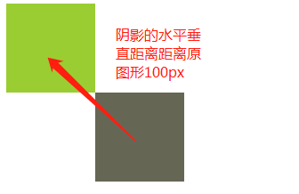
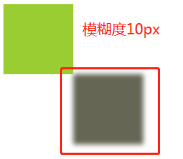
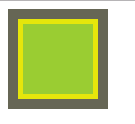
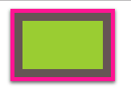
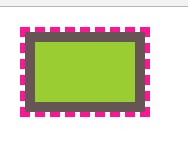

>[success] # box-shadow 多重边框
~~~
1.'box-shadow : h-shadow v-shadow blur spread color inset' 
2.属性依次分别为'控制阴影的水平距离，垂直距离，模糊程度'
               '模糊大小，模糊颜色，默认外部阴影加上inset内部阴影'
3.根据下面案例理解，'box-shadow' 实际是生成一个形状大小和
所赋值的元素一致的图形，通过控制这个形状的水平垂直距离，
模糊度，已经大小来实现阴影效果
~~~
>[info] ## 对上面六个属性详细讲解

>[danger] ##### 控制水平距离 和 垂直距离

~~~
<!DOCTYPE html>
<html lang="en">
<head>
    <meta charset="UTF-8">
    <meta name="viewport" content="width=device-width, initial-scale=1.0">
    <meta http-equiv="X-UA-Compatible" content="ie=edge">
    <title>Document</title>
    
</head>
<body>
    

        
    

</body>
</html>
~~~
>[danger] ##### 改变模糊度

~~~
<!DOCTYPE html>
<html lang="en">
<head>
    <meta charset="UTF-8">
    <meta name="viewport" content="width=device-width, initial-scale=1.0">
    <meta http-equiv="X-UA-Compatible" content="ie=edge">
    <title>Document</title>
    
</head>
<body>
    

        
    

</body>
</html>
~~~
>[danger] ##### 第四个参数改变大小

~~~
1.改变后的大小 = 原本大小 + 改变参数*2
~~~
~~~
<!DOCTYPE html>
<html lang="en">
<head>
    <meta charset="UTF-8">
    <meta name="viewport" content="width=device-width, initial-scale=1.0">
    <meta http-equiv="X-UA-Compatible" content="ie=edge">
    <title>Document</title>
    
</head>
<body>
    

        
    

</body>
</html>
~~~
>[info] ##### 利用 box-shadow 多层边框
* 因为'box-shadow' 设置后的阴影是实际不存在的元素上，
* 如果想实现鼠标悬停效果需要使用inset设置成内边框
 
~~~
<!DOCTYPE html>
<html lang="en">
<head>
    <meta charset="UTF-8">
    <meta name="viewport" content="width=device-width, initial-scale=1.0">
    <meta http-equiv="X-UA-Compatible" content="ie=edge">
    <title>Document</title>
    
</head>
<body>
    

        
    

</body>
</html>
~~~
* 设置多层边框的时候要注意层级嵌套的时候要第四个参数一层比一层大才行

~~~
<!DOCTYPE html>
<html lang="en">
<head>
    <meta charset="UTF-8">
    <meta name="viewport" content="width=device-width, initial-scale=1.0">
    <meta http-equiv="X-UA-Compatible" content="ie=edge">
    <title>Document</title>
    
</head>
<body>
    

        
    

</body>
</html>
~~~
>[info] ## 使用outline 方案
~~~
1.' outline : outline-color ||outline-style || outline-width '
2.上面参数是或的关系，因此位置可以随意更改，解释依次是，'颜色'，'样式'，'粗细'
~~~
>[danger] ##### outline 多重边框的弊端和优势
~~~
1.只能设置一层边框，因为'outline '不接受逗号分隔的形式
2.如果元素是倒圆角，那么使用'outline ' 边框不会贴合他是一个方块
3.优点：可以设置边框的样式
~~~
>[danger] ##### 案例
* 案例利用boder 和 outline属性搭配形成两个边框

~~~
<!DOCTYPE html>
<html lang="en">
<head>
    <meta charset="UTF-8">
    <meta name="viewport" content="width=device-width, initial-scale=1.0">
    <meta http-equiv="X-UA-Compatible" content="ie=edge">
    <title>Document</title>
    
</head>
<body>
    

        
    

</body>
</html>
~~~

 