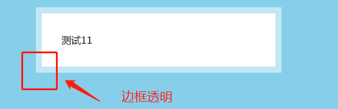
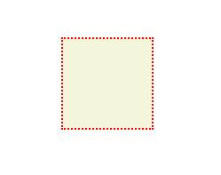
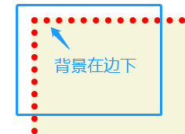
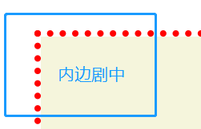
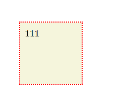
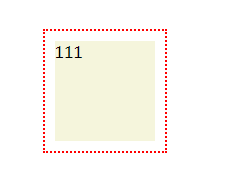

[TOC]

 
>[success] # 重学 -- 透明边框

~~~
1.想做到图片这种效果透明边框需要使用css的'background-clip' 属性
~~~
>[info] ##  background-clip 介绍
~~~
1.'background-clip：border-box | padding-box | content-box | text'
2.'border-box'：从border区域（含border）开始向外裁剪背景。
3.'padding-box'：从padding区域（含padding）开始向外裁剪背景。
4.'content-box'：从content区域开始向外裁剪背景。
5.'text'：从前景内容的形状（比如文字）作为裁剪区域向外裁剪，
如此即可实现使用背景作为填充色之类的遮罩效果。遮罩效果

~~~
>[danger] ##### border-box -- 默认值
* 代码展示效果:

* 放大效果：

~~~
1.下面代码使用了'border-box' 也就是默认效果，将这个效果放大后
可以发现默认状态下背景延伸在'border' 边框下
~~~
~~~
<!DOCTYPE html>
<html lang="en">
<head>
    <meta charset="UTF-8">
    <meta name="viewport" content="width=device-width, initial-scale=1.0">
    <meta http-equiv="X-UA-Compatible" content="ie=edge">
    <title>Document</title>
    
</head>
<body>
    

    

</body>
</html>
~~~
>[danger] ##### padding-box -- 从边框内侧开始
* 放大图片

~~~
1.当使用'padding-box ' 属性通过放大图可以看出来，整个背景显示区域紧
贴着整个边框最内部
~~~
~~~
<!DOCTYPE html>
<html lang="en">
<head>
    <meta charset="UTF-8">
    <meta name="viewport" content="width=device-width, initial-scale=1.0">
    <meta http-equiv="X-UA-Compatible" content="ie=edge">
    <title>Document</title>
    
</head>
<body>
    

    

</body>
</html>
~~~
>[danger] ##### content-box -- 从内容开始
* 正常效果

* 使用了 content-box

~~~
1. 设想下如果在div中设置了'padding' 内边距，当我们在div中
设置了背景色，并且添加了内容正常效果是什么样？
2.如图正常效果和使用了'content-box' 效果
3.根据图片可以看出背景颜色只会保持在内容区域
~~~
~~~
<!DOCTYPE html>
<html lang="en">
<head>
    <meta charset="UTF-8">
    <meta name="viewport" content="width=device-width, initial-scale=1.0">
    <meta http-equiv="X-UA-Compatible" content="ie=edge">
    <title>Document</title>
    
</head>
<body>
    

        111
    

</body>
</html>
~~~
>[info] ## 利用属性去实现图片效果
~~~
1.根据上面的属性讲解，其实就可以知道，因为默认情况下'border-box'
背景会延伸到边框下面，即使我们让背景透明，所展示映射的也是当前div
的背景，也不是我们希望的div所在的背景上的背景色
2.想实现因此使用'background-clip: padding-box;'
3.可以使用'rgba' 或者 'hsla' 来设置边框透明
4.em 单位表示，子元素字体大小的em是相对于父元素字体大小
~~~
>[danger] ##### 实现代码
~~~
<!DOCTYPE html>
<html lang="en">
<head>
    <meta charset="UTF-8">
    <meta name="viewport" content="width=device-width, initial-scale=1.0">
    <meta http-equiv="X-UA-Compatible" content="ie=edge">
    <title>Document</title>
    
</head>
<body>
    

        测试11
    

</body>
</html>
~~~
