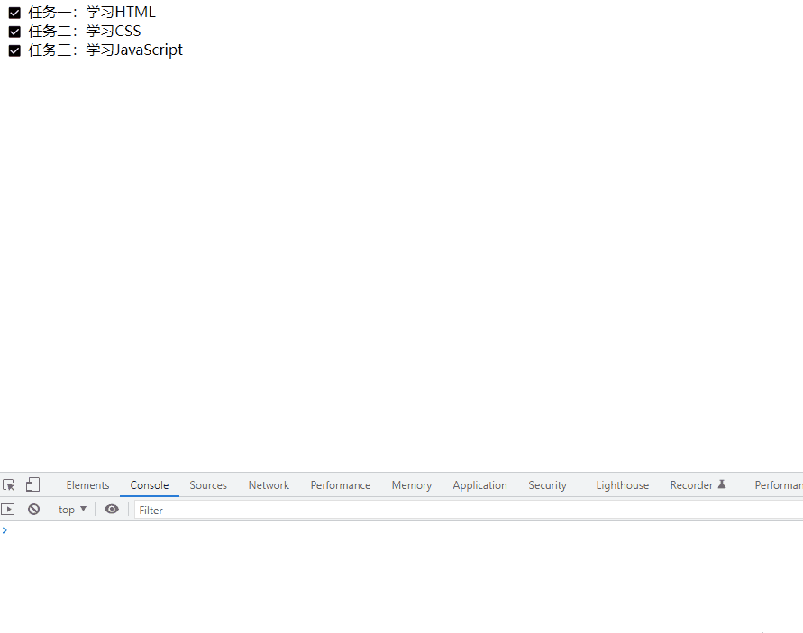
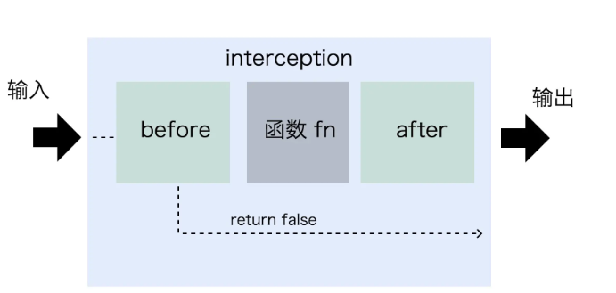

>[success] # 抽象函数
* 函数式编程是js天生具备的，如何使用函数式编程将过程抽象出来
>[info] ## 第一个案例 -- 连续点击问题
有个todo-list，当我们点击时候对应todo 事项会被移除，为了做的效果更好看，增加了动画效果，导致连续点击时候会出现报错，如下

~~~
<!DOCTYPE html>
<html lang="en">
	<head>
		<meta charset="UTF-8" />
		<meta http-equiv="X-UA-Compatible" content="IE=edge" />
		<meta name="viewport" content="width=device-width, initial-scale=1.0" />
		<title>Document</title>
		
	</head>
	<body>
		<ul>
			<li><button></button>任务一：学习HTML</li>
			<li><button></button>任务二：学习CSS</li>
			<li><button></button>任务三：学习JavaScript</li>
		</ul>
	</body>
	
</html>

~~~
* 因此现在要解决的是防止连续点击，思路
1. **addEventListener** 使用 **once** 参数限制点击次数
~~~
const list = document.querySelector('ul');
const buttons = list.querySelectorAll('button');
buttons.forEach((button) => {
  button.addEventListener('click', (evt) => {
    const target = evt.target;
    target.parentNode.className = 'completed';
    setTimeout(() => {
      list.removeChild(target.parentNode);
    }, 2000);
  }, {once: true});
});
~~~
2. **removeEventListener** 触发事件后将事件移除 这样就不能点击
~~~
const list = document.querySelector('ul');
const buttons = list.querySelectorAll('button');
buttons.forEach((button) => {
  button.addEventListener('click', function f(evt) {
    const target = evt.target;
    target.parentNode.className = 'completed';
    setTimeout(() => {
      list.removeChild(target.parentNode);
    }, 2000);
    target.removeEventListener('click', f);
  });
});

~~~
3. **disabled** 属性禁止点击
~~~
const list = document.querySelector('ul');
const buttons = list.querySelectorAll('button');
buttons.forEach((button) => {
  button.addEventListener('click', (evt) => {
    const target = evt.target;
    target.parentNode.className = 'completed';
    setTimeout(() => {
      list.removeChild(target.parentNode);
    }, 2000);
    target.disabled = true;
  });
});
~~~
>[danger] ##### 通过函数编程思想解决
1. 先将只执行**一次**这个事进行抽象成一个函数，这个函数是负责用来修饰只需要将我们传递函数进行包装后返回
2. 下面例子中把这个返回函数称作是fn的**修饰函数**，而把**once**称为函数的**装饰器**，其中**replacer** 函数用来做一些第二次调用时异常处理提示
~~~
// 封装一个once 函数
function once(fn, replacer = null) {
	return (...args) => {
		if (fn) {
			const res = fn.apply(this, args)
			fn = null
			return res
		}
		if (replacer) {
			return replacer.apply(this, args)
		}
	}
}

// 使用
const list = document.querySelector('ul');
const buttons = list.querySelectorAll('button');
buttons.forEach((button) => {
  button.addEventListener('click', once((evt) => {
    const target = evt.target;
    target.parentNode.className = 'completed';
    setTimeout(() => {
      list.removeChild(target.parentNode);
    }, 2000);
  }));
});
~~~
* 第二次执行时候抛出异常
~~~
const obj = {
  init: once(() => {
    console.log('Initializer has been called.');
  }, () => {
    throw new Error('This method should be called only once.');
  }),
}

obj.init();
obj.init();
~~~
>[danger] ##### 函数拦截器
1. 有时候我们需要对函数做一些改造，但是这类改造如果是在函数里面进行破坏性改造，可以采用类似思想做**装饰器**。在函数执行前后将函数进行包装

~~~
function intercept(fn, {beforeCall = null, afterCall = null}) {
  return function (...args) {
    if(!beforeCall || beforeCall.call(this, args) !== false) {
      // 如果beforeCall返回false，不执行后续函数
      const ret = fn.apply(this, args);
      if(afterCall) return afterCall.call(this, ret);
      return ret;
    }
  };
}
~~~
* 使用前后加运行时间
~~~
function sum(...list) {
  return list.reduce((a, b) => a + b);
}

sum = intercept(sum, {
  beforeCall(args) {
    console.log(`The argument is ${args}`);
    console.time('sum'); // 监控性能
  },
  afterCall(ret) {
    console.log(`The resulte is ${ret}`);
    console.timeEnd('sum');
  }
});

sum(1, 2, 3, 4, 5);
~~~
* 调整参数位置
~~~
const mySetTimeout = intercept(setTimeout,  {
  beforeCall(args) {
    [args[0], args[1]] = [args[1], args[0]];
  }
});

mySetTimeout(1000, () => {
  console.log('done');
});
~~~
* 我们可以校验函数的参数类型
~~~
const foo = intercept(foo, {
  beforeCall(args) {
    assert(typeof args[1] === 'string');
  }
});
~~~
>[danger] ##### 类似解决思想
1. **节流**是让事件处理函数隔一个指定毫秒再触发
2. **防抖**则忽略中间的操作，只响应用户最后一次操作
 