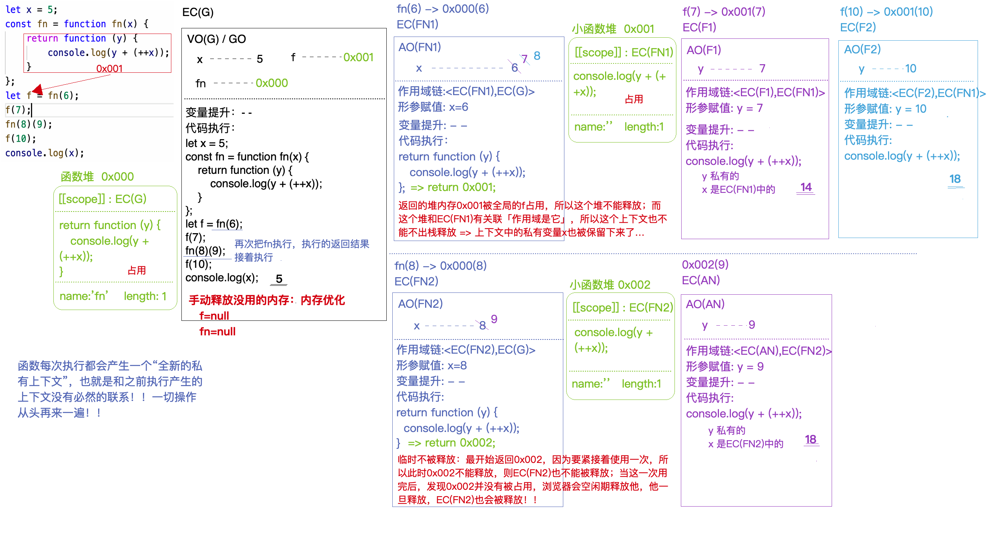
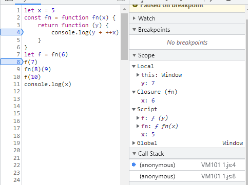

>[success] # 闭包
[闭包的导读从概念看闭包](https://www.kancloud.cn/cyyspring/more/1314922)
>[info] ## 从执行上下文看闭包
~~~
let x = 5; // 在VO(G) 储存该变量
// const 定义因此fn 也是VO(G)
const fn = function fn(x) {
    return function (y) {
        console.log(y + (++x));
    }
};

// 执行fn(6) 此时创建一个EC(fn) 的执行上下文推入ESC执行栈中
// f 此时在全局上下文中VO(G) 中指向的是fn return 返回的匿名函数地址
// 此时f 即 fn return 返回的匿名函数存在的原因，导致这个匿名函数暂时不能被释放
// 然而 此匿名函数 此时scope 作用域链指向他上级也就是 fn 也因此不能被释放

let f = fn(6);
// 此时 调用f(7) 即调用匿名函数 即因为匿名函数没有被释放他上级作用域fn 依旧不能
// 被释放，此时在上次执行没被释放的 AO(fn) 依旧共享
f(7);

// 但是时fn(8) 和上面f 没有任何关系，函数每次执行会创建新的私有的执行上下文即EC(fn(8))
// 此时fn(8) 生成的匿名函数被(9) 直接掉用导致 内存再次不能被释放，但随着(9)销毁
// fn(8)也不在被占用因此也跟着销毁

fn(8)(9);
// 此时f(10) 因为还在使用f ,导致f 上级作用域fn 依旧不能被销毁，此时AO(fn)接着上次继续变化

f(10);
console.log(x); 
~~~
* 图片来自珠峰课堂

