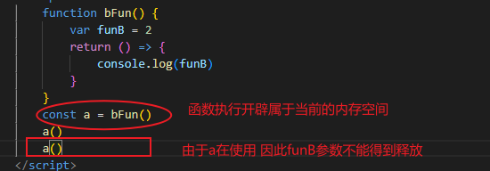
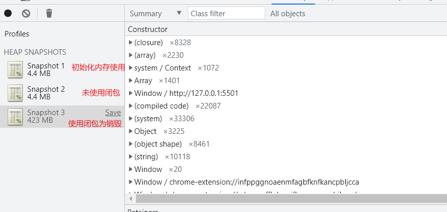

>[success] # 闭包内存
1. 闭包会产生作用域不会被释放，站在之前`js执行上下文`章节来看，每次函数执行时候，无论是**ES3规范**还是**新的ES规范**，函数都会在执行时候开辟属于当前执行时候的内存空间，然后销毁。闭包由于内部引用了外部导致无法销毁
* 图解，不停调用`a()` 会被释放，只是创建的指向 a的`bFun` 不会被释放

>[danger] ##### 通过案例
~~~
<!DOCTYPE html>
<html lang="en">
	<head>
		<meta charset="UTF-8" />
		<meta http-equiv="X-UA-Compatible" content="IE=edge" />
		<meta name="viewport" content="width=device-width, initial-scale=1.0" />
		<title>Document</title>
	</head>
	<body>
		<button class="create">创建一系列的数组对象</button>
		<button class="createNot">创建一系列的非闭包</button>
		<button class="destroy">销毁一系列的数组对象</button>

		
	</body>
</html>

~~~
* 如图（使用销毁没有释放后续再看）
