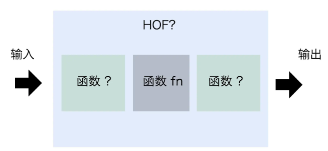

>[success] # 范式
* `HOF0`是高阶函数的**等价范式**,`HOF0`修饰的函数功能和原函数`fn`的功能完全相同。因为被修饰后的函数就只是采用调用的`this`上下文和参数来调用`fn`，并将结果返回。也就是说，执行它和直接执行`fn`完全没区别
~~~
function HOF0(fn) {
  return function(...args) {
    return fn.apply(this, args);
  }
}
~~~

>[danger] ##### 利用这些范式去组合
~~~
function continous(reducer) {
  return function (...args) {
    return args.reduce((a, b) => reducer(a, b));
  };
}

const add = continous((a, b) => a + b);
const multiply = continous((a, b) => a * b);

console.log(add(1, 2, 3, 4)); // 1 + 2 + 3 + 4 = 10

console.log(multiply(1, 2, 3, 4, 5)); // 1 * 2 * 3 * 4 * 5 = 120
~~~